# Architecture — zdtd

> **What this is:** the map of how the Zig dedicated server is built, how it runs at 20 TPS, and how the pieces fit together. For the canonical RE behind the wire see [protocol.md](../../7dtd-engine-research/docs/protocol.md) and for the founding design [ZIG_CLONE.md](ZIG_CLONE.md). For what actually works today see [STATUS.md](STATUS.md).

> **How to read it:** start at the overview, then follow the runtime loop (tick), then the three planes that ride it — net, sim, and storage — plus the plugin and observability planes that cross-cut them. Every major section has a Mermaid diagram. When a diagram and code disagree, code wins.

**Contents**

- [1. System overview](#1-system-overview)
- [2. Source layout and dependency edges](#2-source-layout-and-dependency-edges)
- [3. Process lifecycle and the 50 ms tick](#3-process-lifecycle-and-the-50-ms-tick)
- [4. Net stack: LiteNet, framing, packages](#4-net-stack-litenet-framing-packages)
- [5. Join flow](#5-join-flow)
- [6. ECS simulation and schedule](#6-ecs-simulation-and-schedule)
- [7. World and chunks](#7-world-and-chunks)
- [8. Interest and replication: serialize-once](#8-interest-and-replication-serialize-once)
- [9. Plugin host: Wasm guests](#9-plugin-host-wasm-guests)
- [10. Config, assets, and persistence](#10-config-assets-and-persistence)
- [11. Observability: APM](#11-observability-apm)
- [12. Invariants](#12-invariants)

---

## 1. System overview

zdtd is a **single-process, single-authority, fixed-step** dedicated server. Stock Unity clients (EAC off, V3.1.0 b14) join over LiteNetLib; the server owns blocks, inventory, HP, quests, time, and every byte it sends. There is no Mono, no GC pause, and no `Mods/` code loading — behavioral extension is Wasm plugins over a typed host boundary.

The three planes are deliberately split even though the tick thread is single-owner for game rules:

- **Net plane** accepts, decodes, and fans out bytes.
- **Sim plane** steps the SoA ECS deterministically at 20 Hz.
- **Store plane** persists chunks, player files, and tile entities off the hot path.

Plugins and APM are cross-cutting: plugins observe or veto at narrow hooks, APM measures every hot section.

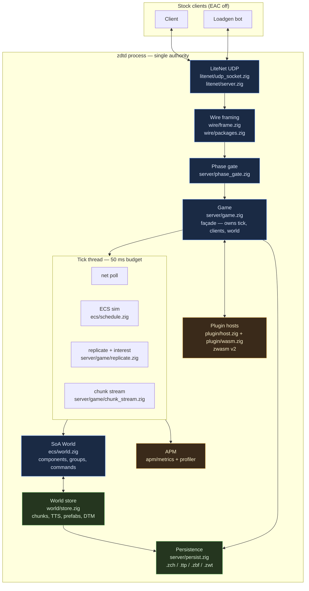

**Key files by plane**

| Plane | Owns | Hot path budget |
|---|---|---|
| Net | `src/litenet/*`, `src/wire/*`, `src/server/phase_gate.zig`, `src/server/c2s/*` | `net_poll` ≤ 5 ms |
| Sim | `src/ecs/*`, `src/server/game/tick.zig`, `src/server/game/step.zig` | `sim_entities` ≤ 30 ms |
| Store | `src/world/*`, `src/server/persist.zig`, `src/server/game/chunk_fill.zig` | async where possible |
| Plugin | `src/plugin/*`, `src/server/game/hooks.zig` | `plugin` section, fuel capped |
| APM | `src/apm/*`, `src/server/game/harness.zig` | always on for listed sections |

---

## 2. Source layout and dependency edges

The layout mirrors the dependency rule enforced by `scripts/lint-architecture.sh`. The rule is simple: **leaf packages never import application or domain layers**, and `world` never imports `wire` (tile-entity domain types live in `world`, wire re-exports them).

```
src/
  main.zig              CLI, allocator, Game construction, run loop
  protocol.zig          tick rate + challenge constants
  version.zig           product + stock wire version
  apm/                  native counters + section profiler + reports
  assets/               stock XML tables (blocks/items/quests/biomes/…)
  ecs/                  SoA World, components, systems, schedule, groups
  world/                chunk store, TTS, prefabs, DTM, sleepers, weather, deco
  wire/                 framing + stock package bodies (one builder per shape)
  litenet/              LiteNet framing, peers, UDP socket (std.Io.net)
  server/               Game façade + c2s handlers + persistence + webui + admin
    c2s/                C2S handlers by domain (join/move/blocks/inv/quest/misc)
    game/               per-domain Game helpers (tick/step/replicate/chunk_stream/…)
  plugin/               Wasm host, hook table, budgets, manifests
  util/                 parallel, toml_bind, io_fs, clock, log, sim
```

Facades: import `*/root.zig` per package and `wire/packages.zig` for stock bodies. Leaf files stay importable. Every `src/*/root.zig` re-exports its package files so `zig build test` aggregates them.

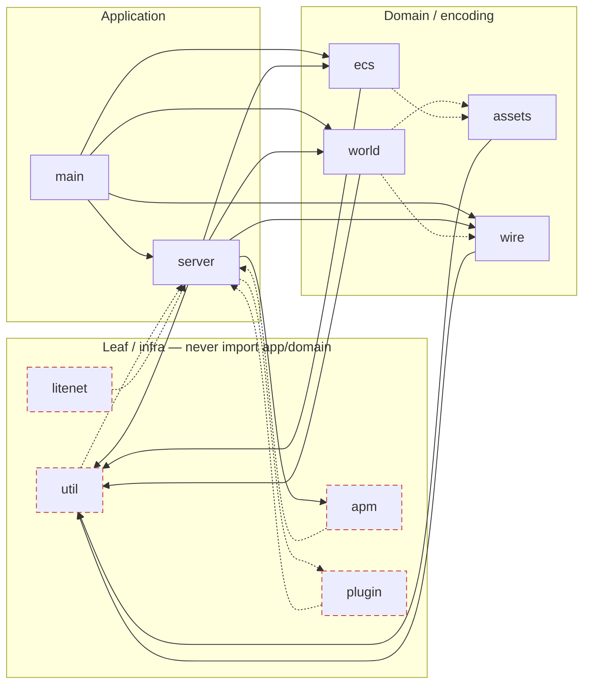

**Enforced forbidden edges** (`lint-architecture.sh`):

- `util` → `server|wire|world|ecs|assets|litenet|apm`
- `apm` → `server|wire|world|ecs|assets|litenet`
- `litenet` → `server|world|ecs|assets|apm`
- `plugin` → `server|wire|world|ecs|assets|litenet|apm`
- `assets` → `server|wire|world|litenet|apm` (ecs shapes ok)
- `ecs` → `server|wire|world|assets|litenet|apm`
- `world` → `server|wire|litenet|apm`
- `wire` → `server|litenet|apm`

`server/game.zig` is the **delegating façade** — it owns `Game` and fans out to `server/game/*.zig` and `server/c2s/*.zig` helpers that each take `*Game`. Wire bodies live in `wire/stock_*.zig` behind `wire/packages.zig`.

---

## 3. Process lifecycle and the 50 ms tick

`src/main.zig` parses CLI + env + `zdtd.toml` + mode pack into `server/config.zig` and `ecs/rules.zig`, constructs `Game`, and runs the fixed-step loop. The loop is **effectively single-threaded for game rules**; parallelism lives inside a phase via `util/parallel`.

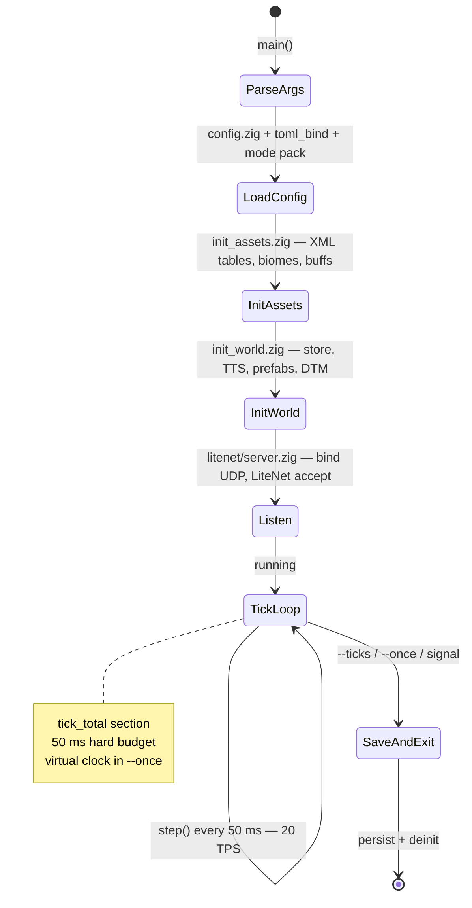

One iteration of the loop (`src/server/game/step.zig:step`) — the hot path that must not allocate:

```mermaid
flowchart TB
    START([step — tick_n++]) --> POLL

    subgraph poll["net_poll — ≤ 64 events"]
        POLL[poll LiteNet + recv_buf]
        POLL --> REAP[reapStalePeers + reapPolicyKicks]
        REAP --> ADMIN[poll admin TCP + webui + mcp]
    end

    ADMIN --> SNAP{terrain snapshot?}
    SNAP -- on --> TERR[terrain_snap rebuild]
    SNAP -- off --> DIR
    TERR --> DIR

    subgraph sim["sim_entities — schedule.run + Game extras"]
        DIR[systemDirector — clock + blood moon + restocks]
        DIR --> AI[systemZombieAi + systemDigUpdate<br/>parallel over slots]
        AI --> VEH[systemVehicles]
        VEH --> TUR[systemTurrets — parallel]
        TUR --> DESP[systemDespawnFar]
        DESP --> CMD[drainCommands — spawn/despawn/damage  cap 64]
        CMD --> WATER[world.levelWaterTick — budgeted fills]
        WATER --> FALL[systemFallingBlocks — gravity + landing]
        FALL --> EXPL[drainExplosions — EntityZombieCop AoE]
        EXPL --> DIG[drainDigRequests — MoveHelper]
        DIG --> WAKE[drainSleeperWakeups + tickEntityLookAt]
        WAKE --> MAPS[tickMapChunks + tickPlayerPositions + tickClientInfo]
        MAPS --> SURV[tickSurvival + tickBots + loot bags + claims + blood-moon music]
    end

    SURV --> SLEEP[periodic — every sleeper_tick_ticks:<br/>tickSleeperVolumes, tickWorkstations, tickBlockRadiusEffects]
    SLEEP --> POWER[power.tick<br/>replicate_te.broadcastPowerVisuals]
    POWER --> CORPSE[sweepCorpses — EntityRemove + loot spawns]
    CORPSE --> WORLD_TICK{world_time tick?}
    WORLD_TICK -- yes --> WT[WorldTime + weather.tick + weather broadcast<br/>blood-moon music per player]
    WORLD_TICK -- no --> VEH_POS
    WT --> VEH_POS[broadcastVehiclePositions<br/>broadcastTurretSync<br/>plugins onTick + withdraw trap queue]
    VEH_POS --> REWARDS[drain completed_quests ring — plugin verdict then give/loot/exp/quest]
    REWARDS --> REPLICATE[replicate — interest + encode + fan-out]
    REPLICATE --> SAVE{save interval?}
    SAVE -- yes --> IO[saveAll + containers + vending + claims + allies + weather + clock]
    SAVE -- no --> APM
    IO --> APM[sampleFlushCounters — per apm_report_period_ticks: JSON line to stdout]
    APM --> DONE([tracy.frameMark + virtual clock advance])

    classDef hot fill:#1a3a5c,stroke:#5b8def,color:#dbe6ff
    class POLL,DIR,AI,TUR,REPLICATE hot
```

**No-heap invariant:** tick, per-packet C2S/S2C, interest/replicate, chunk stream, and ECS systems must not `alloc`/`create`/`dupe`/`allocPrint` or grow `ArrayList`/`HashMap`. They reuse `recv_buf`/`send_buf`/`body_buf`, fixed client slots, SoA columns, pools, and stack `bufPrint`. At cap: drop or omit, never realloc.

---

## 4. Net stack: LiteNet, framing, packages

Stock clients never speak raw TCP for gameplay. Everything rides **LiteNetLib reliable ordered (delivery 2)** over a single UDP socket (`src/litenet/udp_socket.zig` via `std.Io.net`). The address the operator passes as `--port` is the TCP info port; **LiteNet is `port + 2`** — that is why loadgen uses `zdtd_port + 2`.

### 4.1 Framing

Every datagram the client `Read`s is one LiteNet payload that contains one or more packages:

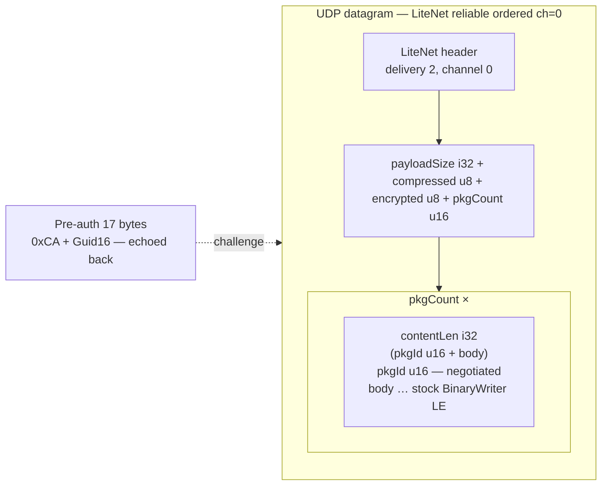

Details in `src/wire/frame.zig` (framing helpers) and `src/litenet/*` (peers, window, reaps). Reliable-window retry pumps ACKs for the fast window before pacing at 1 ms so a dead peer is reclaimed by the stale sweep instead of wedging the tick (`src/server/game/net.zig:sendReliablePumped`).

### 4.2 Packages

Package ids are **negotiated at join**, not fixed. The server advertises an ordered name list as `NetPackagePackageIds` (`src/wire/packages.zig:default_mappings`); the client maps name to `u16`. Every stock shape has **one builder** in `src/wire/stock_*.zig` writing into a caller buffer (`buildXxxBody(buf, …) ![]u8`) using `src/wire/binary.zig` (LE ints, 7-bit string lengths). The facade `src/wire/packages.zig` re-exports all of them.

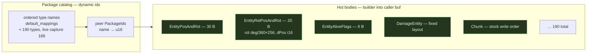

One shape → one builder (AGENTS rule 14). If a body cannot be built correctly (missing catalog entry, buffer too small, unknown TE) the sender **omits** or sends the stock empty form — never truncates mid-field.

---

## 5. Join flow

A stock client (or loadgen bot) walks a phase-gated session. `Client.joined`/`Client.entered` map to `server/phase_gate.zig:Phase` (`connecting → joined → playing`); the gate drops C2S packages that are not legal for the current phase. The UDP challenge echo races the first payload, which is buffered and replayed after auth (`Client.preauth_buf`).

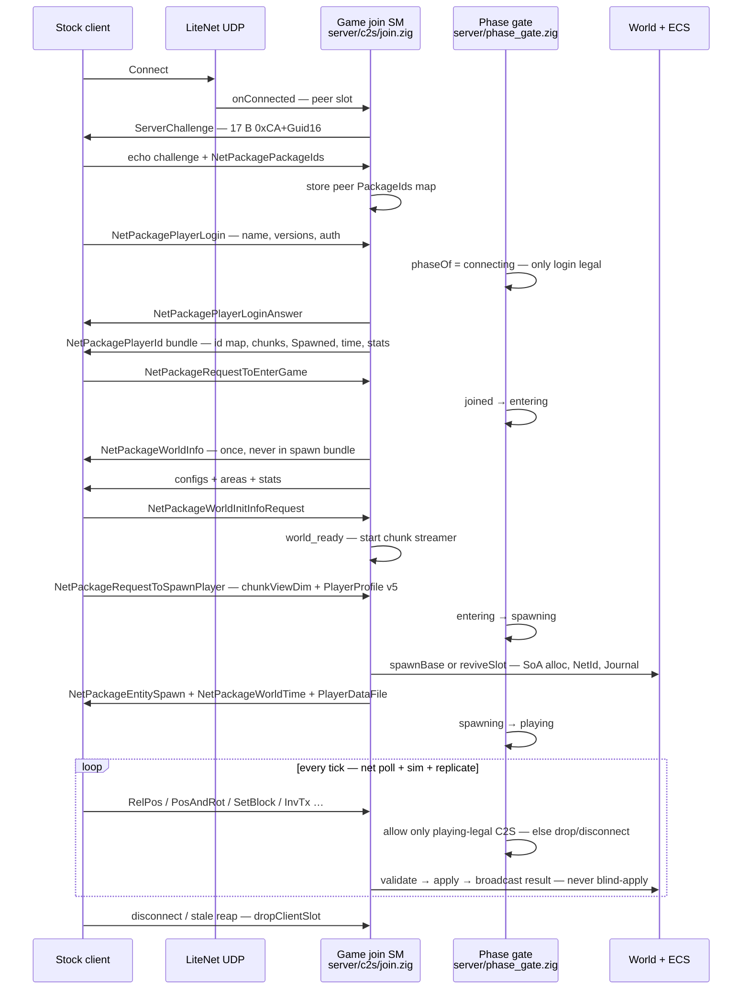

State view (same machine, compact):

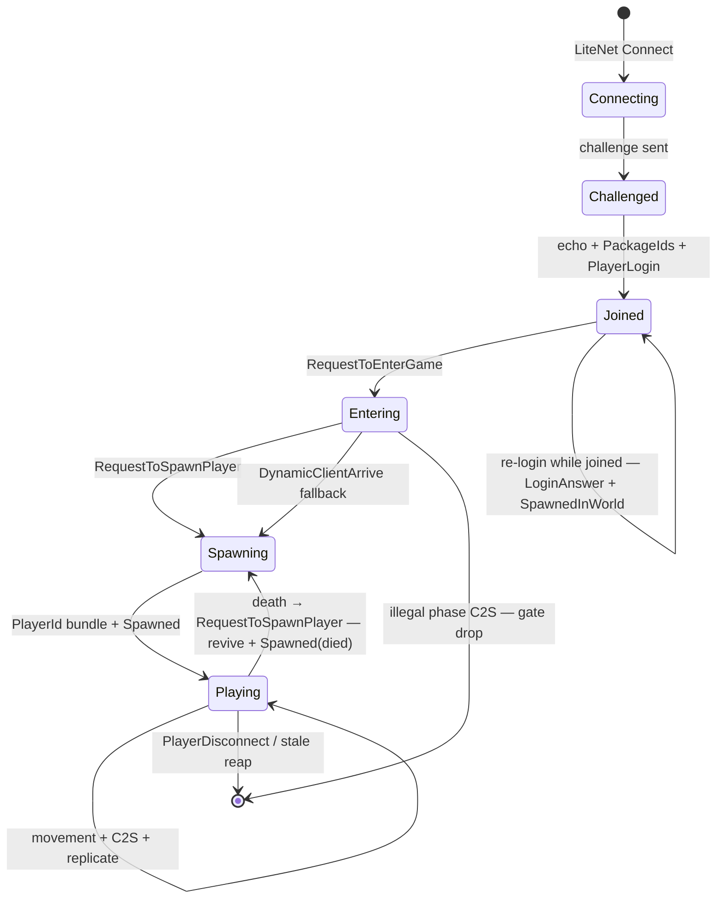

Owners: `src/server/c2s/join.zig` (7-package SM), `src/server/c2s/dispatch.zig` (dispatch table), `src/server/game/join.zig` (sendJoinBundle, sets `Client.entered`), `src/server/phase_gate.zig` (allowed table). For all 20 state machines see [STATE_MACHINES.md](STATE_MACHINES.md).

---

## 6. ECS simulation and schedule

The sim is a **single SoA ECS** (`src/ecs/`). An entity is a dense `Slot` `0..511` plus a stable network `NetId` (i32). Components are parallel arrays gated by a `Mask`; resources are shared singletons on `World`. Systems are plain `fn(*World, …)` and tick via `schedule.run`.

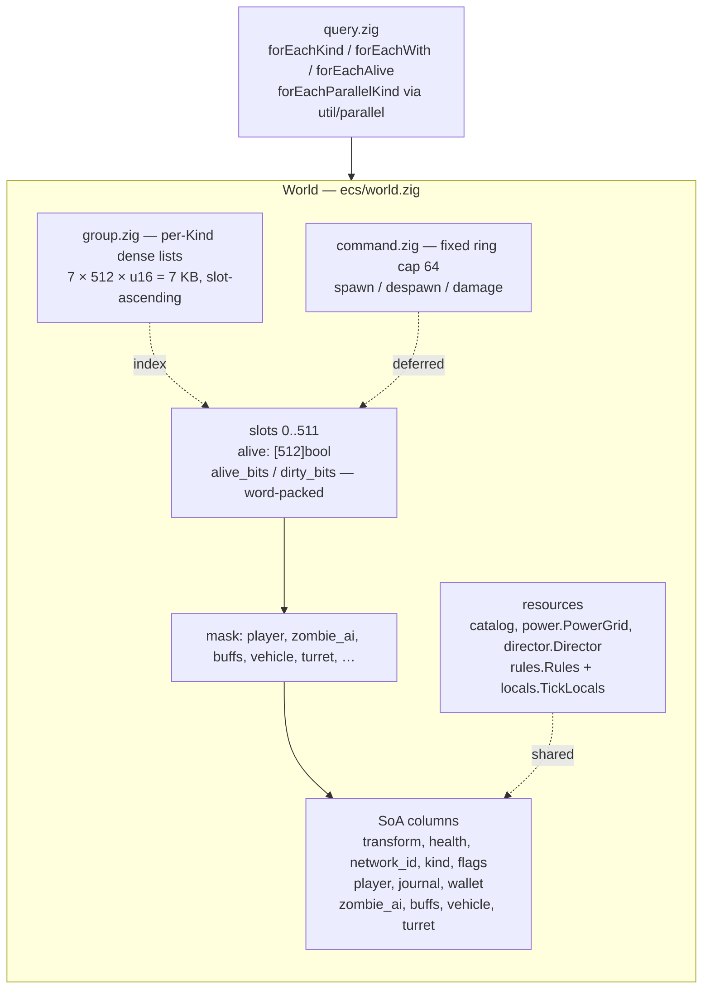

### 6.1 Schedule

Document order is run order. A mode pack may **disable** a phase (`Rules.systems.<name>`) but never reorder one — the order encodes a real dependency (buffs before AI so movement and damage read this tick's buff state).

```mermaid
flowchart LR
    BEGIN([beginTick<br/>clear TickLocals<br/>clear dirty bits]) --> BUFFS
    BUFFS[buffs<br/>systemBuffs — 20 Hz<br/>stack + duration + expiry] --> DIR
    DIR[director<br/>systemDirector — clock<br/>blood moon + horde spawns] --> AI
    AI[ai<br/>systemZombieAi — parallel<br/>+ systemDigUpdate] --> VEH
    VEH[vehicles<br/>systemVehicles — driver stick] --> TUR
    TUR[turrets<br/>systemTurrets — parallel<br/>target + fire] --> DESP
    DESP[despawn<br/>systemDespawnFar — cull far zombies] --> CMDS
    CMDS[commands<br/>drainCommands — apply deferred ops<br/>from systems + plugins]

    classDef phase fill:#1a3a5c,stroke:#5b8def,color:#dbe6ff
    class BUFFS,DIR,AI,VEH,TUR,DESP,CMDS phase
```

Pinned in `src/ecs/schedule.zig:order`:

```
buffs → director → animals → ai → vehicles → turrets → despawn → commands
```

Power (`ecs/electric.zig:PowerGrid`) resolves once per tick in `Game.step` with real daylight, not inside `schedule.run` — a second resolve doubled the BFS and forced daylight at night. Turrets read last tick's resolve. Command-style systems (`questAccept*`, `questOn*`, `trade`, `vehicleAttach`) run on demand, not every tick.

### 6.2 Queries and groups

```zig
ecs.forEachKind(w, .zombie, ctx, f);
ecs.forEachWith(w, .{ .player = true, .inventory = true }, ctx, f);
for (ecs.groupSlice(w, .zombie)) |s| { ... }   // O(live), ascending
```

`World.kind_groups` is maintained only at `spawnBase`/`destroy`/`reviveSlot`; a slot never migrates between groups. Iteration that mutates the world snapshots via `copyKindInto`. The replicate pass walks `alive_bits`/`dirty_bits` word-packed sets, not kind groups, to keep slot order.

### 6.3 Threading

| Path | Mode | Safety |
|---|---|---|
| AI + turrets | `util/parallel` range-split | workers write only their own slots; HP via fixed-point atomics + serial apply |
| Chunk save | parallel when many dirty | `World.saveAll` batch |
| Net poll / replicate | single-threaded owner | serialize-once framed fan-out |
| Block store | tick-owned | not lock-free |

---

## 7. World and chunks

Chunks are the unit of terrain, storage, and streaming. Stock constants are fixed:

| Constant | Value | Where |
|---|---|---|
| Chunk XZ | 16 × 16 | `world/store.zig` |
| YDim | 256 | columns |
| Layer height | 4 | `y >> 2` |
| Layers | 64 | save loop |
| Region | 8 × 8 = 64 chunks | `RegionFileRaw` header 779 |
| File ext | `.ttc` (plus zdtd `.zch` overlay) | `world/store.zig` |

Block index: `layer = y >> 2`, `idx = x + z*16 + (y & 3)*256`.

### 7.1 Chunk lifecycle

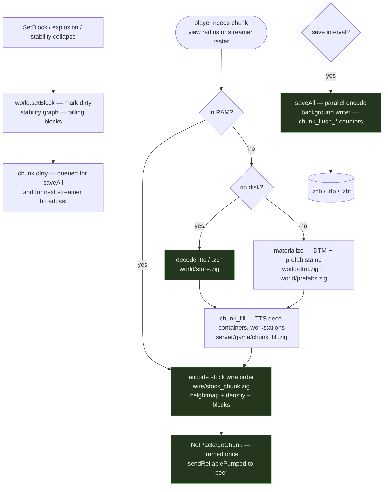

Storage details: `src/world/store.zig` (chunk columns, heightmap `byte[256]`, density bands), `src/world/tts.zig` (terrain texturing), `src/world/prefabs.zig` + `src/world/dtm.zig` (Navezgane / Pregen + procedural), `src/world/biomes.zig`, `src/world/weather.zig` (storm + blood-moon groups, `weather.zwt`), `src/world/sleepers.zig` + `src/server/game/sleeper.zig` (volume wakes, one-way), `src/world/deco_mirror.zig` (optional deco, `[feature] deco_mirror`).

The stream itself (`src/server/game/chunk_stream.zig:streamChunksForClient`) rasters inside a budget square derived from `chunk_stream_radius` and `max_streamed_chunks`, delivering at most `chunk_adds_per_stream_tick` per pass so the reliable window can drain. See the backpressure SM below.

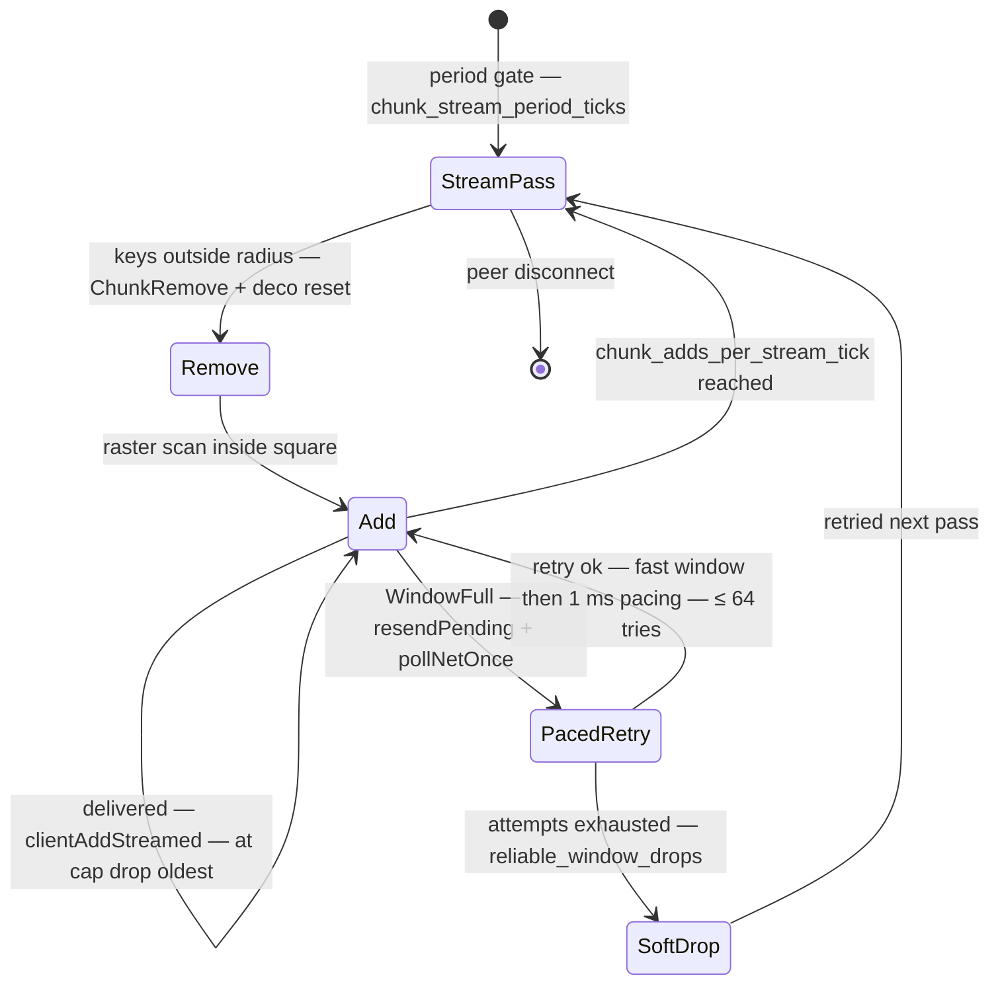

---

## 8. Interest and replication: serialize-once

Stock's measured wall is not entity AI but **net**: per-entity × per-player rebuild with no spatial index and per-connection re-serialization of the same bytes. zdtd collapses it:

- **Spatial interest** via a chunk or 16-block grid hash — an entity evaluates only players in nearby cells, and interest rebuilds only when a cell changes.
- **Dirty bitsets** per entity: `POS | ROT | FLAGS | HP | SPAWN | REMOVE`.
- **Serialize once** per dirty package kind per tick, then `memcpy` fan-out.

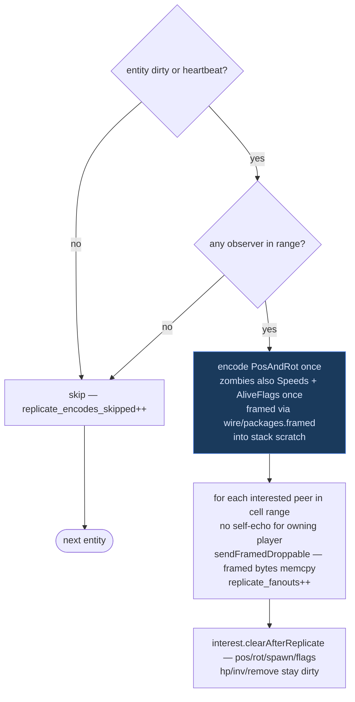

Spawn-on-approach still builds `NetPackageEntitySpawn` (ECD) once when any peer needs it. Motion frames (`RelPos`) are genuinely per-player and are the only per-peer encode. The trio `replicate_candidates / replicate_fanouts / replicate_encodes_skipped` plus `packages_encoded` is the acceptance check:

- `candidates / ticks` follows world change, not slot table size.
- `fanouts / packages_encoded` is the fan-out ratio — adding a viewer raises fan-outs and leaves encodes flat.
- `encodes_skipped` is pure interest savings.

Wired in `src/server/game/replicate.zig` (candidates + dirty gating + `needsPosSend`), `src/ecs/interest.zig` (range + dirty helpers), `src/server/game/net.zig` (framed fan-out + `sendReliablePumped` soft-drop). Guarded by the scenario in `src/server/scenarios.zig`.

---

## 9. Plugin host: Wasm guests

Behavioral extension is **Wasm only** (ADR 0020). A plugin is a `.wasm` module named in `zdtd.toml:[plugin] modules`; the host is `plugin/wasm.zig` over `zwasm` v2 (Zig-native, no C, `use_llvm = true`). The static host (`plugin/host.zig`) stays for scenario scaffolding.

### 9.1 Lifecycle

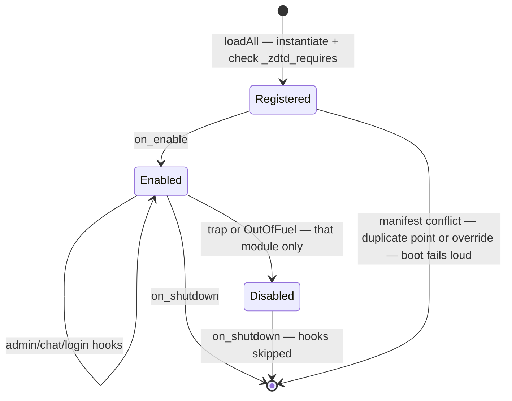

Modules declare what they need via `_zdtd_requires` (hook + host verb names); a typo is a **load rejection**, not a silent never-fire. Every `zdtd.queue` command is attributed to its 1-based issuing slot; if the module disables itself, its still-pending commands are withdrawn before the drain (revertible effects). See `docs/prompts/plugin-composability-review.md` and ADR 0030.

### 9.2 Host boundary

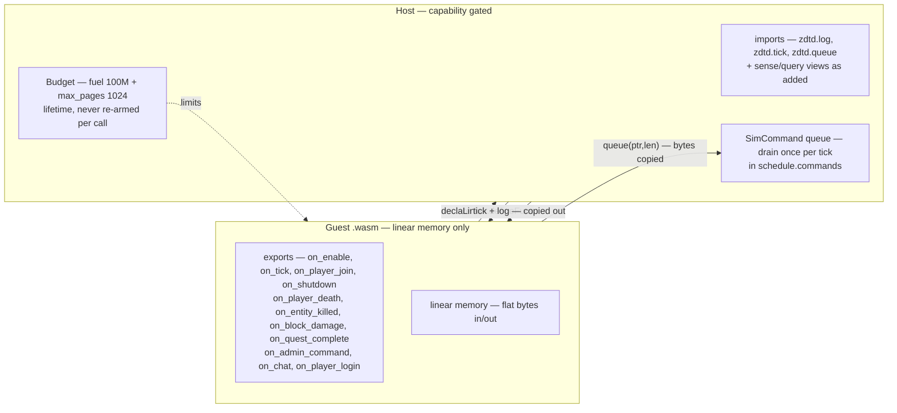

Verdict semantics (first non-zero across plugins wins; a trap is keep):

| Hook family | Return | Meaning |
|---|---|---|
| `on_player_login` | `< 0` deny with reason bytes in out | first deny wins |
| `on_chat` | `< 0` deny, `0` keep, `> 0` filtered bytes | bad UTF-8 is deny |
| `on_admin_command` | `> 0` handled bytes | first handler wins, else core |
| `on_player_death` / `on_entity_killed` / `on_block_damage` / `on_quest_complete` | `< 0` deny, `0` keep, `> 0` adjust as percent | first non-zero wins |
| Core override points `loot.roll` etc. | exclusive claimant | native default skipped |

Five exclusive core override points (`loot.roll`, `quest.payout`, `damage.player_scale`, `craft.request`, `trade.price`) become single-owner when a `mod.toml` claims `points = "…"`. Duplicate claims fail the boot (`src/plugin/manifest.zig`, `src/plugin/resolver.zig`).

Core plugins under `plugins/core_*/` ship Zig sources built to `.wasm` by `scripts/build-plugins.sh` (shared `mods/plugin_common.zig`). Addons (`mods/fps_bot`, `mods/mcp`, `mods/example_chat_filter`) live under `mods/`. Bot brains are **Wasm only** — `BotManager` is a servant (spawn/replicate/move/LOS/sense/`bot` verbs) and never grows native decision logic (ADR 0026).

---

## 10. Config, assets, and persistence

### 10.1 Config precedence

Tuning is data, not parse arms (`util/toml_bind.zig` walks the dest struct — a new field auto-binds). Sim params are `ecs/rules.zig:Rules`, a floor that per-entity stock data overrides where present.

```mermaid
flowchart LR
    CODE["code defaults<br/>ecs/rules.zig<br/>server/config.zig"] --> SC
    SC["--serverconfig XML<br/>ServerSettings"] --> MODE
    MODE["mode pack<br/>modes/*.toml — --mode NAME"] --> CWD
    CWD["CWD zdtd.toml"] --> WORLD_TOML
    WORLD_TOML["world/zdtd.toml"] --> ENV
    ENV["env — ZDTD_WEBUI_SECRET etc."] --> CLI
    CLI["CLI flags — --port --world --game-dir …"] --> EFFECTIVE

    EFFECTIVE["effective config<br/>Game + Rules + world store"]

    classDef winner fill:#25361f,stroke:#6fbf6a,color:#dff5dc
    class EFFECTIVE winner
```

See `docs/GAME_OPTIONS.md`, `docs/RULES_CONFIG.md`, `docs/PLUGIN_CONFIG_DISPOSITION.md`.

### 10.2 Asset pipeline

Stock content is **data loaded from the operator install** (`--game-dir` / `--map` / `--config-dir`), never shipped or hardcoded per ADR 0010. Every `src/` file carries a provenance row in `docs/PROVENANCE.md` (bucket A stock-data / R RE-cited / Z zdtd-owned).

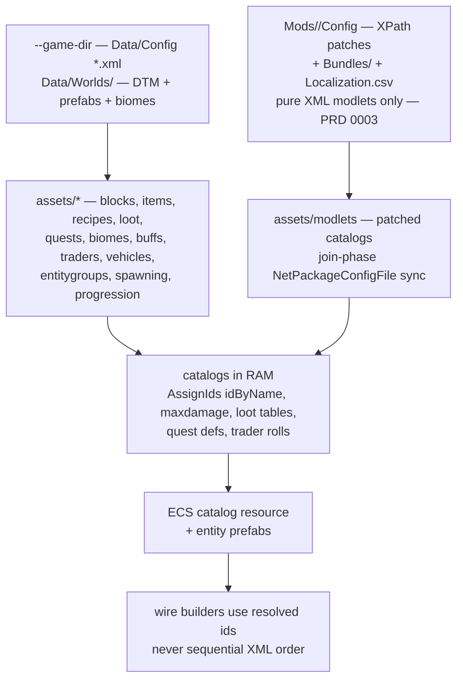

Fail-closed rules: missing name → omit / not placeable / skip deco (wrong id is worse than missing). `xml_patch` applies XPath; `NetPackageConfigFile` syncs the patched view at join.

### 10.3 Persistence

Mutations surviving a restart go through `world/*` / `server/persist.zig`, not just interest caches.

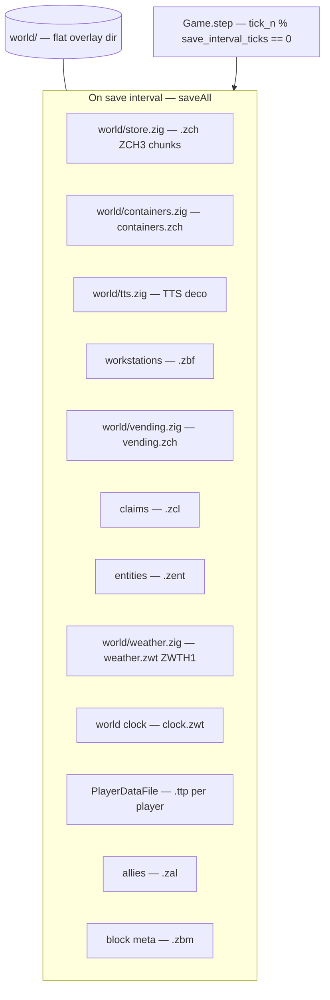

Green join does not mean persisted. Deterministic sim uses explicit seeded RNG, not time noise.

---

## 11. Observability: APM

Native metrics live in `src/apm/` (`metrics.zig:CounterId`, `profiler.zig:Section`, `report.zig`). They ship **inside** the `zdtd` binary, not via `7dtd-server-apm` (Mono bridge, different process).

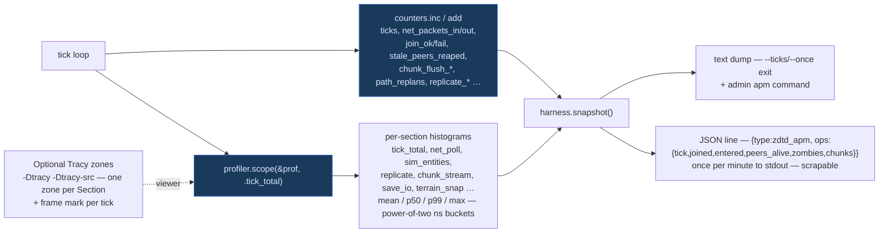

Text and JSON max sizes are derived at comptime from the enums so a new counter can never silently truncate a report. The replication trio (`replicate_candidates / replicate_fanouts / replicate_encodes_skipped` over `packages_encoded`) is the M11 serialize-once acceptance check — see section 8.

Optional Tracy markers are zero-sized when off and link no libc. See [APM.md](APM.md).

---

## 12. Invariants

These are the non-negotiables the architecture exists to enforce. When in doubt, these decide.

| # | Invariant | Where it is enforced |
|---|---|---|
| 1 | **Clean-room, stock wire only** — no TFP DLLs, no decompiled C#, no invented terrain/packages/FX | `docs/PROVENANCE.md`, `tools/provenance_scan.py` |
| 2 | **Single shape → single builder** — one stock package shape is one `wire/stock_*.zig` builder the client `Read`s | `src/wire/packages.zig` facade |
| 3 | **Server authoritative** — C2S is a request validated at trust boundaries, sim owns the result | `src/server/c2s/*`, `server/phase_gate.zig`, `server/guard_policy.zig` |
| 4 | **Phase gates** — only packages legal for the peer's SM state are accepted | `server/phase_gate.zig:allowed` |
| 5 | **No self-echo, serialize-once** — per-entity encode once, fan-out to observers | `server/game/replicate.zig`, `ecs/interest.zig` |
| 6 | **Bounds and caps on every untrusted input** — coords, slot indices, counts, string lengths, fragments | C2S handlers + `chunk_stream` caps + `command` cap 64 |
| 7 | **Fail closed on encode** — omit or send stock empty form, never truncate mid-field | wire builders |
| 8 | **Hot path never allocates** — reuse `recv_buf`/`send_buf`/`body_buf`, SoA columns, pools | `server/game/step.zig`, `ecs/*`, `world/*` |
| 9 | **Deterministic sim** — same seed and inputs produce same outcomes where claimed | seeded RNG in loot/AI/director |
| 10 | **20 TPS budget** — 50 ms tick validated by loadgen + stock client + zdtd APM dumps | `src/protocol.zig:ticks_per_second = 20`, `src/apm/*` |

---

## Related docs

| Doc | Role |
|---|---|
| [STATUS.md](STATUS.md) | What works now — the hub |
| [GAP_ANALYSIS.md](GAP_ANALYSIS.md) | Full 291-feature inventory — WORKS/PARTIAL/MISSING |
| [WORK_PLAN.md](WORK_PLAN.md) | Ranked next tasks |
| [STATE_MACHINES.md](STATE_MACHINES.md) | 20 state machines with diagrams and `src/` anchors |
| [ECS_SYSTEMS.md](ECS_SYSTEMS.md) | SoA columns, queries, groups, tick order |
| [PLUGIN_API.md](PLUGIN_API.md) | Wasm plugin design — host boundary and budgets |
| [PLUGIN_DEV.md](PLUGIN_DEV.md) | Writing a plugin: hooks, limits, building a `.wasm` |
| [wire/PACKAGES.md](wire/PACKAGES.md) | 190-package catalog |
| [AUTHORITY.md](AUTHORITY.md) | Join phases, C2S validation, interest, mode |
| [APM.md](APM.md) | Native metrics — counters, sections, Tracy |
| [SCALE.md](SCALE.md) | Scale switches and shard plan |
| [ZIG_CLONE.md](ZIG_CLONE.md) | Founding architecture from the RE (history) |
| [MAPS.md](MAPS.md) | DTM, prefabs, TTS |
| [GAMEPLAY.md](GAMEPLAY.md) | Gameplay flows — craft, trade, loot, survival |
| [WEBUI.md](WEBUI.md) | Operator web UI and security model |

## Keeping this document honest

- This doc is the map; `src/` is the territory. When they disagree, fix code to RE, then fix the map.
- State machines added or removed in code: update the table in `STATE_MACHINES.md` and the matching diagram here in the same commit.
- New wire or sim surface: add a row to `PROVENANCE.md` and a builder in `wire/stock_*.zig` — never invent wire.
- New hot-path cost: add an `apm` section and counter and judge regressions from zdtd dumps, not Mono APM.
