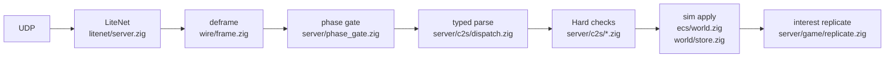

# Server authority (P4 spine)

> **What this is:** who owns sim state and which C2S gates enforce it: the P4 authority spine for join phases, validation, interest, and guard policy.

> **Related:** [ARCHITECTURE §12](ARCHITECTURE.md#12-invariants) · [ARCHITECTURE §4](ARCHITECTURE.md#4-net-stack-litenet-framing-packages) · [ARCHITECTURE §5](ARCHITECTURE.md#5-join-flow) · [STATUS](STATUS.md) · [STATE_MACHINES](STATE_MACHINES.md) · [wire/PACKAGES](wire/PACKAGES.md) · [wire/INVENTORY](wire/INVENTORY.md) · [APM](APM.md) · [SCALE](SCALE.md)

Short map of **who owns state** and the gates already on the C2S path.
ADR: [adr/0004-server-authoritative-c2s.md](adr/0004-server-authoritative-c2s.md).
Backlog depth: [TODO.md](../TODO.md) P4 section.

## Principle

Sim owns world blocks, TE contents, entity HP/alive, quests, locks, and time.
**Target** ownership of player inventory is the same; **today** the stock UI
path still trusts C2S hold/bag pushes (see below). C2S is a **request**:
validate → apply or reject → broadcast the **result**. Never apply client
**world** blobs blindly (AGENTS rule 17). Inventory: [ADR 0007](adr/0007-player-inventory-c2s-trust.md).

## Mode config

| Property | Values | Default |
|---|---|---|
| `ZdtdAuthorityMode` | `observe` \| `correct` | `correct` |

Parsed in `src/server/config.zig`, stored on `Game.authority_mode`
(`InitOptions.authority_mode`). Helper: `Game.authorityCorrects()`.

| Mode | Behavior |
|---|---|
| **correct** | Hard invariants reject/clamp (reach, phase, ownership, damage caps). Production default. |
| **observe** | Same Hard drops for join phase, reach, ownership, and damage caps. **Soft path today:** movement envelope applies client pos (no clamp, no S2C snap) and records the violation in the evidence ring; `movement_rejects` counts ENFORCED rejections only (correct mode), so observe never inflates it (T19). Other soft-only signals (ledgers, evidence) reserved. |

`permissive` is accepted as an alias of `observe`.

## Gates already in process

| Gate | Where | Notes |
|---|---|---|
| **Join phase matrix** | `phase_gate.zig` via `handlePackage` | Phases: `connecting` / `joined` / `playing` (`joined`+`entered`). Pre-play: join-SM allowlist only; since 2026-08-08 a pre-login (`connecting`) peer may only send PlayerLogin / PlayerDisconnect, so enter/spawn are unreachable without an identity. Play C2S dropped + `phase_rejects`. Always Hard. |
| **Movement envelope** | `movement.zig` on PosAndRot / RelPosAndRot | Soft max 20 m/s horizontal over server dt. **correct**: clamp + soft S2C PosAndRot snap + `movement_rejects`; **observe**: applies client pos and records the violation in the evidence ring only (no clamp, no snap, no reject count - T19). Reset on spawn/teleport. |
| **Decode validation** | PosAndRot / Speeds / RelPos | Reject NaN/Inf and out-of-range world coords at parse; `decode_rejects`. |
| **C2S bounds** | SetBlock / Explosion / TE / DamageEntity | Reach ~96 blocks; damage strength cap 200; fatal damage vs NPC only. |
| **Ownership** | Bag / InvTx / player entity id / motion pkgs | No cross-player inv writes; entity_id must match peer; `ownership_rejects`. |
| **Stack bounds** | PlayerInventory / Bag apply | Clamp slot count to items.xml `Stacknumber` (fail closed omit excess). |
| **Admin** | `guardstats` | Line 1: phase/ownership/bounds/movement/decode reject counters. Line 2: guard policy rungs + outcomes + per-slot quarantine bits. `guardclear <slot>` clears them. |
| **Player inv (interim)** | PlayerInventory / player Bag C2S | **Client-trusting apply** into ECS (ADR 0007). No S2C PlayerInventory echo. Admin `give` = loot bag drop. |
| **Interest / no self-echo** | `replicate` / scenarios | Motion and entity updates go to observers; sender does not get own PosAndRot echo. Serialize-once: ADR 0008. |
| **Rate / lock** | join IP throttle; lock channels | ~500 ms join gap (loopback exempt); TE lock holder deny + stale release. |
| **Land claim** | SetBlock | Non-owner edits inside claim denied. |
| **PvP** | DamageEntity | `PlayerKillingMode` 0 drops player→player damage. |

## Pipeline (current)

```text
UDP → LiteNet → deframe
  → phase matrix (phase_gate; connecting|joined|playing)
  → typed parse (no blind blob apply)
  → Hard checks (reach, ownership, caps, movement envelope)
  → sim apply (ecs / world store)
  → interest replicate result
```



Inv cause ledger (first cut): `World.inv_ledger` fixed ring (`ecs/inv_ledger.zig`),
causes loot|craft|give|place|eat|drop|tx|unknown; apm `inv_ledger_events`.

## Guard policy (P4)

Every detector event funnels through one choke point, `Game.noteEvidence`, which
records into the fixed 64-entry ring (`server/evidence.zig`) and then runs the
pure policy layer `server/guard_policy.zig`. The policy holds no allocator and
no wall clock: windows key off `Game.tick_n`, so scenario runs are deterministic.

**Severity ladder.** `.info` and `.soft` return `.none` *before any counter
moves*. That is the whole "weak signals never kick" guarantee: it is a property
of the control flow, not a threshold, and it has its own unit test. Only
`.strong` and `.hard` can open a gate.

**Gates (per peer, per window, default 1200 ticks = 60 s).**

- 2 **distinct** Strong detectors (repeating one detector never trips), or
- 25 **Hard** events.

One action per window: the gate latches after it fires.

**Outcome ladder** (each rung must be switched on explicitly):

| Rung | Requires | Effect |
|---|---|---|
| log-only | *default* | `guard would kick …` log + `guard_would_kicks` |
| quarantine | `guard_quarantine=true` **and** Correct mode | sets per-surface denial bits + `guard_quarantines` |
| kick | `guard_enforce=true` **and** `guard_dry_run=false` **and** Correct mode | `NetPackagePlayerDenied` then a delayed drop + `guard_kicks` |

Observe mode records and logs but never denies or drops.

**Surfaces.** `evidence.Surface` (`none|damage|container|block`) attributes each
signal to the C2S surface it was seen on, and maps 1:1 to the three quarantine
bits, so an abusive damage claim does not lock a player out of containers.
`.none` (movement, phase, reconnect flood) is unattributed and quarantines all
three. Enforcement points: DamageEntity, SetBlock, ExplosionInitiate,
TileEntity (storage + workstation), and LockRequest when acquiring a lock;
each denial bumps `quarantine_rejects`.

**Kick wire.** Stock parity: `GameUtils::KickPlayerForClientInfo` sends
`NetPackagePlayerDenied` then `disconnectLater(0.5f)` (asm.il:1918548-1918583).
zdtd sends the same body (`i32 reason | i32 apiResponseEnum | i64 banUntil |
string customReason`, asm.il:827055-827090) with reason `ModDecision` (0x10, the
honest value for a server-side policy decision) and `banUntil = 0`, then drops
the peer 10 ticks (0.5 s at 20 TPS) later. There is **no ban ladder and no ban
duration**; the IP ban list stays operator-only, and `EacViolation`/`EacBan` are
never emitted (zdtd has no EAC integration).

**Weak signal.** Per-peer block-destroy rate (`Detector.farming`, `.soft`,
surface `.block`) fires once per window past 900 destroys. The threshold is a
heuristic tuning knob, not stock-derived ground truth: nothing in the IL defines
a legitimate harvest rate. Record-only by construction.

**Load shed.** A missed 50 ms tick budget in `Game.run()` opens a 2 s valve
(`guard_load_shed`, on by default). While open, info/soft evidence records are
dropped (`load_shed_drops`) and weather + vehicle-position broadcasts are
deferred. Chunk streaming, motion replicate, WorldTime and every Hard gate are
never shed. It is a coarse availability valve, not a scheduler, and only the
real-time loop arms it.

**Evidence dump is a sample, not an audit trail.** The ring is global, 64
entries, and the policy deduplicates ring writes per (detector, surface) per
window to bound pressure from a laggy client. The exact counts that drove a
decision live in the per-peer policy state and the apm counters
(`guard_quarantines`, `guard_kicks`, `guard_would_kicks`, `quarantine_rejects`,
`load_shed_drops`), not in `evidence`.

**Quarantine is session-scoped.** A kick or disconnect resets the client slot to
`.{}`, which clears the bits, so a reconnect starts clean. Reconnect churn is
itself a `.flood` evidence signal; the kick gate, not quarantine, is the
anti-reconnect answer. Persisting bits would need a `players.zsv` schema change
and is not faked here.

**Operator switches** live in zdtd.toml `[authority]` only (Bucket B, see
`src/server/zdtd_config.zig`): `guard_enforce`, `guard_dry_run`,
`guard_quarantine`, `guard_load_shed`, `guard_window_ticks`,
`guard_strong_distinct`, `guard_hard_repeat`. There is deliberately **no**
`ZdtdGuard*` serverconfig.xml property: one obvious way to set them. Unknown
keys abort startup; out-of-range values are repaired and logged by
`Policy.clamp()` in `sanitizeInitOptions`.

## Related

- [adr/0004-server-authoritative-c2s.md](adr/0004-server-authoritative-c2s.md) principle
- [adr/0007-player-inventory-c2s-trust.md](adr/0007-player-inventory-c2s-trust.md) inv interim
- [adr/0008-serialize-once-interest.md](adr/0008-serialize-once-interest.md) interest fan-out
- [INVENTORY.md](wire/INVENTORY.md) slot layout and wire directions
- [GAME_OPTIONS.md](GAME_OPTIONS.md) for stock serverconfig knobs
- [PLUGIN_API.md](PLUGIN_API.md) hooks must not bypass these gates
- Sibling `7dtd-server-guard` is Harmony-on-stock only; outcomes reimplemented here
