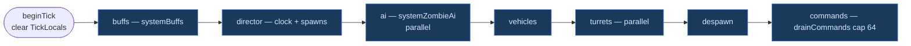

# ECS simulation architecture and systems

> **What this is:** the SoA ECS layout, schedule order, queries/groups and the per-system inventory for `src/ecs/*` — the sim plane that ticks at 20 Hz inside [ARCHITECTURE §6](ARCHITECTURE.md#6-ecs-simulation-and-schedule).

> **Related:** [ARCHITECTURE §6](ARCHITECTURE.md#6-ecs-simulation-and-schedule) · [ARCHITECTURE §8](ARCHITECTURE.md#8-interest-and-replication-serialize-once) · [STATE_MACHINES](STATE_MACHINES.md) · [GAMEPLAY](GAMEPLAY.md) · [AUTHORITY](AUTHORITY.md) · [ASSETS](ASSETS.md) · [STATUS](STATUS.md) · [GAP_ANALYSIS](GAP_ANALYSIS.md) · [APM](APM.md)

zdtd's game sim is a single **SoA entity-component-system**.

```text
src/ecs/
  entity.zig       Slot / max_entities / NetId
  components.zig   plain data types + Mask
  world.zig        SoA columns + resources + spawn + locals
  systems.zig      mutations; tickAll → schedule.run; quest phase-advance systems (questAccept*, questOn*)
  schedule.zig     Phase enum + ordered run (buffs…commands)
  locals.zig       TickLocals scratch (cleared beginTick)
  query.zig        groupSlice / copyKindInto (View scans are file-private tests)
  group.zig        cached per-Kind dense alive lists (ascending, no heap)
  command.zig      fixed tick command buffer (cap 64; drain in schedule)
  interest.zig     spatial range + dirty/serialize-once helpers
  inventory.zig    armor mitigation + inventory helpers
  inv_ledger.zig   P4 inv cause ledger (fixed ring, no heap)
  party.zig        Party/PartyManager (membership, leader, voice lobby, shared kill XP)
  rules.zig        Rules struct + overlay (ADR 0021 sim-rule surface)
  path.zig         greedy path helper (no navmesh yet)
  poi_lock.zig     quest POI lockout table (locked until unlock grace)
  quest.zig        Catalog resource types (defs from stock XML or builtin)
  buff.zig         buff stack/duration/expiry rules over the BuffSet component
  electric.zig     PowerGrid resource
  powerblocks.zig  placeable electrical block registry (id -> kind/watts)
  aidirector.zig   Director resource (clock / hordes / animals)
  root.zig         package exports
src/util/parallel.zig   range-split thread helper
```

## Review

Agent scorecard for "is this state ECS SoA, a resource, world/*, or session?":
[prompts/ecs-soa-review.md](prompts/ecs-soa-review.md).

## Model

| Concept | Implementation |
|---|---|
| **Entity** | Dense `Slot` `0..511` + stable network `NetId` (i32) |
| **Components** | Parallel SoA arrays + `Mask` presence flags |
| **Resources** | `catalog`, `power`, `director` on `World` (shared, not entities) |
| **Systems** | Pure `fn(*World, …)` in `systems.zig`; tick via `tickAll` |
| **Threads** | AI + turrets + chunk save via `util/parallel` |

### SoA columns

```text
alive, mask
transform, health, network_id, kind, flags
player, journal, wallet          // players
buffs                            // any EntityAlive (lazily attached)
zombie_ai                        // zombies
vehicle                          // vehicles
turret                           // turrets
trader_stock                     // traders (inventory on the entity)
```

### Tick order (`schedule.run` / `systems.tickAll`)

Pinned order `src/ecs/schedule.zig:order` — document order is run order; mode packs may disable a phase but never reorder it.



Detail: `src/ecs/schedule.zig:run` and [ARCHITECTURE §6](ARCHITECTURE.md#6-ecs-simulation-and-schedule). Power resolves once per tick in `Game.step` with real daylight, not inside `schedule.run`.

0. `World.beginTick`: clear `TickLocals`
1. `systemBuffs`: 20 Hz buff duration/stack tick; reports expiries to the net layer
2. `systemDirector`: clock, horde/blood-moon spawns (serial; spawns entities)
3. `systemZombieAi`: multi-threaded over slots; deferred player damage
4. `systemVehicles`: driver transform stick
5. Power: resolve stays in `Game.step` (daylight); not doubled here
6. `systemTurrets`: multi-threaded targeting; deferred zombie damage
7. `systemDespawnFar`: cull far zombies
8. `World.drainCommands`: apply deferred spawn/despawn/damage (cap 64)

Command-style systems (not every tick): `questAccept*`, `questOn*`, `trade`,
`vehicleAttach` / `vehicleControl` / `vehicleDetach`.

### Queries (`query.zig`)

Production walks cached kind lists. The open `0..max_entities` View scans
(`forEachKind` / `forEachAlive` / …) stay file-private as the test oracle that
`groupSlice` must match.

```zig
for (ecs.groupSlice(w, .zombie)) |s| { ... }   // O(live), ascending
var buf: [ecs.max_entities]ecs.Slot = undefined;
const n = ecs.copyKindInto(w, .zombie, &buf);  // snapshot; for loops that destroy
```

No heap. `copyKindInto` when the loop body spawns or destroys.

#### Groups (cached kind lists, `group.zig`)

`World.kind_groups` keeps one **slot-ascending** dense array of alive slots per
`Kind` (7 x 512 x u16 = 7 KB, no heap), maintained at the only two points that
write `alive[]`/`kind[]`: `spawnBase` inserts, `destroy` removes (plus the
idempotent `World.reviveSlot`, the single sanctioned un-kill). Because `kind[s]`
is written exactly once per entity lifetime, a slot never migrates between
groups. Stock does the same thing: `World` holds the general `Entities` index
plus maintained per-type lists (`Players`, EntityAlive, vehicle/drone/turret
trackers) added in `World::SpawnEntityInWorld` and removed in
`World::unloadEntity` (asm.il:1225261-1225262, :1234230/:1234384,
:1233956/:1234090); `GetPlayers()` just returns the cached list.

Keeping the list ascending means group iteration visits the same slots in the
same order as the open View scan, so wiring a group into a system is a pure
speedup with byte-identical results (nearest-player tie-breaks, capped despawn
id lists and turret target selection all depend on slot order).

A group slice is invalidated by the next spawn/destroy; loops that mutate the
world use `copyKindInto`. `countKind` reads the group length (one mechanism, no
parallel counter).

Wired today: `systems.snapshotPlayers` (twice per tick), the `systemTurrets`
zombie-list build, `systemDespawnFar` (via `copyKindInto`, it destroys),
`Game.tickZombieBlockDamage`, `Game.broadcastVehiclePositions`. The replicate
entity pass, motion dirty-clear and `clearDeadKnownEntities` do not use groups
either (iterating 7 kind groups would be kind-major, not slot-ascending); they
walk `World.alive_bits` / `World.dirty_bits`, word-packed sets maintained by
`spawnBase` / `destroy` / `reviveSlot` and the `markDirty` funnel, which keeps
slot order and costs O(live) or O(changed). Still an open scan: `systemZombieAi`
(its predicate is `mask.zombie_ai`, a bit mutated after spawn, so it would need
maintenance points that do not exist).

### Tick command buffer (`command.zig`)

```zig
_ = w.pushCommand(.{ .spawn_zombie = .{ .x, .y, .z, .hp } });
_ = w.pushCommand(.{ .despawn = .{ .net_id } });
_ = w.pushCommand(.{ .damage = .{ .net_id, .amount } });
// drained once at end of tickAll (also World.drainCommands)
```

Full buffer drops new ops (`dropped` counter). Systems and (later) plugins enqueue;
core applies serially so parallel AI never races spawn/destroy.

### Threading notes

- Workers only write **their own** entity slots (transform / AI / turret state).  
- Shared HP writes go through fixed-point **atomic accumulators**, then a serial
  apply pass (safe destroys).  
- Player positions are snapshotted before AI.  
- `World.saveAll` saves chunks in parallel when many are loaded.

### Queries (component matching)

No separate query DSL. Systems filter dense slots with `alive[s] && mask[s].*`.
That is the archetype/mask match path: O(capacity) scan, branch-predictable, no
LINQ-style value predicates. Interest uses spatial range on top of that.

### Concurrency path (current)

| Path | Mode |
|---|---|
| AI / turrets | range-split threads + atomic damage FP |
| Chunk save | parallel when many dirty |
| Net poll / replicate | single-threaded owner; serialize-once framed fan-out |
| World block store | not lock-free; tick-owned |

Not a third-party ECS port. Keep Zig SoA + explicit `tickAll` phases +
`util/parallel`. Zig ECS survey + steal checklist + scale brainstorm:
[../TODO.md](../TODO.md) (P3 + scale). Priority path: apm baseline → persistent
pool → dirty/serialize-once interest **[shipped]** → chunk stream workers →
sharded store.

### Serialize-once interest (M11.2)

`Game.replicate` walks entities outer, clients inner:

1. Gate with `Dirty` + `interest.needsPosSend` (dirty pos/rot or heartbeat).
2. Encode PosAndRot once; for zombies also Speeds + AliveFlags once.
3. `packages.framed` once per package kind into stack scratch.
4. Fan-out framed bytes via `sendFramedDroppable` to peers in cell range
   (no self-echo for the owning player).
5. `interest.clearAfterReplicate` clears pos/rot/spawn/flags; hp/inv/remove stay.

Spawn-on-approach still builds ECD EntitySpawn once when any peer needs it.
Chunk stream caps are named in `game.zig` (`max_streamed_chunks`,
`chunk_stream_radius_*`, `chunk_adds_per_stream_tick`, `chunk_stream_period_ticks`).

## Game wiring

`Game.sim: ecs.World` is the only sim store. Network handlers call `systems.*` and
spawn helpers; `step()` runs `tickAll` then replicates transforms.

Quest **definitions** load from stock `Data/Config/quests.xml` into `catalog`;
see [ASSETS.md](ASSETS.md). Journals and coins are **player components**.

## Systems (beyond the join core)

All of these run on the **SoA ECS** (`src/ecs/`); the schedule that runs them is the Tick order above (`schedule.run` / `systems.tickAll`), and each section names its own open items rather than implying the system is finished.

### Zombie AI (`systems.systemZombieAi` + `ZombieAi` component)

| State | Behavior |
|---|---|
| idle / wander | pick nearby wander points |
| chase / alert | path toward nearest player within sense range |
| attack | melee damage on players when in range |

LOD scales (RE-inspired): full / mid / far throttle decision rate (`1.0` / `0.3` / `0.1`).

### AIDirector (`ecs/aidirector.zig` resource + `systemDirector`)

- **World clock**: hours 0–24, day index, blood moon every 7th night
- **Wandering horde**: night spawns near players
- **Blood moon waves**: denser spawns when `day % 7 == 0` at night
- **Day scouts**: rare daytime spawns
- Broadcasts `NetPackageWorldTime` each second of sim time

### Quests (`Journal`/`Wallet` + catalog + stock wire)

**Catalog** (shared resource) is either:

- **Builtin** (no stock config): kill×3, goto (50,70,50), visit trader
- **Stock XML**: load real `Data/Config/quests.xml` via `--game-dir` / `--map` /
  `--config-dir` / `--quests` (see [ASSETS.md](ASSETS.md)); tracks
  `objective_count` and per-reward Item/LootItem flags for Quest.Write

Per-player progress is **SoA**: `journal` + `wallet` on the player entity.
Join auto-accepts `catalog.starter_id`. Systems: `questAccept*`, `questOn*`.

**Stock wire** (`src/wire/stock_quest.zig`):

| Package | Role |
|---|---|
| PlayerId PDF `QuestJournal` v5 | Starter quest when name is client-known (`quest_*` / `tier*`); `Quest.Write` FileVersion 8 |
| RewardItem/LootItem | RewardIndex u8 **+** ItemStack (not index-only) |
| `NetPackageNPCQuestList` | FetchList + `QuestPacketEntry` offers (not zdtd-native journal body) |
| `NetPackageSharedQuest` | Share/remove; server accept-by-name + forward to target |
| `NetPackageQuestObjectiveUpdate` | Stock treasure/block layout; legacy op kept for fixtures (builder in `wire/packages.zig`) |

### Traders (`trader_stock` component on trader entities)

- Spawns **Trader Jen** near map spawn as entity kind `trader`
- Stock lives on the entity (`TraderStock` column), not a side table
- **Stock** `NetPackageTraderData`: hasEntity + entityId + Vector3i + TraderData v2
  (primary ItemStack entries + markup + money)
- Opening trader advances fetch-trader / TurnIn quests (sim); offers via NPCQuestList

### Buffs (`BuffSet` component + `systemBuffs` + `ecs/buff.zig`)

- Catalog: `assets/buffs.zig` (typed `stack_type`, `duration`, `update_rate`
  seconds → `UpdateRateTicks`, `remove_on_death`), builtin subset without buffs.xml
- Runtime: fixed 8-slot `BuffSet` attached lazily per entity; the rules mirror
  stock `EntityBuffs`/`BuffClass`/`BuffValue` tick-for-tick (Invalid → Finished →
  Remove → Paused/dead → Started → DurationTick), 20 Hz counting **up**, and
  `DurationMax <= 0` never expires
- Stack rules (`BuffEffectStackTypes`): Ignore revives a pending removal,
  Duration extends by the remainder, Effect increments `stackEffectMultiplier`
  (saturating at 255), Replace restarts the timer. No `stack_type` means Ignore
- Wire (`src/wire/stock_buff.zig`): `NetPackageAddRemoveBuff` body and the
  `EntityBuffs` blob (version 3). Join sends every other player's full list as
  `NetPackageEntityStatsBuff` (remote-only on the client), since a late joiner
  missed the relays
- C2S is validated (own entity only, name must resolve) then relayed to the other
  peers; expiries fan out from the tick. Relays always send `duration = -1`:
  any value >= 0 calls `BuffClass::set_DurationMax` on the receiving client and
  retunes that buff class for every entity for the rest of its session
- Not shipped: the `triggered_effect` VM (the client runs it from its own
  buffs.xml), the blob's cvar section, immunity/damage-type gates, buff
  persistence across sessions, and therefore `PlayerDataFile.buffData` (still
  written as length 0)

### Chat / attach / collect

- Stock `NetPackageChat` (Global); SimpleChat upgraded to Chat
- `NetPackageEntityAttach` for vehicle mount/dismount: the client sends type 0/2,
  the server resolves the seat and answers everyone with type 1/3 (asm.il:844722)
- `NetPackageEntityCollect` entityId+playerId fan-out

### PackageIds

Join-stable prefix plus large stock name list in `packages.default_mappings`
(dynamic ids at runtime; never hard-code ids as permanent).

### Vehicles (`Vehicle` component + `systemVehicles`)

- Kinds: bicycle, minibike, motorcycle, 4x4, gyrocopter
- Mount / dismount / drive (throttle + steer); fuel burn; every seated rider's
  transform sticks to the vehicle
- Seats: `seat0..seatN` from vehicles.xml (`Vehicle::SetSeats`, asm.il:1344168).
  Seat 0 drives, 1..n-1 ride. Base counts: Bicycle/Minibike/Motorcycle 1,
  Gyrocopter 2, Truck4x4 4
- Wire: `NetPackageVehicleSpawn` (native control body), `VehiclePositions`,
  `VehicleDataSync` (stock framing, opaque payload relayed)

### Electricity (`ecs/electric.zig` PowerGrid resource)

- Nodes: generator, battery, relay, consumer
- Undirected wires; BFS power flood from generators
- Overload: consumers unpowered when load > generation
- Gates: `is_trigger` plates open on player step for their stock
  TriggerPowerDelay/Duration; `is_switch` blocks open while latched on
- Wire: `NetPackageWireActions` / `WireToolActions` (connect, toggle, add node)
- Wire: `NetPackageTileEntity` carries TileEntityPoweredTrigger ClientTriggerData
  (delay/duration/reset in, authoritative state out)
- Wire: grid state reaches clients as edge-triggered `NetPackageSetBlock` bodies
  rewriting BlockValue meta bit 0x1 (isPowered) and 0x2 (isOn)

### Turrets (`Turret` component + `systemTurrets`)

- Require **power** from the grid; auto-acquire zombies in range; fire + ammo
- Kills feed quest kill counters for joined players
- Wire: `NetPackageTurretSpawn`, `TurretSync`
- Default map: gen + turret wired near spawn


### Weather (`src/world/weather.zig` + `NetPackageWeather`)

Storm and blood-moon weather groups run as a state machine driven from
biomes.xml, with the per-biome parameters (temp, precipitation, cloud, wind, fog)
on the raw 0..100 XML scale the client divides by 100. The package carries one
entry per biome with no count prefix, so the body length must match what the
client's `biomeWeather.Count` expects, and `groupIndex` is clamped because
`BiomeDefinition::SetWeatherGroup` indexes unchecked. Storm state persists
across a restart (`weather.zwt`, ZWTH1, restored at init over the fresh seed);
there are still no `ForceWeather` / `SetStorm` admin commands.

### Pathfinding (`src/ecs/path.zig`, used by `systemZombieAi`)

Grid A* over a body-aware step predicate that models step-up, drop and headroom,
so a wall, a POI roof and a crawlspace are all impassable while a slope is not.
Results fill an 8-cell waypoint buffer, and the search runs under a deterministic
per-tick node budget so the 20 Hz tick cannot be blown by one hard path.

The predicate replaced a boolean hook that asked `isSolid(heightAt + 1)`, which
is false for every column by construction, because `heights` is maintained as the
topmost non-air block. The pathfinder therefore used to see an open world
everywhere.
Open: navmesh parity, jump and climb, data-driven per-class task graphs.

### Gamestage (`src/assets/gamestages.zig`)

Computed from level, days survived and deaths with party weighting, and consumed
by sleeper volume groups, the blood-moon spawner tier, daytime scout tiers and
loot probability bands. Several stock inputs are parsed but not applied; the list
is in [GAP_ANALYSIS.md](GAP_ANALYSIS.md) under the gamestage subsection.

### Honesty

This file describes shape, not completeness. For what actually works, what is
partial and what is missing, with anchors, use
[GAP_ANALYSIS.md](GAP_ANALYSIS.md); it is rescored against the code rather than
written from intent. The ranked follow-up work is in
[WORK_PLAN.md](WORK_PLAN.md).

Systems land in layers: an IL-grounded core first, then depth. Every section
above names its own open items rather than implying the system is finished.


## Adding a system

1. Component data in `components.zig` + `Mask` bit + SoA field on `World`.  
2. Spawn helper sets mask bits.  
3. `systemFoo` / command fn in `systems.zig`; call from `tickAll` if needed.  
4. Package handlers in `server/game.zig` call systems only.
