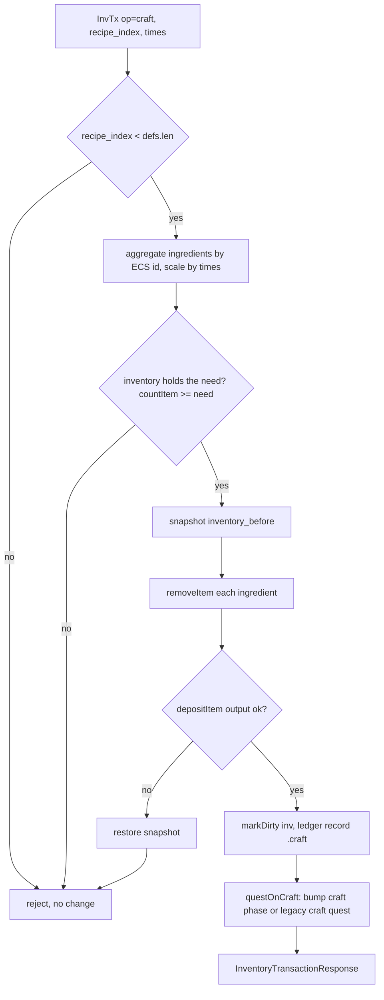
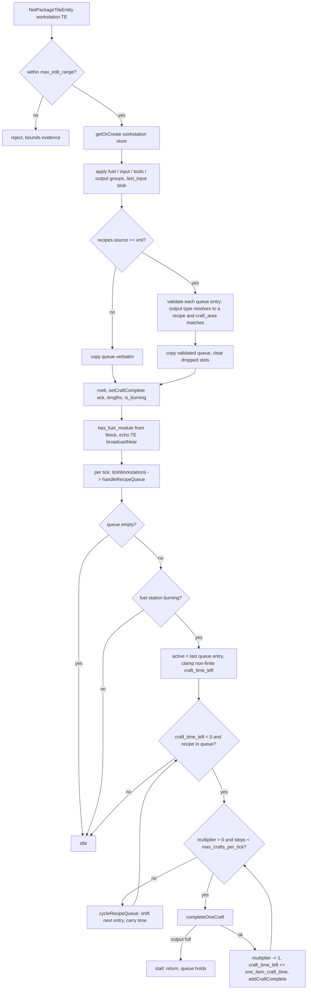
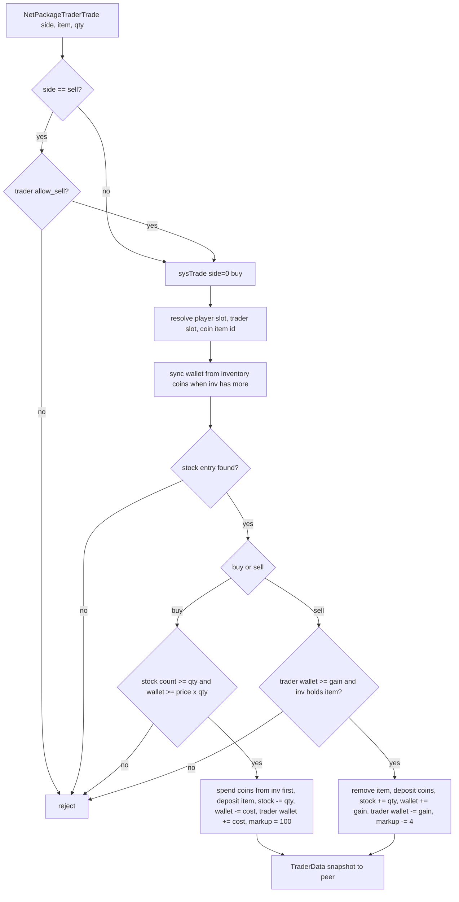
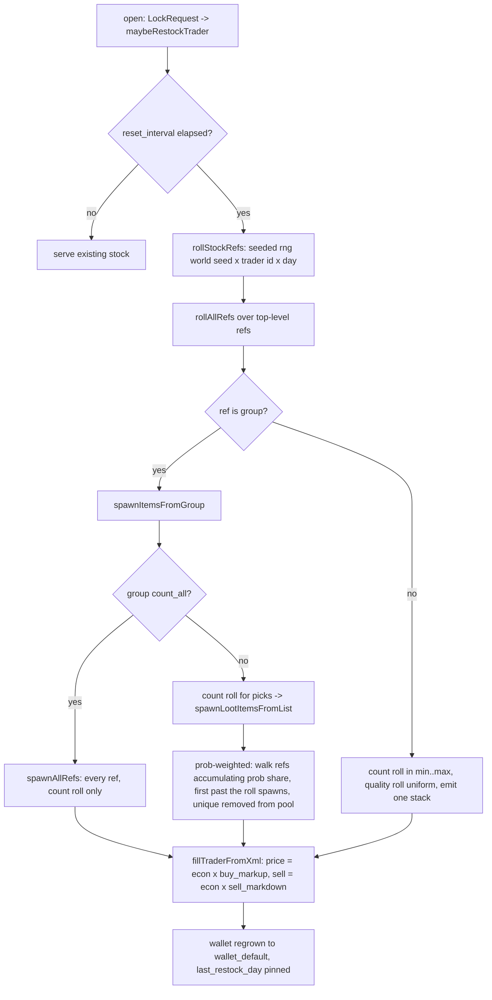
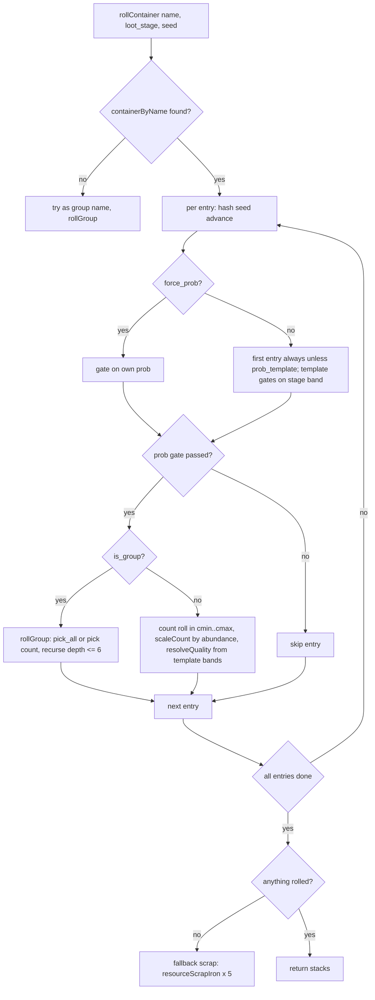
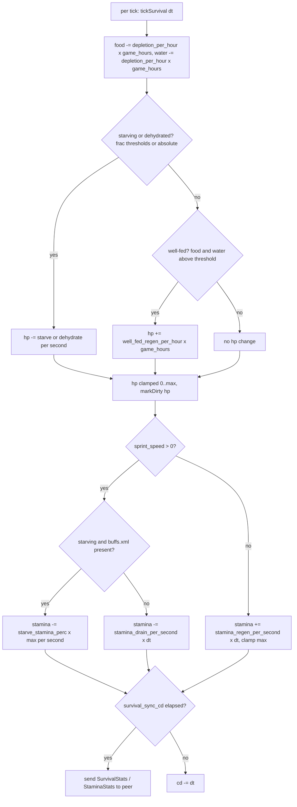
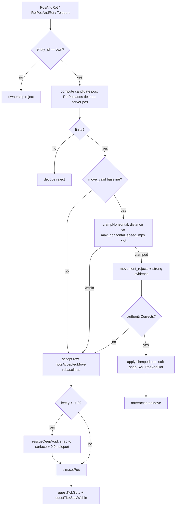

# Gameplay behavior flows

The core gameplay behaviors as flows (what happens when a player crafts,
trades, rolls loot, survives or moves). Lifecycle state machines (join, quest,
weather, blood moon window, power, sleepers, trader hours, party, vending
rent, buffs, guard policy) live in [STATE_MACHINES.md](STATE_MACHINES.md); this
file covers the flow shapes that are not state lifecycles. The `src/` anchors
are the authority when a diagram and a comment disagree.

## 1. Craft (player inventory)

`NetPackageInventoryTransactionRequest` with `op = craft` (c2s/inv.zig:480)
calls `tryCraft` → `tryCraftRecipe`. Ingredients are aggregated by ECS item id
so duplicate or alias ingredient lines are not double-counted; the whole
transaction is atomic over a snapshot of the bag. On success the output goes
to the inventory, the ledger records a `.craft` cause, and quest craft
progress bumps.

Anchors: `src/server/c2s/inv.zig:480` (craft op dispatch),
`src/server/game.zig:3779` (`tryCraft`), `:3784` (`tryCraftRecipe`),
`src/ecs/systems.zig:443` (`questOnCraft`). `times` is clamped to
`craft_max_times`; zero means one. Any missing ingredient name or an output
that fails to deposit restores the exact pre-craft bag.

## 2. Workstation queue craft

The client sends the workstation `TileEntity` (type 12) and the server applies
it to the workstation store, then the per-tick `handleRecipeQueue` advances
the queue. With stock recipes.xml loaded, queued outputs are validated: the
output type must resolve to a recipe and that recipe's `craft_area` must match
the station's `CraftingAreaRecipes`, so a modified client cannot queue a forge
output on a campfire.

Anchors: `src/server/c2s/inv.zig:337` (workstation TE apply), `:350`
(`getOrCreate`), `src/world/workstations.zig:236` (`handleRecipeQueue`), `:274`
(`completeOneCraft`), `:285` (`addCraftComplete`), `:339`
(`cycleRecipeQueue`), `:361` (`addOutput`), `src/server/game.zig:3884`
(`tickWorkstations`, also feeds the heat map).

Notes: `max_crafts_per_tick = 64` bounds one tick; a non-finite or huge
client-written `CraftingTimeLeft` is clamped to `max_craft_backlog`.
`addCraftComplete` merges by crafted item and drops the oldest entry at cap;
`setCraftComplete` replaces the record list with what the client acknowledged.

## 3. Trade buy / sell

`handleTrade` parses `NetPackageTraderTrade` and delegates to
`systems.trade`. The server owns the prices (from `fillTraderFromXml`), the
coin wallet and the trader money pool; the client's post-trade `TraderData`
copy is mirrored back (`applyTraderDataCopyFrom`) and re-broadcast. A sell is
refused once the trader's money pool runs out; a buy demand spike sets the
entry markup to +100, a sell eases it by 4.

Anchors: `src/server/trade.zig:78` (`handleTrade`), `src/ecs/systems.zig:664`
(`trade`), `src/server/trade.zig:117` (`applyTraderDataCopyFrom`),
`src/server/game/trader.zig:167` (`fillTraderFromXml` prices),
`src/server/trade.zig:26` (`stockEntries`, markup on the wire).

## 4. Trader inventory roll

Stock `TraderInfo::Spawn` port. Restock is lazy: opening the trader window
(`LockRequest`) calls `maybeRestockTrader`, which rolls fresh stock only when
the `ResetInterval` has elapsed (never / daily / every N days). The roll is
deterministic: `XorShift32` seeded from world seed, trader id and day. Every
top-level ref always spawns; group refs expand with prob-weighted picks and
unique-only removal; each item rolls a count and (when the XML set one) a
uniform quality.

Anchors: `src/assets/traders.zig:134` (`rollAllRefs`), `:176`
(`spawnLootItemsFromList`), `:205` (`spawnItemsFromGroup`), `:228`
(`spawnItem`), `:243` (`randomSpawnCount`), `src/server/game/trader.zig:141`
(`rollStockRefs`), `:167` (`fillTraderFromXml`), `:204`
(`maybeRestockTrader`), `src/ecs/systems.zig:751` (`traderRestock` daily
timer).

## 5. Loot roll pipeline

`rollContainer` fills a world container (or loot-bag table) from loot.xml.
The container's entries iterate in document order; the first entry always
rolls unless it carries a loot-stage template (a template's prob is the stage
gate itself). Group entries recurse into `rollGroup`: `pick_all` groups emit
every entry, others roll a pick count then pick entries prob-weighted. Every
picked entry still clears its loot-stage band. Quality comes from the
container's quality template: first band matching `loot_stage`, then
prob-weighted quality picks.

Anchors: `src/assets/loot.zig:196` (`rollContainer`), `:262` (`rollGroup`),
`:142` (`probGate`), `:123` (`resolveQuality`), `:154` (`scaleCount`),
`src/server/chunk_stream.zig:247` (`fillContainerFromLoot` feeds the stacks
into a container and stamps `touched_day`). The loot stage is the party loot
stage (`game.zig:4225`); the seed is deterministic per position and respawn
cycle (see [STATE_MACHINES.md#17-loot-respawn](STATE_MACHINES.md#17-loot-respawn)).

## 6. Survival and stamina

Per tick, per joined client. Food and water deplete by in-game hours; the
stage thresholds come from `buffs.xml` (`buffStatusCheck01` hungry/thirsty
fractions of max) when the table is loaded, else `Rules.progression`
absolutes. Starvation/dehydration drains HP, well-fed regens it. Stamina
drains only while `sprint_speed > 0` (set by `NetPackageEntitySpeeds`
movement state 3, lapsed by `sprint_stale_seconds`) and regens otherwise.
Changed stats sync at `survival_sync_seconds` cadence.

Anchors: `src/server/game/tick.zig:23` (`tickSurvival`), `src/assets/buffs.zig:396`
(`survival()` resolves thresholds and per-second HP loss), `src/ecs/rules.zig:169`
(`progression` defaults: depletion, starvation, well-fed, stamina drain/regen,
sync cadence), `src/server/c2s/move.zig:156` (sprint state from
`NetPackageEntitySpeeds`).

## 7. Blood moon schedule

The blood moon window (scheduled day, dusk start, party stage freeze, dawn
end) is a state lifecycle and is covered in STATE_MACHINES section 6 with the
`WorldClock` transitions. Gameplay-relevant notes that belong to flows:
`Director.bm_stage_frozen` latches the party gamestage at dusk and clears at
dawn (`src/ecs/aidirector.zig:333`); one horde wave spawns per party every 6 s
(`:344`); horde zombies teleport back to their party focus past 150 m. See
[STATE_MACHINES.md#6-blood-moon-window](STATE_MACHINES.md#6-blood-moon-window).

## 8. Movement authority

C2S movement (`PosAndRot`, `RelPosAndRot`, `Teleport`) goes through
`applyMovementEnvelope`. The envelope is a horizontal speed gate over the
server's dt: within budget the move is accepted and rebaselines the gate;
over budget it is rejected, counted as strong evidence, and in Correct mode
the client gets a soft snap back to the clamped position. A Y below -1.0
(void) is rescued to the DTM surface.

Anchors: `src/server/c2s/move.zig:20` (PosAndRot handler), `:107` (RelPos
handler), `:172` (Teleport handler), `src/server/game.zig:1536`
(`applyMovementEnvelope`), `src/server/movement.zig:39` (`clampHorizontal`),
`src/server/game.zig:1503` (`noteAcceptedMove`, rebaselines and fires
pressure plates), `:2956` (`rescueDeepVoid`), `src/server/c2s/move.zig:156`
(`NetPackageEntitySpeeds` sprint state).

Notes: the gate is `move_valid` false after spawn/teleport (`resetMoveEnvelopePeer`,
`game.zig:1524`), so the first move after a sanctioned teleport always
rebaselines; dt is floored at 1/40 s and capped at 1 s so a single packet
cannot jump the whole map. Observe mode counts the violation but still applies
the client position.
