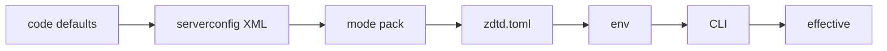

# Server game options (serverconfig.xml)

> **What this is:** how stock `serverconfig.xml` properties map into the sim and the precedence that decides the effective value (CLI > env > zdtd.toml > mode pack > serverconfig XML > code defaults). Stock names, stock defaults, applied wiring.
> **Related:** [ARCHITECTURE.md](ARCHITECTURE.md) §10 · [ZIG_CLONE.md](ZIG_CLONE.md) · [RULES_CONFIG.md](RULES_CONFIG.md) · [AUTHORITY.md](AUTHORITY.md) · [PLUGIN_CONFIG_DISPOSITION.md](PLUGIN_CONFIG_DISPOSITION.md) · [serverconfig.example.xml](../serverconfig.example.xml)

`src/server/config.zig` parses the stock `serverconfig.xml` `<property>` list.
Every gameplay option below is read with the same name/default as the stock
dedicated server and **applied to the sim** (`game.initWithOptions` + runtime
systems). Out-of-range values are clamped (see `clampU8` / `clampRange` and the
config tests).

Example template: [`serverconfig.example.xml`](../serverconfig.example.xml).

## Loading and precedence

| Source | Role |
|---|---|
| CLI (`--port`, `--mode`, `--admin-port`, `--webui-port`, `--world-name`, …) | Highest; overrides matching file keys |
| Env `ZDTD_WEBUI_SECRET` | Web UI secret when `--webui-secret` is unset (prefer env: not in `ps`) |
| `<world>/zdtd.toml` then CWD `zdtd.toml` | stream/authority/feature/sim/plugin + optional `[mode] name`; first existing file wins; **fatal** if present but unreadable |
| Mode pack `modes/<name>.toml` | When `--mode` or `[mode] name` is set: data-only InitOptions + `[rules.*]` sim-rule overrides (after serverconfig, before stream keys; `zdtd.toml` wins on a rules key) |
| `--serverconfig path` | Stock-like XML; **fatal** if the path cannot be read |
| Code defaults | Used when neither CLI nor file sets a value |

Startup prints a one-line effective summary (`password=set|open`, never secrets).
The console binds **127.0.0.1 only** unless `TelnetPassword` is set, matching
stock `TelnetConsole::.ctor`; a password is the only way it leaves loopback.
`ServerMaxPlayerCount` is applied to GSI ads and soft join capacity (capped at 64).
Out-of-range serverconfig values are clamped with a stderr warning (not silent).
Non-numeric values for applied integer keys keep the previous default and print
a named stderr warning (same shape as invalid `ServerPort`). Unknown stock
properties are ignored (stock configs have many keys zdtd does not apply).
Near-miss typos of applied keys (edit distance ≤2) print a stderr hint.
TCP listen collisions among ServerPort, AdminPort/TelnetPort, and webui port
abort startup (LiteNet uses UDP port+2 and is not checked against TCP).
`zdtd.toml` / mode-pack stream knobs are sanitized after merge even when no
toml file is present. Invalid authority modes and mode-file name mismatches
abort startup. Operator config reads are size-bounded (1 MiB serverconfig,
256 KiB zdtd.toml, 64 KiB mode pack). Webui listen failures abort startup.

Ground: `src/server/config.zig` (XML parse + `applySandboxCode` + clamps), `src/ecs/rules.zig` (`Rules` floors), `src/server/zdtd_config.zig` + `src/util/toml_bind.zig` (toml overlay).

## Applied to the sim

| Property | Default | Range | Effect + where |
|---|---|---|---|
| `GameDifficulty` | 2 | 0..5 | zombie hp scale 0.5×–2.0× (`Director.hpScale`) |
| `BloodMoonFrequency` | 7 | 0..255 | blood moon every N days; 0 disables (`WorldClock.isBloodMoonNight`) |
| `BloodMoonRange` | 0 | 0..15 | deterministic ±day jitter of the blood-moon day per cycle |
| `BloodMoonEnemyCount` | 8 | 0..60 | zombies per blood-moon spawn burst |
| `PlayerKillingMode` | 3 | 0..3 | 0 drops player→player `DamageEntity` (PvP off) |
| `DayNightLength` | 60 | 10..1200 | real minutes per full day → `WorldClock.seconds_per_hour` |
| `DayLightLength` | 18 | 1..23 | daylight window; dawn 04:00, dusk = 4 + value |
| `MaxSpawnedZombies` | 64 | 0..2048 | server-wide alive-zombie cap (`Director.max_alive`); 0 = no zombie spawns |
| `MaxSpawnedAnimals` | 50 | 0..2048 | daytime wildlife cap + spawner (`Director.spawnAnimalsNearPlayers`) |
| `ZombieMove` / `ZombieMoveNight` / `ZombieFeralMove` / `ZombieBMMove` | 0/3/3/3 | 0..4 | zombie speed per day/night/feral/blood-moon → `World.zombie_speed_scale` |
| `EnemyDifficulty` | 0 | 0..1 | 1 = feral (always feral speed) |
| `LootAbundance` | 100 | 1..1000 | percent multiplier on rolled loot stack counts (`LootTable.scaleCount`) |
| `LootRespawnDays` | 7 | 0..365 | days after a world container is touched until it re-rolls loot on its next open (0 = never respawn; `Game.loot_respawn_days`, `maybeRespawnContainer`) |
| `XPMultiplier` | 100 | 1..1000 | scales server XP awarded per kill (`Game.awardXp`, `Client.xp`) |
| `BlockDamagePlayer` | 100 | 1..1000 | scales player dig damage in `NetPackageSetBlock` |
| `BlockDamageAI` | 100 | 0..1000 | zombies chew through cover blocks (`tickZombieBlockDamage`) |
| `BlockDamageAIBM` | 100 | 0..1000 | as above during a blood moon |
| `AirDropFrequency` | 72 | 0..8760 | game-hours between supply-crate drops; 0 off (`tickAirDrop`) |
| `DropOnDeath` | 1 | 0..4 | 0 nothing / 1 all / 2 toolbelt / 3 backpack / 4 delete → loot bag on death |
| `LandClaimSize` | 41 | 1..255 (odd) | keystone protection area; even values forced odd |
| `LandClaimOnlineDurabilityModifier` | 4 | 0..64 | own-claim block hp ×N while owner online |
| `LandClaimOfflineDurabilityModifier` | 4 | 0..64 | own-claim block hp ×N while owner offline |
| `LandClaimExpiryDays` | 3 | 0..365 | offline days without owner online before claim is released (0 = never; `Game.land_claim_expiry_days`) |
| `ServerPort` | 26902 | 0..65533 | TCP GameServerInfo; LiteNet = port+2 (CLI `--port` wins); values above 65533 abort startup |

| `ServerMaxPlayerCount` | 8 | 1..64 | GSI max + soft join cap |
| `ServerPassword` | empty | string | LiteNet Connect key; empty = open |
| `ViewRadius` | 7 | 1..16 | stream / interest seed radius |
| `GameName` / `GameWorld` | zdtd / empty | string | world identity / stock map folder under `--game-dir` |
| `AdminPort` | 0 | u16 | zdtd alias for the console port; 0 = off |
| `TelnetEnabled` | false | bool | enable the stock telnet console (`TelnetPort` then wins over `AdminPort`) |
| `TelnetPort` | 0 | u16 | stock telnet port; 0 = off |
| `TelnetPassword` | empty | string | empty = no login and loopback bind; set = stock login prompt and INADDR_ANY bind |
| `TelnetFailedLoginLimit` | 10 | 1..255 | failed logins before the session is dropped |
| `TelnetFailedLoginsBlocktime` | 10 | 0..1440 | minutes a source address stays blocked (login lockout enforced in `admin.zig` auth; 0 = no lockout) |
| `ZdtdAuthorityMode` | correct | observe\|permissive\|correct | C2S Hard reject ladder; see [AUTHORITY.md](AUTHORITY.md) |
| `SandboxCode` | empty | string | Stock sandbox code (EnumGamePrefs.SandboxCode 296): one string encoding all 165 sandbox options, echoed verbatim into the GameStats(71) blob so a joining client decodes the server's gates (TemperatureSurvival, StormFreq, blood-moon settings) instead of its own defaults (RE sandbox-options §8). Also decoded server-side by `config.zig applySandboxCode`, which overlays the operator's tuning (XP, block damage, blood moon, day length, zombie speeds) on the sim from the embedded stock value sets (§2.1). Malformed codes leave client defaults, exactly like stock |
| `SandboxPreset` | empty | string | Sandbox preset NAME (295) for the server-browser display and stock-settings check; not used to load values. Advertised in the GSI GameInfoString (SandboxPreset = 0x12, SandboxCode = 0x13) when set; unset keys are omitted (empty = client default) |

### Web UI (CLI / env; WU0–WU2 shipped)

| Flag / env | Default | Notes |
|---|---|---|
| `--webui-port` | 0 | HTTP ops UI; 0 = off. Requires a secret. Design: [WEBUI.md](WEBUI.md) |
| `--webui-bind` | `127.0.0.1` | IPv4 loopback only; use a TLS reverse proxy for remote access |
| `--webui-secret` | empty | Bearer / `X-Zdtd-Secret` / login form; min 8 chars; visible in `ps` (prefer env) |
| `ZDTD_WEBUI_SECRET` | unset | Used when CLI secret is empty; refuse start if port≠0 and both empty; min 8 chars |

`GET`/`HEAD` `/healthz` is unauthenticated liveness. `GET`/`HEAD` `/readyz` is unauthenticated readiness and returns 503 until the first live tick snapshot. Dashboard + `POST /api/cmd` (admin verbs) need secret; CSRF field required for cookie-only sessions. `Accept: text/plain` on `/api/cmd` returns a plain body instead of an HTML fragment.

### zdtd.toml (operator tunables)

Template: [`zdtd.toml.example`](../zdtd.toml.example). Loaded from
`<world>/zdtd.toml` if present, else CWD `zdtd.toml`. Parser:
`src/server/zdtd_config.zig`. Unknown keys and malformed assignments abort
startup so misspelled operator settings cannot silently use defaults.

| Section | Keys (subset) | Effect |
|---|---|---|
| `[stream]` | `max_streamed_chunks`, `stream_radius_min/max`, `chunk_adds_per_stream_tick`, `chunk_stream_period_ticks`, `motion_replicate_period_ticks`, `world_time_send_ticks`, `vehicle_pos_send_ticks`, `sleeper_tick_ticks`, `turret_sync_ticks`, `save_interval_ticks`, `spawn_area_radius_max` | Chunk stream caps (clamped to compile cap 169) + broadcast/side-work cadences in ticks. `sleeper_tick_ticks` gates prefab sleeper volumes, airdrops and workstations; `turret_sync_ticks` gates turret state broadcasts; `save_interval_ticks` gates the periodic world flush |
| `[authority]` | `interest_range_blocks`, `max_edit_range_blocks`, `max_horizontal_speed_mps`, `max_claimed_damage`, `peer_stale_ms`, `lock_stale_ms`, `join_rate_limit_ms`, `mode`, `guard_enforce`, `guard_dry_run`, `guard_quarantine`, `guard_load_shed`, `guard_window_ticks`, `guard_strong_distinct`, `guard_hard_repeat`, `guard_kick_delay_ticks`, `guard_shed_hold_ticks`, `guard_weak_break_rate` | C2S range / interest / mode. `join_rate_limit_ms` (default 500) paces connection attempts per IP like stock's ~500 ms/IP flood gate; loopback is exempt so bots and tests share 127.0.0.1. `lock_stale_ms` (default 120 000 ms = 120 s) auto-releases a container/trade lock after the peer goes silent. The `guard_*` keys are the P4 guard policy (defaults log-only, dry-run on); `guard_kick_delay_ticks` (default 10 = stock `disconnectLater(0.5f)`), `guard_shed_hold_ticks` (default 40 = 2 s valve hold) and `guard_weak_break_rate` (default 900 destroys/window) tune the policy ladders; see [AUTHORITY.md](AUTHORITY.md) |
| `[feature]` | `wire_chunks`, `deco_trees`, `deco_mirror`, `deco_objects_per_join`, `block_id_mapping` | `wire_chunks`: stream NetPackageChunk (default true). `deco_trees`: join-time deco burst (default true); false sends the empty firstPackage only. `deco_mirror`: write placed deco into the block store so collision and harvest match the client (default true). `deco_objects_per_join` (default 8192): cap on join-time deco objects sent in the burst. `block_id_mapping`: send the full `blocks` NameIdMapping before the config files so block ids are negotiated instead of trusted (default true); false for a modded client whose block set differs from ours |
| `[perf]` | `async_chunk_flush`, `terrain_snapshot`, `job_batches` | Performance switches, all default false. Each ships with an always-on apm section/counter that must show the cost before it is worth enabling; see `docs/SCALE.md` |
| `[apm]` | `dump_every_s` | Periodic apm snapshot dump cadence in seconds (default 60 = the historic `apm_report_period_ticks`; 0 disables the periodic dump). See `docs/APM.md` |
| `[sim]` | `trader_wallet_dukes`, `min_chat_gap_ns`, `inv_bucket_cap`, `inv_refill_ns`, `block_bucket_cap`, `block_refill_ns`, `min_damage_gap_ns`, `damage_burst_max`, `trader_restock_cap`, `trader_restock_refill`, `craft_max_times`, `sleeper_party_radius`, `storm_frequency`, `te_scan_block_cap`, `te_scan_te_cap`, `workstation_crafts_per_tick`, `workstation_craft_backlog`, `trader_use_range`, `party_shared_kill_range`, `storm_bm_push_ticks`, `sleeper_cap_gate_enabled`, `airdrop_schedule`, `airdrop_day_min`, `airdrop_day_max`, `airdrop_drop_hour`, `airdrop_loot_list` | `trader_wallet_dukes`: Trader `AvailableMoney` display pool (default 5000). Not stock data: `traders.xml` has no wallet key; stock `AvailableMoney` is engine-managed per-day, and zdtd credits the player wallet directly. The rest are per-peer anti-abuse gates: chat broadcast gap, inv/block token bucket shape (mono-ns refill), and the damage-accept gap + burst cap. `trader_restock_cap`/`trader_restock_refill` set the trader restock refill policy (stackables grow toward the cap by at most the refill per restock). `craft_max_times` (default 20) bounds a single InvTx craft batch request. `sleeper_party_radius` (default 100 m) is the sleeper wake/stage radius (`CalcGameStageAround`, asm.il ~1093363; stock uses the volume box + party stage, provenance PROVENANCE.md §3.7). `storm_frequency`: `World::StormFrequency` percent (default 100 = 1.0x; 0 disables storms). V3.1.0 ships no serverconfig key for it (world state in the GameStats blob), so this is the zdtd.toml surface; it feeds both the weather scheduler divisor and the wire value the client is told. `te_scan_block_cap`/`te_scan_te_cap` (default 32/48) bound the per-chunk storage/prefab TE scan. `workstation_crafts_per_tick` (default 64) and `workstation_craft_backlog` (default 60 s) bound the workstation craft catch-up.  `trader_use_range` (default 32) is the trader/vending open-and-echo reach gate (`trader_wire.zig`; closes the rewrite-a-trader-from-anywhere vector). `party_shared_kill_range` (default 100) is the party shared-kill XP credit range (stock GameStats[54] default, no serverconfig key). `storm_bm_push_ticks` (default 5000) pushes storms past a horde night (weather.zig). `sleeper_cap_gate_enabled` (default false) restores the stock sleeper global spawn gate (CanSpawn 2.1x MaxSpawnedZombies) instead of the documented zdtd divergence. `airdrop_schedule` = "interval" (default; every `AirDropFrequency` game-hours) or "days" (stock-like day-count + TOD: every `airdrop_day_min..airdrop_day_max` days at `airdrop_drop_hour`, defaults 3/3/12); `airdrop_loot_list` (default "airDrop") is the loot.xml container for the crate. Defaults match the previous code constants |
| `[mode]` | `name` | Select gamemode pack `modes/<name>.toml` (CLI `--mode` wins) |
| `[rules.combat]` / `[rules.ai]` / `[rules.bloodmoon]` / `[rules.director]` | any `Rules` field | Sim-rule overlay (ADR 0021), merged over the mode pack so `zdtd.toml` wins; see the `[rules]` section below |
| `[plugin]` | `modules`, `fuel`, `max_pages` | Comma-separated `.wasm` paths for the Wasm plugin runtime (ADR 0020, [PLUGIN_DEV.md](PLUGIN_DEV.md)); empty default = no Wasm plugins. `fuel` (default 100000000) is the per-instance fuel budget, armed once at instantiate and never re-armed (a module spending ~10k/tick silently disables after minutes; lower to bound a hostile guest). `max_pages` (default 1024) caps linear memory per instance |
| `[quests]` | `objective_kinds`, `default_kill_count`, `kill_per_tier`, `goto_radius`, `stay_radius`, `poi_min_dist`, `poi_max_dist`, `max_poi_attempts`, `poi_bed_lockout_radius`, `trader_band_1`, `trader_band_2` | Quest data policy (ADR 0021): the objective `type=` → phase-kind mapping (comma-separated `Type=PhaseKind`, config rows win over the builtin stock table; a new stock objective type is a row here, not a code change), the kill-count default for objectives with no explicit `value` (`default + tier * per_tier`), and the goto/stay radius fallbacks when an objective omits its distance (the parsed `value` still wins). `poi_min_dist`/`poi_max_dist` (default 32/2000) set the POI selection distance band for random-POI-goto objectives and `max_poi_attempts` (default 50) bounds the search loop (RE ObjectiveRandomPOIGoto). `poi_bed_lockout_radius` (default 32) is the respawn-bed lockout radius around a POI center; `trader_band_1`/`trader_band_2` (default 500/1500) are the GetRandomPOINearTrader distance band boundaries. Provenance: PROVENANCE.md §3.7 |
| `[bots]` | `shoot_damage`, `headshot_multiplier`, `spawn_spread`, `spawn_y`, `max_step_up`, `arrival_dist`, `shot_range_slop`, `weapon_profiles` | Host-side FPS bot policy (ADR 0026): the `bot shoot` damage floor, the headshot multiplier (clanker parity), the `bot count`/`bot spawn` spawn spread + default Y, and the move step-up cap. `weapon_profiles` (empty = builtin pool) is the host loadout as `tag:damage:range:pellets,...` (up to 8 guns). `bot_max_hp` is fixed at 100 (wasm guest contract). Defaults match the pre-config constants |

### `[rules]` sim rules (mode packs and zdtd.toml)

ADR 0021: the sim's rule parameters live in one `Rules` struct
(`src/ecs/rules.zig`) read as `w.rules.<group>.<field>`. Both a mode pack and
`zdtd.toml` can set them under `[rules.<group>]` sections (dotted keys); the
binder reflects the struct, so this table is the struct and the struct is the
parser (adding a tunable is one field + one row). Precedence for a key set in
both: **zdtd.toml wins over the mode pack** (operator wins), matching the
top-level order.

Defaults equal the pre-move code constants (pinned by the `Rules` defaults
test, so a retune cannot land silently).

| Section / key | Default | Floor / policy |
|---|---|---|
| `[rules.systems]` | | Which sim systems run. All default `true`, so the default pipeline is the stock one. A disabled system is skipped, not stubbed: its slice of `TickResult` stays zero. Order is not configurable (it encodes a real dependency: buffs before ai) |
| `buffs` | true | Off means no buff ever ticks down |
| `director` | true | Off stops **spawning only**. The director owns the world clock, the blood-moon flag and the daily trader restock, so time still advances |
| `animals` | true | Off stops daytime wildlife (stock SpawnManagerBiomes is a system separate from the AIDirector, spawning.md §2); independent of `director` so a no-zombie mode can keep animals |
| `ai` | true | Off means zombies never select or run a task |
| `vehicles` | true | |
| `turrets` | true | |
| `despawn` | true | Off means spawns accumulate; pair with `director = false` or a lower cap |
| `stealth` | true | Player stealth-noise model (RE entity-ai.md PlayerStealth): consumes the movement-noise ring, accumulates per-player noise volume, wakes sleepers at the volume cap, feeds the heat map. Off means relayed/server sounds never alert AI |
| `commands` | true | Off means queued `SimCommand`s (plugins, admin) are never applied. Leave on unless the mode owns the queue |
| `[rules.combat]` | | |
| `attack_damage` | 8.0 | **Floor**: `entityclasses.xml` `HandItem` → `items.xml` `DamageEntity` wins when non-zero |
| `attack_range_sq` | 4.0 | Policy (no per-entity stock equivalent) |
| `attack_cooldown_s` | 1.2 | Policy (no entityclasses field) |
| `armor_mitigation_per_piece` / `armor_mitigation_cap` | 0.1 / 0.5 | **Fallback floor**: with a game-dir present, mitigation is the equipped armor's summed PhysicalDamageResist percent at its quality (items.xml curves, stock GetTotalPhysicalArmorRating / Equipment.CalcDamage, combat-damage.md), capped by `armor_mitigation_cap`. `armor_mitigation_per_piece` applies only when no XML row resolved (offline/builtin catalog) |
| `stamina_usage_multiplier` | 1.0 | Per-attack stamina cost multiplier (stock ItemActionAttack.StaminaUsageMultiplier, sandbox option): a landed melee swing drains the held item's items.xml StaminaLoss x this factor (RE ItemActionMelee IL) |
| `knockback_speed` / `knockback_seconds` | 8.0 / 0.3 | Melee knockback impulse: shove speed (blocks/s) and hit window (s); 0.3 s at 8 blocks/s pushes ~2.4 blocks (stock melee shove ballpark) |
| `[rules.ai]` | | |
| `full_dist_sq` | 4096.0 | Policy (AI LOD step) |
| `mid_dist_sq` | 225.0 | Policy (AI LOD step) |
| `sense_dist_sq` | 2304.0 | **Floor**: `entityclasses.xml` `SightRange` wins per class (stock ships 27, 30, 40 m) |
| `hear_range` | 10.0 | Hearing radius: a player within it is sensed regardless of sight (sound passes walls). RE entity-ai.md PlayerStealth; exact movement-noise radius not IL-pinned |
| `view_cone_half_deg` | 90.0 | Sight view-cone half-angle. Stock `EntityAlive.maxViewAngle` cctor default 180 (half 90 = only excludes targets strictly behind), per-class `MaxViewAngle` in entityclasses.xml halves and wins via `viewHalfDeg`; this is the floor when unset. RE entity-ai.md EntityAlive cctor |
| `smell_radius` | 10.0 | Smell radius: a player within it is sensed regardless of sight or hearing (smell passes walls). RE entity-ai.md PlayerStealth `cSmellRadiusMin` |
| `smell_bleed_radius` | 25.0 | Smell radius while the player carries `buffInjuryBleeding`. RE entity-ai.md PlayerStealth `cSmellRadiusBleed` |
| `crouch_hear_scale` | 0.5 | Hearing multiplier while the player crouches (stealth). Stock mutes tracked-player noise per clip via `muffledWhenCrouched` (sounds.xml `<Noise>`, now loaded by assets/noise.zig and applied in the movement-noise model); this flat scale is the floor on `hear_range`. RE entity-ai.md NotifyNoise |
| `crouch_sleeper_detect_range` | 5.0 | Sleeper attack-detect range while the target crouches. Stock `CanSleeperAttackDetect` crouch is light-based `FastLerp(3,15,light)` (light leg RE-blocked); this close range is the floor |
| `combat_noise_radius` | 24.0 | Combat-noise radius, blocks: a landed melee hit or ranged damage alerts zombies and wakes sleepers within it (flat floor; per-clip sounds.xml `<Noise>` volumes now feed the movement-noise model instead). Group-AI PARTIAL |
| `noise_events_per_tick` | 2 | Combat-noise events the AI consume pass drains per tick (bursts dropped; ring holds one tick's worth) |
| `stealth_noise_decay` | 0.6 | Movement-noise geometric decay per stealth-list slot (stock PlayerStealth CalcVolume weight `0.6^i`) |
| `stealth_noise_curve_a` / `stealth_noise_curve_b` / `stealth_noise_scale` | 2.35 / 0.86 / 1.5 | CalcVolume curve: `(sum x 2.35)^0.86 x 1.5` (RE entity-ai.md CalcVolume IL=68) |
| `stealth_noise_passive` | 1.0 | `EffectManager.GetValue(Noise passive 88)` analog: the sim carries no equipment passives, so stock's no-items value is 1.0; servers scale all player noise here instead of patching data |
| `stealth_attract_sense_scale` | 0.0 | `EAIManager.CalcSenseScale` analog in the attraction radius (`min(sum x 0.6 x (1 + sense x 1.6), 40 + 15 x sense)`); stock default 0 |
| `stealth_attract_radius_cap_a` / `stealth_attract_radius_cap_b` | 40.0 / 15.0 | Attraction radius cap shape (RE TickServer IL_01EF-01FF) |
| `stealth_hear_feral_sense` | 0.0 | Per-enemy `feralSense` in the heard test (`noiseVolume x (1 + feralSense)`); stock per-entity value not modeled, floor 0 |
| `stealth_hear_detect_us` | 1.0 | `EntityPlayer.DetectUsScale` in the heard test; stock returns 0.3 for POI-resident sleepers (>60 s in a tier>=1 prefab) — not modeled, floor 1.0 |
| `stealth_sleeper_wake_volume` | 360.0 | Sleeper wake cap: `sleeperNoiseVolume` accumulation at 360 queues a volume wake at the noise position (stock NotifyNoise + CheckSleeperVolumeNoise) |
| `stealth_sleeper_volume_decay` | 2.5 | `sleeperNoiseVolume` decay per tick once the loud-noise wait window elapses (RE TickServer IL_0195-01BA) |
| `stealth_loud_volume` / `stealth_loud_wait_ticks` | 11.0 / 20 | A noise at/above this volume holds the sleeper-volume decay for this many ticks (stock NotifyNoise IL_001F-002A) |
| `body_radius` | 0.35 | Move-body half-width, blocks (stock CharacterController radius ~0.35); the AI collide-and-slide keeps this much of the body out of solid cells. Policy floor (RE entity-movement.md) |
| `body_height` | 1.8 | Move-body height, blocks (stock zombie CC height ~1.8); the head probe so a body does not duck through 1-high gaps. Policy floor |
| `step_height` | 1.0 | Step-up limit, blocks: a blocked horizontal move is retried with the feet lifted by this much (stock CC stepOffset; zombies climb a full block). Policy floor |
| `jump_height` | 1.3 | Jump hop height, blocks: a fully blocked, grounded AI hops over the obstacle (stock MoveHelper StartJump heightDiff ~1.3, entity-ai.md 2030-2034). Policy floor |
| `jump_delay_s` | 1.0 | Min seconds between jumps (stock EntityAlive jumpDelay default 1 x20 ticks = 1 s, entity-ai.md 3228). Prevents bunny-hop on a sealed wall |
| `fall_max_vy` | -30.0 | Hard terminal fall velocity cap, blocks/s (safety bound; the stock 0.98 y-drag already self-caps ~ -3.9) |
| `swim_gravity_per` | 0.025 | Swim gravity fraction (stock cSwimGravityPer): a submerged AI body falls with gravity*0.025 |
| `swim_drag_y` | 0.91 | Swim y-drag (stock cSwimDragY): the vertical drag while submerged |
| `swim_speed_frac` | 0.5 | Horizontal speed fraction while swimming (stock swimSpeed < moveSpeed) |
| `gravity` | -1.6 | Vertical acceleration, blocks/s². RE: `World::Gravity` 0.08 blocks/tick (World cctor) integrated `(motion.y - Gravity) * 0.98` per tick (entity-movement.md) → ~1.6 blocks/s², self-capping ~ -3.9 |
| `despawn_dist_sq` | 40000.0 | Policy (far-despawn range) |
| `chase_speed` | 2.2 | **Floor**: `entityclasses.xml` `MoveSpeedAggro` wins when non-zero |
| `wander_speed` | 0.8 | **Floor**: `entityclasses.xml` `MoveSpeed` wins when non-zero |
| `path_replan_interval_s` | 0.35 | Policy: A* replan throttle (s) |
| `path_max_expand` | 96 | Policy: A* node budget per replan |
| `path_wp_arrive` | 0.55 | Policy: waypoint snap radius (blocks) |
| `path_goal_slack` | 2 | Policy: goal drift cells before replan |
| `spot_arrive` | 0.75 | Policy (asm.il:424093) |
| `territorial_radius` | 32.0 | Policy (EAITerritorial leash, m) |
| `execute_delay_scale` | 0.85 | Policy (asm.il:437541) |
| `look_turn_interval_s` | 0.70 | Policy (EAILook 14 ticks at 20 Hz) |
| `look_yaw_range_deg` | 120.0 | Policy (SeekYaw sweep) |
| `look_yaw_slow_at_deg` | 35.0 | Policy (SeekYaw slow-at) |
| `look_turn_speed_deg` | 250.0 | Policy (zombieTemplateMale MaxTurnSpeed) |
| `look_turn_speed_min_deg` | 20.0 | Policy (SeekYaw floor) |
| `wander_look_min_s` | 0.5 | Policy (EAIWander look window) |
| `wander_look_max_s` | 5.0 | Policy |
| `spot_look_base_s` | 5.0 | Policy |
| `spot_look_rand_s` | 3.0 | Policy |
| `distraction_look_s` | 2.0 | Policy |
| `distraction_close_sq` | 2.25 | Policy (1.5 m squared) |
| `distraction_broadcast_ticks` | 20 | Policy (EntityItem.tickDistraction) |
| `distraction_replan_min` | 20 | Policy |
| `distraction_replan_rand` | 20 | Policy |
| `wander_time_max_s` | 30.0 | Policy (EAIWander 30 s cap) |
| `wander_arrive` | 0.2 | Policy (wander no-op radius) |
| `flee_distance` | 20.0 | Policy (EAIRunAway flee distance, m) |
| `mount_range_sq` | 64.0 | Policy (vehicle mount 8 m squared) |
| `destroy_area_rng_mod` | 16 | Policy (DestroyArea gate) |
| `revenge_window_s` | 20.0 | Policy (EAISetAsTargetIfHurt 400 ticks) |
| `no_target_scale` | 0.1 | AI scale when no player is sensed at all (LOD) |
| `sleep_dist_mult` | 4.0 | Ultra-far gate: player beyond `full_dist_sq` × this → slow wander only |
| `sleep_decision_scale` | 0.05 | Ultra-far decision-cooldown drain scale |
| `sleep_wander_interval_s` | 1.0 | Ultra-far re-decide cadence (s) |
| `sleep_wander_speed_frac` | 0.5 | Ultra-far wander speed fraction |
| `fear_scan_cd_s` | 0.5 | Passive-animal fear-source scan cadence (s) |
| `move_arrive` | 0.2 | stepToward arrive threshold, blocks (compared squared) |
| `push_range` / `push_y_tol` / `push_shove` | 0.7 / 1.5 / 0.15 | Entity-push (AttackPush) proximity box (x/z), vertical tolerance, shove per step |
| `dig_windup_ticks` / `dig_budget_ticks` | 18 / 90 | Zombie dig windup before a bite (ticks, stock) and the DigStop budget (ticks) |
| `[rules.bloodmoon]` | | |
| `party_join_dist` | 80.0 | Policy (AIDirectorBloodMoonParty constant) |
| `party_teleport_dist` | 150.0 | Policy (AIDirectorBloodMoonParty constant) |
| `party_spawn_dist` | 40.0 | Policy (AIDirectorBloodMoonParty constant) |
| `party_enemy_max` | 30 | Policy (cPartyEnemyMax) |
| `max_parties` | 8 | Policy; clamped to the storage array bound at use |
| `budget_scale` | 1.9 | Blood-moon spawn ceiling multiplier over the world MaxSpawnedZombies (RE `AIDirector::CanSpawn(1.9f)`, asm.il:413528) |
| `wave_frac` | 0.5 | Per-party horde wave size as a fraction of the blood-moon enemy count |
| `[rules.progression]` | | |
| `food_depletion_per_hour` | 2.0 | Policy (GAP 22 survival): Food units lost per in-game hour; stock applies FoodChangeOT through Stat.Tick whose per-effect default is not in the V3.1.0 IL corpus, so the rate is operator-tunable |
| `water_depletion_per_hour` | 2.5 | Policy (GAP 22 survival): Water units lost per in-game hour |
| `starvation_damage_per_hour` | 12.0 | Policy: HP lost per in-game hour while Food or Water is exhausted (UpdatePlayerHealthOT starvation branch) |
| `well_fed_regen_per_hour` | 10.0 | Policy: HP regenerated per in-game hour while fed and hydrated |
| `well_fed_threshold` | 80.0 | Policy: Food/Water above this count as well-fed |
| `stamina_drain_per_second` | 12.0 | Policy (GAP 22): Stamina drained per real second while sprinting (MovementState 3) |
| `stamina_regen_per_second` | 8.0 | Policy (GAP 22): Stamina regenerated per real second while not sprinting |
| `sprint_stale_seconds` | 0.5 | Policy (GAP 22): seconds without an EntitySpeeds update before the sprint latch lapses |
| `survival_sync_seconds` | 2.0 | Policy: per-player survival S2C refresh throttle |
| `block_bite_damage` | 10.0 | Policy: zombie block-bite damage before the `BlockDamageAI/BM` percent (tick every 0.5 s) |
| `block_damage_range` | 3.0 | Policy: anti-kite gate - only when the zombie is within this range of its target |
| `drowning_damage_per_second` | 2.0 | HP lost per real second while the head block is water (drowning, after the client's local O2 bar empties; stock ~2 hp/s) |
| `radiation_damage_per_second` | 8.0 | HP lost per real second inside a radiated biome (biomes.xml `<biomemap name="radiated"/>`; stock BiomeType.Radiated is deadly) |
| `kill_xp_fallback` | 100 | **Floor**: kill XP when entityclasses.xml ExperienceGain did not resolve (offline/builtin catalog or recycled slot); stock classes resolve their own XP when a game-dir is present |
| `trap_kill_xp_frac` | 0.0 | **Floor**: fraction of a turret/trap kill's XP the owner is credited. Stock reads `PassiveEffects.ElectricalTrapXP` (default 0, unlocked by `perkAdvancedEngineering` levels 1-5 at .15/.3/.45/.6/.75); zdtd has no per-player perk level yet (planned: ADR 0023/0024), so this is a flat floor rather than a per-player lookup. 0.0 matches stock's unperked default |
| `[rules.world]` | | |
| `poi_unlock_grace_ticks` | 2000 | POI quest-lock release grace after unlock (ticks; 100 s at 20 TPS; RE QuestLockInstance.SetUnlocked 0x7d0) |
| `[rules.director]` | | AIDirector policy (RE: aidirector.md; provenance PROVENANCE.md §3.7) |
| `wander_start_after` | 28000 | World tick after which wandering hordes can start (day 1 end) |
| `wander_min_gap` / `wander_max_gap` | 12000 / 24000 | Horde schedule gap in world ticks (stock 12-24 in-game hours) |
| `wandering_horde_size` | 6 | Zombies per wandering horde (stock is gamestage-group driven, live-observed "enemy max 5" at GS 1; the fixed 6 is the zdtd approximation) |
| `wandering_spawn_dist` | 92.0 | Blocks out the horde spawns (stock `RandomOnUnitCircle * 92f`, IL_018B) |
| `heat_spawn_threshold` | 25.0 | Chunk-heat activity at which a region spawns a scout party |
| `heat_check_seconds` | 5.0 | Heat-region check cadence |
| `heat_cooldown_seconds` | 240.0 | Region cooldown after a heat spawn. Stock `FindBestEventAndReset` stamps `cooldownDelay = 240` s (IL=44; the long form 1320 is the feral 2x approximation). Aligned from 120 (A41) |
| `heat_neighbor_cooldown_seconds` | 180.0 | Shorter cooldown applied to the eight surrounding regions. Stock `StartNeighborCooldown` short = 180 s (720 long). Aligned from 60 (A41) |
| `heat_scout_dist` | 10.0 | Scout-party spawn distance from the hot region center (chunk-heat spawner 0/8/10 constants) |
| `heat_scout_count` | 2 | Scouts spawned per heat event |
| `heat_feral_chance` | 0.2 | Feral roll chance per heat event (one in five); doubles the region cooldown when it lands |
| `heat_feral_cd_mult` | 2.0 | Cooldown multiplier applied when the feral roll lands |
| `heat_event_ticks` | 720.0 | Heat-event duration (world ticks) stamped on heat sources (forge runs, campfire activity, craft.zig notifyActivity) |
| `enemy_spawn_ring_min` / `enemy_spawn_ring_max` | 28.0 / 54.0 | Enemy spawn ring around players. Stock `cEnemyMin/MaxDistance` (spawning.md); was 18..28 (on-camera) before the R4 alignment |
| `animal_spawn_ring_min` / `animal_spawn_ring_max` | 48.0 / 70.0 | Animal spawn ring. Stock `cAnimalMin/MaxDistance` (spawning.md); was 20..45 before the R4 alignment |
| `horde_drip_cd` / `bloodmoon_horde_drip_cd` | 45.0 / 8.0 | Night horde drip cadence (zdtd population mechanic; stock has no periodic drip, GAP 2011-2017) |
| `scout_drip_cd` | 120.0 | Daytime scout drip cadence (zdtd mechanic; stock scouts come from heat events only, GAP 1407) |
| `animal_drip_cd` | 60.0 | Daytime wildlife drip cadence (zdtd mechanic) |
| `bloodmoon_wave_cd` | 6.0 | Blood-moon wave cadence (zdtd approximation of the stock wave system) |
| `bloodmoon_hp_mult` | 1.5 | Blood-moon HP floor for classes the gamestage ladder cannot resolve (offline/builtin data). Stock has no flat multiplier: with stock data the ladder's feral/radiated classes carry their own HP |
| `difficulty_hp_0`, `difficulty_hp_1`, `difficulty_hp_2`, `difficulty_hp_3`, `difficulty_hp_4`, `difficulty_hp_5` | 0.5 / 0.75 / 1.0 / 1.25 / 1.5 / 2.0 | GameDifficulty 0..5 → zombie HP multiplier (Scavenger..Insane). Stock tier semantic; numbers zdtd-tuned (R9, no RE pin) — operator policy |
| `move_scale_0`, `move_scale_1`, `move_scale_2`, `move_scale_3`, `move_scale_4` | 0.5 / 0.75 / 1.0 / 1.4 / 1.7 | ZombieMove 0..4 → speed multiplier (walk/jog/run/sprint/nightmare). Stock tier semantic; numbers zdtd-tuned (R9) |
| `[rules.difficulty]` | | GameDifficulty damage scaling (RE: ItemActionAttack.difficultyModifier, combat-damage.md; provenance PROVENANCE.md §3.7) |
| `incoming_damage_0`, `incoming_damage_1`, `incoming_damage_2`, `incoming_damage_3`, `incoming_damage_4`, `incoming_damage_5` | 1.0 / 1.0 / 0.75 / 1.0 / 1.0 / 1.0 | GameDifficulty 0..5 → damage multiplier when a server (AI) attacker hits a client entity (stock `IncomingDamageModifier`; difficulty 2 = Adventurer pins the shipped serverconfig code `AAAJABJACJADJARFBNC` decode 0.75; the rest of the ladder waits on a SetupOptions Cecil extraction) |
| `entity_incoming_damage_0`, `entity_incoming_damage_1`, `entity_incoming_damage_2`, `entity_incoming_damage_3`, `entity_incoming_damage_4`, `entity_incoming_damage_5` | 1.0 (all) | GameDifficulty 0..5 → multiplier for a client hitting a server entity (stock `EntityIncomingDamageModifier`). Stock applies it client-side; the server trusts the claimed strength, so this ladder is config/operator policy and the RE-pin reference, not a server-side re-scale |

`[rules.world]` / `[rules.vehicle]` (ADR 0021):

| Key | Default | Meaning |
|---|---|---|
| `container_open_range` | 8.0 | Container open/use reach in blocks, 3D (R7; authority reach cap, ECS-visible) |
| `topsoil_all_broken` | false | Force every column's topsoil "broken" on the chunk wire: the client renders block textures instead of MicroSplat splat maps. False = stock (fresh terrain splat-renders; dig/upgrade marks disturbed columns). Worlds without splat maps (the flat demo world) may render grey with the stock mode; set true for them |
| `accel_mps2` | 14.0 | Vehicle throttle acceleration (blocks/s^2 per throttle unit; zdtd sim, GAP 4816) |
| `reverse_frac` | 0.3 | Vehicle reverse speed cap as a fraction of max speed |
| `coast_decay` | 0.8 | Vehicle coast decay per second with no throttle |
| `steer_deg_per_s` | 100.0 | Vehicle yaw rate (deg/s) per steer unit at speed |
| `min_turn_speed_frac` | 0.15 | Vehicle minimum turn-speed fraction (steering near standstill) |
| `fuel_per_m` | 0.02 | Vehicle fuel consumed per block travelled (non-bicycle) |
| `fuel_cap` | 100 | Flat fuel-tank capacity on spawn (no vehicles.xml FuelMax in the port) |
| `refuel_reach` | 3.0 | Refuel pickup reach, blocks (InvTx) |
| `gravity` | -9.81 | Vehicle vertical gravity, blocks/s² (RE EntityVehicle::cGravity, asm.il:536018; distinct from zombie `ai.gravity`) |

`[rules.power]` (zdtd power grid, R8):

| Key | Default | Meaning |
|---|---|---|
| `battery_capacity_scale` | 10.0 | Battery capacity fallback scale (× MaxPower) when a battery block only exposes MaxPower |
| `battery_initial_charge_frac` | 0.5 | Initial battery charge as a fraction of capacity on fresh placement |
| `trigger_pulse_s` | 0.5 | Trigger-plate / tripwire pulse duration (s) when the block sets duration=Triggered |

`[rules.water]` (water-leveling budgets, GAP "Water flow / physics" PARTIAL;
the stock sim is a jobified mass-flow engine, light-mesh-water.md §4):

| Key | Default | Meaning |
|---|---|---|
| `edits_per_tick` | 4 | Pending block edits the leveling pass drains per tick (each may pour) |
| `spread_cap` | 128 | Max cells one pour fills (fills, not traversals) |
| `puddle_cap` | 8 | Placed-water puddle: how many cells a bucket may spread at the landing level (bounds the no-mass approximation so a flat floor does not flood in one tick) |

A mode that wants every zombie to hit harder gets a multiplier on the resolved
per-entity value (the `zombie_speed_scale` shape), never a global that discards
`entityclasses.xml` (ADR 0021 decision 5, [HARDCODE_AUDIT.md](archive/HARDCODE_AUDIT_2026-08-08.md)).

### Gamemode packs (`modes/`)

ADR 0010: a **mode** is a data-only config pack plus optional static plugin flag.
No script VM. Sample: [`modes/default.toml`](../modes/default.toml). Loader:
`src/server/mode.zig`.

| Key | Effect on `InitOptions` |
|---|---|
| `max_spawned_zombies` | Director alive-zombie cap (0..2048; 0 = no zombie spawns) |
| `blood_moon_frequency` (alias `bloodmoon_frequency`) | Blood moon every N days |
| `game_difficulty` | 0..5 zombie hp scale |
| `blood_moon_enemy_count` | zombies per blood-moon burst (0..60) |
| `blood_moon_range` | ±day jitter (0..15) |
| `player_killing_mode` | 0..3 PvP gate |
| `day_night_length` / `day_light_length` | real minutes per day (10..1200) / daylight hours (1..23) |
| `zombie_move` / `zombie_move_night` / `zombie_feral_move` / `zombie_bm_move` | 0..4 speed band per state |
| `enemy_difficulty` | 0 normal, 1 feral |
| `loot_abundance` / `xp_multiplier` | percent (1..1000) |
| `block_damage_player` / `block_damage_ai` / `block_damage_ai_bm` | percent (1..1000) |
| `max_spawned_animals` | daytime wildlife cap (0..2048) |
| `air_drop_frequency` | hours (0..8760, stock serverconfig range; default 72 = every 3 days) |
| `drop_on_death` | 0 nothing, 1 all, 2 toolbelt, 3 backpack, 4 delete |
| `land_claim_size` / `land_claim_online_durability_modifier` / `land_claim_offline_durability_modifier` / `land_claim_expiry_days` | claim geometry and decay |
| `loot_respawn_days` | container re-roll interval (0..365) |
| `enable_sample_plugin` | Register in-tree `sample_hello` static plugin (host already exists) |
| `[rules.*]` sections | Any `Rules` field via `[rules.combat]`, `[rules.ai]`, `[rules.bloodmoon]`, `[rules.director]` (see above) |

Only the keys you set override; everything else falls through to
`serverconfig.xml`, `zdtd.toml` and code defaults. A mode is a complete
behavior pack - `hardcore.toml` = `player_killing_mode = 0`,
`drop_on_death = 1`, `game_difficulty = 4`, plus `[rules.combat]`
`attack_damage = 14`, and so on - no code involved.

Shipped examples that exercise the rules surface: [`modes/horde_lite.toml`](../modes/horde_lite.toml)
(softer) and [`modes/survival_crunch.toml`](../modes/survival_crunch.toml) (harsher).

Select with `--mode default` or `zdtd.toml` `[mode] name = "default"`. Name must
be `[A-Za-z0-9_]` only (no path segments). Missing file is fatal when selected.
Unknown keys, unknown sections, and malformed assignments are also fatal so a
misspelled mode setting cannot silently fall back to a default.

Notes:
- Land claims register on keystone (`keystoneBlock`) placement, owned by the
  placing player. Non-owners' `SetBlock` edits inside the area are denied; the
  owner's own claimed blocks take the durability multiplier.
- Air drops spawn a loot bag (supply crate) above a joined player on schedule.
- XP is a server-side ledger (the stock client also tracks its own XP locally
  under EAC-off); the multiplier governs the server total used for gamestage-type
  logic.

## Player data (operators)

Self-hosted only: zdtd does not phone home. Player-related data stays on the
operator host under the world directory and on the wire between client and server.

| Store / surface | Contents | Retention / control |
|---|---|---|
| `<world>/players.zsv` | Login name, last position, coins, inventory stacks, quest journal, progression (level/XP/food/water/buffs); magic ZPV3 (ZPV2 still read) | Kept until `wipeplayer <name>` or the operator deletes the file/world |
| `<world>/claims.zlc` | Land claim position + **owner login name** | Released by claim expiry (`land_claim_expiry_days`), keystone destruction, or `wipeplayer <name>` |
| `<world>/allies.zal` | Ally pairs keyed by **platform identity** (e.g. Steam/EOS id) + status | Kept until the pair is removed in game or `wipeplayer <name>` erases both sides of the identity |
| `<world>/bans.zsv` | Banned player id, ban expiry, operator-written reason | Kept until the ban expires or admin `ban remove <id>` |
| `<world>/admins.zsv`, `<world>/whitelist.zsv` | Player id + permission level | Kept until the operator removes the entry |
| In-memory ban table | IPv4 keys from admin `ban` | Process lifetime only (not written to disk) |
| Admin TCP / WebUI | Player names, slots, inventory dump (`inv`) for ops | Loopback admin (no auth); WebUI requires secret, default off |
| Process logs | Join/slot/entity ids, name **lengths**, reject reasons, command verbs | Never full login names, chat bodies, command arguments, or WebUI/server passwords |

Admin: `wipeplayer <name>` kicks any online session with that name, removes
matching records from `players.zsv`, releases that owner's land claims so
the name does not survive in `claims.zlc`, and erases the online identity's
ally pairs so it does not survive in `allies.zal`. Counts are logged; the
name is not.
A ban entry for that player is deliberately kept: an erased record must not be
a way to shed a ban. Remove it with `ban remove <name>` if that is intended.

## Missing world folder

A configured `GameName`/`GameWorld` that resolves to a non-existent world dir
aborts startup. This prevents a misspelled or stale map setting from silently
starting a new flat world. Omit the configured stock world to intentionally use
the default flat world.

`[rules.ai]` Demolition explosion effect floors (the stock ExplosionData value
string is data-driven from entityclasses.xml and not parsed):

| Key | Default | Meaning |
|---|---|---|
| `explosion_radius` | 4.0 | Demolition blast radius, blocks (linear falloff) |
| `explosion_block_damage` | 1000 | Demolition block damage per cell at the epicentre (vs `maxDamageForBlock`) |
| `explosion_entity_damage` | 100.0 | Demolition entity damage at the epicentre (linear falloff) |
