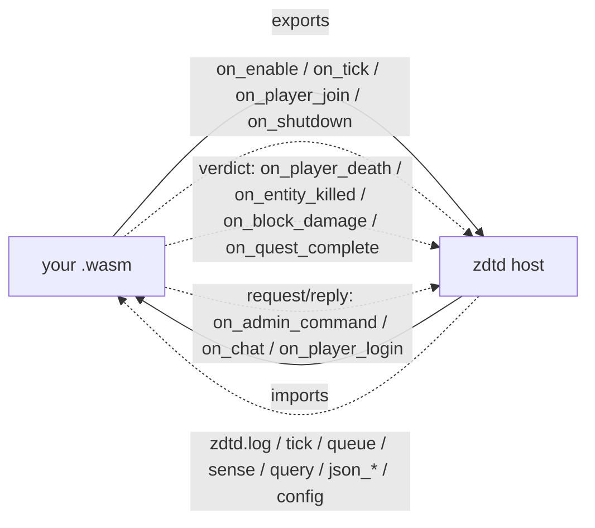

# Writing a zdtd plugin

> **Purpose:** authoring guide for Wasm plugins — module shape, host imports, hook signatures, budgets, and how to build a `.wasm` from any language.

**Status:** shipped (T9 runtime 2026-08-06; T15 event hooks + deny/adjust
2026-08-07). The runtime loads `.wasm` modules named in zdtd.toml and calls the
lifecycle/event hooks under fuel and memory budgets. The host import table is
deliberately small and documented below; read-only sim views are still open.
**Related:** [PLUGIN_API.md](PLUGIN_API.md) (host/guest contract and budgets) · [PLUGIN_STANDARDS.md](PLUGIN_STANDARDS.md) (naming and manifest) · [PLUGIN_CONFIG_DISPOSITION.md](PLUGIN_CONFIG_DISPOSITION.md) (boundary audit) · [STATE_MACHINES.md](STATE_MACHINES.md) (tick and net) · [AUTHORITY.md](AUTHORITY.md) (authority rules) · [GAME_OPTIONS.md](GAME_OPTIONS.md) (config)

A plugin is a single `.wasm` file. Any language that targets WebAssembly works:
Rust, TinyGo, Zig, C, AssemblyScript. You do not link against zdtd, you do not
match a native ABI, and you do not need the zdtd source to build. Ships as an installed
mod under `mods/` or `plugins/` with a `manifest.toml` manifest — see [PLUGIN_STANDARDS.md](PLUGIN_STANDARDS.md)
for the manifest format and `mods/BUILDING.md` for the core build layout.

## The shape of a plugin

You export functions; the server calls them. You import functions; the server
provides them. Nothing else crosses.



Hook table (observe / verdict / request-reply) is in [Hooks](#hooks) and the full
host contract in [PLUGIN_API.md](PLUGIN_API.md#the-boundary).

Export only the hooks you need. A missing export means that hook is not
registered, and costs nothing at runtime. Every signature is listed under
[Hooks](#hooks) below; export a hook with the wrong signature and the call
fails, which disables your module.

## Enabling a plugin

Two ways (PRD 0005): auto-discovery from a `<name>/manifest.toml` manifest, or the
legacy explicit list.

### Auto-discovery via `manifest.toml` (PRD 0005)

Drop a directory under `mods/` (addons) or `plugins/` (first-party core) with
a `manifest.toml` and a `.wasm`; the server scans both `mods/*/manifest.toml` and
`plugins/*/manifest.toml` at boot, sorted by directory name, and loads every
manifest it finds (unless disabled/blacklisted). This is how the shipped
official mods (`fps_bot`, `mcp`) and core plugins (`core_announce`, ...)
load; a fresh install needs zero config.

```toml
name = "my_rules"
version = "0.1.0"
wasm = "my_rules.wasm"      # relative to the mod directory
tier = "user"               # "official" (ships with zdtd) or "user"; "core" is a load error
# override = "fps_bot"     # load THIS mod in place of fps_bot (target not instantiated)
# points = "loot.roll"      # exclusive core override points this mod claims (comma-separated)
# claim_mode = "exclusive"  # only "exclusive"; "chain" (call-next) is reserved, rejected at load
# requires = "on_tick"      # extra hook/verb declarations (same vocabulary as _zdtd_requires)
# enabled = false           # do not auto-load; load via [plugin] modules instead
description = "Scales loot, denies crafts."
```

Unknown keys and unknown override points fail the load loudly (fail-closed,
RFC 0005 N2). An entry naming a **core component** (`loot`, `quests`,
`damage`, `craft`, `trading`) in `[mods] disabled`/`blacklist` is a config
error: core components cannot be disabled or blacklisted.

### Explicit `[plugin] modules` (legacy)

List `.wasm` files in `[plugin] modules` in zdtd.toml (world dir or CWD,
see [GAME_OPTIONS.md](GAME_OPTIONS.md)):

```toml
[plugin]
modules = "mods/my_plugin.wasm, mods/stats.wasm"
```

Explicit paths still load and are folded in after discovery as user mods
(this also loads a discovered mod whose manifest says `enabled = false`).
Modules load once at startup; a missing or unloadable module is logged and
skipped, it does not stop the server. `on_enable` runs right after load,
`on_tick` runs late in every tick, `on_player_join` runs on a player's first
join, `on_shutdown` runs at shutdown, and the verdict/observer hooks run at
their game events (death, kill, block damage, quest completion, perk spend,
GameEvent, trade price, quest accept, stat changed, player leave, trader
event).

### Disabling and blacklisting (`[mods]`)

```toml
[mods]
disabled = "core_killfeed"   # skip loading, one info log per mod
blacklist = "evil_mod"       # refuse; also vetoes any mod that overrides or requires it
```

### Tiers and core override points

Tiers are provenance, not privilege: official and user mods run under the
same fuel/memory budgets and effect attribution (ADR 0020/0030). The five
core override points a mod may claim are the existing verdict hooks with a
core decision site:

| Point id | Hook | Exclusive claim effect |
|---|---|---|
| `loot.roll` | `on_loot_roll` | the claimant decides the roll; native default skipped |
| `quest.payout` | `on_quest_complete` | the claimant decides the payout; native default skipped |
| `damage.player_scale` | `on_player_damage` | the claimant decides the damage verdict |
| `craft.request` | `on_craft_request` | the claimant decides the craft verdict |
| `trade.price` | `on_trade_price` | the claimant decides the price verdict |

Claims are exclusive and checked at load: two mods claiming the same point
stop the boot with an error naming both. Unclaimed points keep today's
composition (first non-zero verdict across subscribers in load order).
Replacing a whole component means claiming all of its points.

### Declarative dependencies (`_zdtd_requires`)

A module may export `_zdtd_requires() -> (ptr, len)` returning a comma-
separated list of capabilities it needs (hook names + the host verbs
`log` / `tick` / `queue` / `sense` / `query` / `json_parse` / `json_str` /
`json_raw` / `json_obj` / `config`). The host validates the list at load and
**rejects
the module loudly** when a capability is unknown or a declared hook is not
actually exported. This is fail-closed at load: a typo'd hook name cannot
silently never fire.

```c
long long _zdtd_requires(void) {
  static const char spec[] = "on_trader_event,log";
  return (long long)(unsigned long)spec |
         ((long long)(unsigned long)(sizeof(spec) - 1) << 32);
}
```

### Hot module replacement (`plugin reload <name>`)

Admin console (or webui console):

```text
plugin list              # slot, display name, tier, enabled/disabled
plugin reload bot        # display name, or path / .wasm-stem suffix
```

`plugin reload` disposes the old instance (`on_shutdown`, fuel/memory
reclaimed), loads the module from disk into the same slot, re-arms the budget
and runs `on_enable` on the new one - no server restart. A reload that fails
to parse/instantiate leaves the slot empty and reports failure. This is the
paper-style dispose-then-reinstantiate cycle: because a module's effects are
bounded by the host boundary, reloading it recovers everything it installed.

### Temporal composability (queued-effect withdrawal)

Queued commands (`zdtd.queue`) are attributed to the plugin that issued them.
When a module disables itself (hook trap / fuel exhaustion), its still-queued,
not-yet-applied commands are **withdrawn** before the next drain, and its
applied ECS spawns and attributed bots (including a `bot count` floor) are
despawned, so a broken module cannot leave side effects behind. Re-enabling
requires a reload.

## Host imports

The host provides these functions, all in the `zdtd` module namespace. The
import **field** names are bare (`log`, not `zdtd_log`); importing
`zdtd.zdtd_log` fails to instantiate.

| Import | Signature | Notes |
|---|---|---|
| `zdtd` . `log` | `(level: i32, ptr: i32, len: i32) -> ()` | Write `len` bytes at `ptr` to the server log; `level` 0..3 (debug/info/warn/err). Sanitized and truncated to 200 bytes |
| `zdtd` . `tick` | `() -> i64` | Current server tick number (1-based, 20 Hz) |
| `zdtd` . `queue` | `(ptr: i32, len: i32) -> i32` | Queue a text `SimCommand`; returns 0 when the bytes were read, 1 when `ptr`/`len` is out of bounds |
| `zdtd` . `sense` | `(ptr: i32, len: i32, token: i32) -> i32` | Read-only world snapshot into the guest's memory at `ptr` (RFC 0001 §3); returns bytes written (0 = no sense surface) |
| `zdtd` . `query` | `(req_ptr: i32, req_len: i32, out_ptr: i32, out_cap: i32) -> i32` | Reverse-direction point query (RFC 0001 §3): write a text request at `req_ptr`, the host answers at `out_ptr`; returns response bytes (0 = no answer) |
| `zdtd` . `json_parse` | `(ptr: i32, len: i32) -> i32` | Parse the JSON doc at guest memory `(ptr, len)` with Zig's `std.json` (ADR 0031 D3); 0 = ok, <0 = parse error. The parsed doc is per-plugin state, replaced on the next call, stored in a lazily allocated fixed buffer (`json_buf_max`, 64 KiB) reset per frame — no heap on the tick path, and the cap also bounds nesting. One doc at a time: frames must be processed before the next parse |
| `zdtd` . `json_str` | `(path_ptr: i32, path_len: i32, out_ptr: i32, out_cap: i32) -> i32` | Decoded string at a dot-separated key path (`method`, `params.name`, ...); returns the FULL length, 0 = missing or not a string, <0 = no parsed doc / bad path. Compare the length against your buffer cap to detect truncation |
| `zdtd` . `json_raw` | `(path_ptr: i32, path_len: i32, out_ptr: i32, out_cap: i32) -> i32` | Raw JSON bytes of the value at a path (for echoing an id verbatim); FULL length, 0 = missing, <0 = error |
| `zdtd` . `json_obj` | `(path_ptr: i32, path_len: i32) -> i32` | 1 = the value at the path is an object, 0 = absent or another type, <0 = error |

You choose the local symbol name; only the module and field names have to
match. In C:

```c
__attribute__((import_module("zdtd"), import_name("log")))
extern void zdtd_log(int level, int ptr, int len);
__attribute__((import_module("zdtd"), import_name("tick")))
extern long long zdtd_tick(void);
__attribute__((import_module("zdtd"), import_name("queue")))
extern int zdtd_queue(int ptr, int len);
__attribute__((import_module("zdtd"), import_name("sense")))
extern int zdtd_sense(int ptr, int len, int token);
__attribute__((import_module("zdtd"), import_name("query")))
extern int zdtd_query(int req_ptr, int req_len, int out_ptr, int out_cap);
```

In Rust the same table is `#[link(wasm_import_module = "zdtd")] extern "C" { fn
log(level: i32, ptr: i32, len: i32); }`; in Zig, `extern "zdtd" fn log(i32, i32,
i32) void;`.

Every host call reads flat bytes from your linear memory at the offset and
length you declare. There is no filesystem, no socket, no thread and no clock
beyond the tick time `zdtd_tick` returns. WASI is deliberately not used; a
module importing `wasi_snapshot_preview1` fails to instantiate.

### Queued commands

`zdtd_queue` accepts one command per call, as UTF-8 text (bounds: 128 bytes):

| Command | Effect |
|---|---|
| `spawn x y z hp` | Queue a zombie spawn at the block coords with the given HP |
| `despawn id` | Queue removal of the entity with the given net id |
| `damage id amount` | Queue damage to the entity with the given net id |

Commands are applied by the sim on a later tick's drain (the fixed 64-slot
command buffer; a full buffer drops new commands). Unknown or malformed
commands are dropped with a log line. The guest never touches sim state
directly: everything goes through this queue.

## Rules you cannot get around

These are enforced by the runtime, not by convention.

1. **You get one fuel budget for the whole instance, not per call.** Fuel is
   armed once at instantiate (default 100 000 000) and decremented per
   instruction for the life of the process; it is never re-armed between hooks.
   Exhaust it and the call ends with `OutOfFuel`, your plugin is disabled, and
   the server logs which hook and module. An infinite loop costs one tick, not
   the server. This is verified, not aspirational. Budget accordingly: at
   20 Hz, a plugin spending 10 000 fuel per tick exhausts the default budget in
   about eight minutes, so `on_tick` work has to be genuinely small; an operator
   can raise `[plugin] fuel` in zdtd.toml.
2. **You get a linear-memory cap.** Ask for more and instantiation fails.
3. **You only get the host functions your capabilities allow.** There is no
   filesystem, no socket, no thread and no clock beyond the tick time the host
   passes you, unless a capability grants it. WASI is deliberately not used:
   the import table is small on purpose so it can be audited.
4. **You cannot touch the wire.** You may ask for high-level operations the
   server already understands, and you may deny or adjust a request. You cannot
   emit package bytes, invent wire types, or skip the join state machine. This is
   the same authority rule the server applies to clients
   ([AUTHORITY.md](AUTHORITY.md)).
5. **Sim hooks run on the tick thread, in a documented order.** Two servers with
   the same plugins and the same inputs step identically. Do not expect threads.

## What belongs in a plugin (and what must stay native)

**Principle (AGENTS.md rule 29):** anything that is *technically* expressible
over the plugin boundary ships as a Wasm plugin. "It is core" is not a reason
to keep something native; prove that the boundary cannot carry it. When a
feature needs an affordance the boundary lacks, extend the boundary (an
ADR-worthy decision) rather than adding native behavior. This is the general
form of the bot rule (ADR 0026): a bot is a plugin because its brain is
behavior, not server.

### Expressibility audit (native surface vs the boundary)

| Native domain | Status | Boundary affordance |
|---|---|---|
| Chat filtering / commands / reactions | **Plugin already** | `on_chat` (rewrite/suppress, `c2s/misc.zig:42`) |
| Kill / death / quest events | **Plugin already** | `on_entity_killed` / `on_player_death` / `on_quest_complete` verdicts; `plugins/core_killfeed` is the reference |
| Quest acceptance policy (which quests a player may take) | **Plugin already** | `on_quest_accept` verdict (added 2026-08-20, fired on every acceptance via a World gate) + the `quest` query verb; `plugins/core_questgate` is the reference (denies `forbidden_*` quests by name) |
| Craft-request policy (which recipes a player may craft, batch caps) | **Plugin already** | `on_craft_request` verdict (added 2026-08-20, `<0` deny / `>0` cap at the `tryCraft` gate, recipe name is the key); `plugins/core_craftgate` is the reference (denies `forbidden_*` recipes) |
| Loot-roll policy (loot abundance / empty rolls) | **Plugin already** | `on_loot_roll` verdict (added 2026-08-20, `<0` empty / `>0` scale the rolled stack count by percent, at both the bag and container chokepoints); `plugins/core_lootgate` is the reference (50% loot) |
| Quest reward scaling | **Plugin already** | `on_quest_complete` verdict `>0` scales the payout (`step.zig`) |
| Block-damage policy | **Plugin already** | `on_block_damage` verdict (`world.zig:20`; also the C2S player-dig delta since 2026-08-20 — every block-damage path routes through it) |
| Player-death policy | **Plugin already** | `on_player_death` verdict (`killVerdict`) |
| Admin commands / tooling | **Plugin already** | `on_admin_command` |
| Login gate (allow/deny names) | **Plugin already** | `on_player_login` deny gate (`join.zig:72`) |
| Bot brains | **Plugin already** | `mods/fps_bot` (ADR 0026) |
| Player-damage policy (PvP / friendly-fire rules) | **Plugin already** | `on_player_damage` verdict (added 2026-08-20) + the `kind` query verb; `plugins/core_pvp` is the reference (denies all player-vs-player damage, keeps the rest) |
| Guard / anti-cheat policy ladder | **Not yet** — technically expressible but needs per-peer counter/quarantine verbs | Guard state is rate/authority; a plugin verdict surface for it is a deliberate boundary extension |
| Announcements wired to join/leave | **Plugin already** | `on_player_join` / `on_player_leave` (the latter added 2026-08-19; `session_drop.zig`) — `plugins/core_killfeed` logs both |
| Trader announcements (window open, buy, sell) | **Plugin already** | `on_trader_event` (added 2026-08-20; kind 0 open / 1 buy / 2 sell, fired at the LockResponse open and the typed trade path) — `plugins/core_tradefeed` is the reference |
| Announcements wired to more events (vehicle) | **Not yet** — technically expressible | Missing hooks for those events; add hooks, do not add native announcement code |
| Wire encode/emit, LiteNet, chunk stream, interest/replication | **Cannot be a plugin** | Boundary never touches wire bytes or package layout (enforced) |
| ECS sim mutation: inventory, blocks, quests, trading authority | **Cannot be a plugin** | Plugins mutate only via `queue` verbs the server already understands; no direct sim access |
| World store, persistence (ZCH3/ZPV3/…), config loading | **Cannot be a plugin** | Filesystem/capability-gated; init-time, not tick |
| Plugin runtime, APM instrumentation | **Cannot be a plugin** | They host the plugins / measure them |

The audit's rule of thumb: a feature that *decides* is a plugin; a feature
that *emits wire or mutates sim state directly* is native by construction.
Anything in the "Not yet" rows is a boundary-extension candidate: implement
the affordance, then move the behavior into a module.

**Belongs in a plugin (behavior / policy):**

- Bots and bot brains (`mods/fps_bot` is the reference implementation).
- Chat commands, filters, and moderation reactions (the `on_chat` hook and
  `queue`).
- Announcements, kill-feeds, scoreboards, stat hooks (the `on_player_death` /
  `on_entity_killed` / `on_quest_complete` verdict hooks).
- Custom game rules expressed as verdicts (deny a kill, alter quest rewards,
  react to block damage).
- Admin automation and operator tooling (`on_admin_command`).
- Event-driven integrations (webhook-style observers, logging).

**Must stay native Zig (the server itself):** wire encode/decode and package
building, LiteNet framing, interest/replication and the chunk stream, ECS
authority (inventory, blocks, quests, trading), world store and persistence,
config loading (`serverconfig.xml` / `zdtd.toml`), the plugin runtime itself,
and APM instrumentation. These run on the 20 TPS hot path, and the plugin
boundary is deliberately narrow: plugins never touch wire bytes or sim memory
directly, they only see `sense` snapshots, `query` answers, and the verbs
`queue` accepts. A feature that must emit wire or mutate sim state directly is
native by construction; a feature that *decides* about such things is a plugin.

**When adding a feature, default to a plugin.** If it cannot be expressed over
`sense`/`queue`/`query` + the hooks, either extend the boundary deliberately
(an ADR-worthy decision) or document why the native placement is required.

**Reference modules shipped in this repo (production plugins, committed
`.wasm`). All core plugins are written in Zig and rebuilt with
`scripts/build-plugins.sh` (see [mods/BUILDING.md](../mods/BUILDING.md) for the
layout, build recipe, and [PLUGIN_STANDARDS.md](PLUGIN_STANDARDS.md) for naming
and manifest rules). The one exception is `bot`, which is C by design
(ADR 0026):**

- `mods/fps_bot/fps_bot.wasm` — the bot brain (ADR 0026): sense → decide →
  `bot <verb>` commands; the flagship plugin (C source).
- `plugins/core_killfeed/core_killfeed.wasm` — a minimal event observer: logs
  kills, player deaths and quest completions via the verdict hooks and keeps
  every outcome (0). Use it as the template for announcements, kill-feeds,
  scoreboards and integrations.
- `plugins/core_pvp/core_pvp.wasm` — a player-damage policy module: uses the
  `on_player_damage` verdict + the `kind` query verb to deny all
  player-vs-player damage while leaving NPC damage untouched. Use it as the
  template for PvP/friendly-fire and damage-scaling policies.
- `plugins/core_questgate/core_questgate.wasm` — a quest-acceptance policy
  module: uses the `on_quest_accept` verdict + the `quest` query verb to deny
  quests named `forbidden_*` and log every acceptance. Use it as the template
  for quest gating (whitelists, class/level restrictions).
- `plugins/core_craftgate/core_craftgate.wasm` — a craft-request policy module:
  uses the `on_craft_request` verdict to deny recipes named `forbidden_*` and
  log every request. Use it as the template for recipe blacklists and batch
  caps.
- `plugins/core_lootgate/core_lootgate.wasm` — a loot-roll policy module: uses
  the `on_loot_roll` verdict to scale every rolled loot count to 50%. Use it
  as the template for loot-abundance and empty-loot policies.
- `plugins/core_tradefeed/core_tradefeed.wasm` — a trader-event observer module:
  uses `on_trader_event` (kind 0 open / 1 buy / 2 sell) to log every trade
  window event. Use it as the template for trader/vehicle announcements.
- `plugins/core_announce/core_announce.wasm`, `plugins/core_damagegate`,
  `plugins/core_pricegate`, `plugins/core_rewardgate`,
  `plugins/core_adminverbs`, `mods/mcp` (ADR 0031) — the remaining core
  plugins: clock/join announcements, damage/price/reward scaling verdicts,
  operator verbs via `on_admin_command`, and the MCP server addon.
- `mods/example_chat_filter/` — a drop-in example layout (C), not a core
  plugin.

## Data across the boundary

Everything crosses as flat bytes in your module's linear memory. The host copies
in and copies out; you never receive a host pointer, and the host never follows
one of yours beyond the length you declare.

The practical consequence: a hook that hands you a structure hands you an offset
and a length into your own memory. Read it, copy what you need, and do not retain
the offset past the call.

## Hooks

Observe / lifecycle hooks (all return `void`):

| Export | Signature | When |
|---|---|---|
| `on_enable` | `() -> ()` | once, at enable: register interest, read config, allocate |
| `on_tick` | `() -> ()` | late in each tick, after sim and replicate; keep it cheap, it runs 20 times a second |
| `on_player_join` | `(peer_slot: i32, entity_id: i32) -> ()` | a player's first join |
| `on_shutdown` | `() -> ()` | once, at shutdown: flush anything you own |

Event hooks (T15, return a verdict):

| Export | Signature | Verdict return |
|---|---|---|
| `on_player_death` | `(victim_entity_id: i32) -> i32` | `<0` deny: the victim survives at 1 hp and the hit is consumed |
| `on_entity_killed` | `(killed_entity_id: i32, killer_entity_id: i32) -> i32` | `<0` deny the kill; `killer` is `-1` when the attacker is unknown (AI melee accumulator) |
| `on_block_damage` | `(x: i32, y: i32, z: i32, dmg: i32) -> i32` | `<0` deny (no damage); `>0` apply that percent (`200` doubles) |
| `on_quest_complete` | `(player_entity_id: i32, quest_def_id: i32) -> i32` | `<0` withhold the payout; `>0` pay that percent of items/exp |

Remaining verdict hooks and observers (the full host surface is 22 hooks;
[PLUGIN_API.md](PLUGIN_API.md) is the authoritative contract — this table
completes the authoring view):

| Export | Signature | Verdict return / when |
|---|---|---|
| `on_player_damage` | `(attacker: i32, victim: i32, amount: i32) -> i32` | `<0` deny the damage; `>0` apply that percent (the `damage.player_scale` override point) |
| `on_quest_accept` | `(player: i32, quest_def_id: i32) -> i32` | first non-zero wins: `<0` deny, `0` keep, `>0` scale |
| `on_craft_request` | `(player: i32, recipe_ptr, recipe_len, times: i32) -> i32` | `<0` deny the batch; `>0` percent (the `craft.request` override point) |
| `on_loot_roll` | `(list_ptr, list_len, rolled: i32) -> i32` | `<0` deny the drop, `0` keep, `>0` scale the roll count (re-capped to the roll array; the `loot.roll` override point) |
| `on_trade_price` | `(player: i32, item: i32, unit_price: i32) -> i32` | `<0` deny, `0` keep, `>0` percent (the `trade.price` override point) |
| `on_perk_spend` | `(player: i32, skill_ptr, skill_len, level, cost: i32) -> i32` | ADR 0033: `<0` deny the purchase, `0` keep, `>0` scales the skill-point cost by percent |
| `on_game_event` | `(player: i32, event_ptr, event_len, target, var_count: i32) -> i32` | ADR 0035: `<0` deny, `0` keep, `>0` keep (first non-keep wins); the stock sender/party gate runs native before the verdict |
| `on_player_leave` | `(peer_slot: i32, entity_id: i32) -> ()` | void observer at disconnect (the join counterpart) |
| `on_stat_changed` | `(player: i32, hp, food, water, stamina, level, xp: i32) -> ()` | ADR 0034: pure observer fired when the survival pass or an XP award changed a tracked stat |
| `on_trader_event` | `(player: i32, trader_entity: i32, kind: i32) -> ()` | void observer on trade open / sell / buy |

Five of the verdict hooks back the ADR 0032 exclusive override points
(`loot.roll`, `quest.payout`, `damage.player_scale`, `craft.request`,
`trade.price`): a mod that claims the point becomes the sole decision maker
and the native default is skipped.

The return convention is: **below 0 denies the proposed outcome, 0 keeps
today's behaviour, above 0 adjusts as a percent** (where a percent is
meaningful). A module that does not export the hook costs nothing and the
default holds. Verdicts are taken in plugin load order, first non-zero wins;
a plugin that traps or exhausts its fuel is disabled and reports keep, so one
broken module cannot veto the game.

Request/reply hooks (the host copies a payload into your memory and reads a
reply back out of it):

| Export | Signature | Return |
|---|---|---|
| `on_admin_command` | `(cmd_ptr, cmd_len, out_ptr, out_cap: i32) -> i32` | `>0` bytes of reply written at `out_ptr` (handled); `<=0` not handled, so the next plugin, then core's `unknown`, gets a turn |
| `on_chat` | `(sender, msg_ptr, msg_len, out_ptr, out_cap: i32) -> i32` | `<0` deny the message; `0` keep it unchanged; `>0` bytes of the rewritten body at `out_ptr`. A rewrite that is not valid chat text is treated as deny |
| `on_player_login` | `(peer_slot, name_ptr, name_len, out_ptr, out_cap: i32) -> i32` | `0` allow; non-zero deny, where the magnitude is the number of reason bytes written at `out_ptr` (`-4` and `4` both mean "deny, 4 bytes of reason"). A deny with 0 bytes reads back as "denied" |
| `on_mcp_frame` | `(frame_ptr, frame_len, out_ptr, out_cap: i32) -> i32` | MCP transport bridge (ADR 0031): the host copies one client JSON-RPC frame into your memory, you write your response back; return the bytes written (`0` = nothing to send: a notification, a closed session, or an overflowed response). JSON is parsed by the host (`json_*` imports) — the guest never parses JSON. A trap disables only that module |

For these request/reply hooks the first plugin that responds wins, and a trap
or fuel exhaustion disables that module while the request proceeds as if it
had not been exported (login stays open, chat is kept, the command falls
through, the MCP frame gets no reply).
`on_player_login` runs after the name is sanitized and before the identity ban
check.

The payload the host hands you lives in your own linear memory, at an offset the
host reserves from freshly grown pages, so it does not overlap your statics or
stack. Do not retain either offset past the call.

`on_tick` running at 20 Hz is the one to respect. A hook that burns its budget
every tick will be disabled, which is the system working, but your plugin still
stops.

### Self-contained config (`config.toml`)

A plugin folder may ship `config.toml` - its own default config. The host
loads it (size-capped at 4 KiB) and serves the raw text to the module via
`zdtd.config(out_ptr, out_cap) -> i32` (returns the bytes written; 0 = no
config). The host never parses it: each plugin owns its format. The shared
`mods/plugin_common.zig` `Config` helper parses the minimal `key = value`
subset (`#` comments, quoted values); a plugin with a richer format reads the
buffer directly. Declare the capability in `_zdtd_requires` as `config`.
Reference: `core_pricegate` reads `price_percent` from its own config.toml
and applies it in `on_trade_price` - edit the file, no rebuild.

Fixtures exercising the full surface: `assets/fixtures/plugin_rules.c`
(deny/double verdicts), `assets/fixtures/plugin_trap.c` (trapping hook),
`plugin_admin.c`, `plugin_chat.c` and `plugin_login.c` (the request/reply
hooks), plus `mods/example_chat_filter/` as a drop-in mod layout.

## Building one

Nothing here is zdtd-specific: you are producing a plain WebAssembly module with
no WASI imports.

**Rust**

```sh
cargo build --release --target wasm32-unknown-unknown
# target/wasm32-unknown-unknown/release/my_plugin.wasm
```

```rust
#[no_mangle]
pub extern "C" fn on_tick() { /* ... */ }
```

**Zig**

```sh
zig build-exe plugin.zig -target wasm32-freestanding -rdynamic -OReleaseSmall \
  --name my_plugin
mv my_plugin.wasm my_plugin_final.wasm
```

`zig build-exe` needs an entry point even for freestanding targets; add a
one-line `export fn _start() void {}` to your module (the committed core
plugins put it in a separate `main.zig` wrapper — see
[mods/BUILDING.md](../mods/BUILDING.md)). zwasm runs the start section only if
the module declares one, which ours never do, so `_start` is never invoked.

```zig
export fn on_tick() void { }
```

**TinyGo**

```sh
tinygo build -o plugin.wasm -target=wasm-unknown ./plugin
```

**C**

```sh
clang --target=wasm32 -nostdlib -Wl,--no-entry -Wl,--export-all -o plugin.wasm plugin.c
```

Use `wasm32-unknown-unknown` or an equivalent freestanding target rather than a
WASI target. A module that imports `wasi_snapshot_preview1` will fail to
instantiate, because the host does not provide those imports.

## Checking your module before shipping

```sh
wasm-objdump -x plugin.wasm | grep -A20 "Export\[\|Import\["
```

Confirm that the exports are the hook names you meant, and that the import list
contains only host functions you were granted. An unexpected import is the usual
reason a module fails to instantiate.

## What the server runs it on

zdtd embeds [zwasm](https://github.com/clojurewasm/zwasm) v2, a WebAssembly
runtime written in Zig, so there is no C dependency and no FFI boundary in the
server. Its interpreter is the hardened default. Budgets come from the runtime
itself (`InstantiateOpts.fuel`, `max_memory_pages`), which is why the limits
above are enforcement rather than intent.

Verified on 2026-08-06 against zwasm 2.4.1 under Zig 0.16: a typed export call
returns correctly, fuel accounting reports remaining budget, and a module that
loops forever is stopped with `OutOfFuel` instead of hanging the caller.

## Not supported, on purpose

| Want | Why not |
|---|---|
| WASI | A large surface to audit for no benefit here; the import table is deliberately small |
| Filesystem or network from a plugin | Would defeat the sandbox; ask for a capability and a host function instead |
| Threads | Sim hooks are deterministic and single-threaded by design |
| Emitting raw packages | The server owns the wire; see rule 4 |
| Hot reload | Not in the first version |
