# State machines in zdtd

> **What this is:** every stateful lifecycle in the server - one state machine per section, with the transitions, owning `src/` anchors and a Mermaid diagram. Companion flows (craft, trade, loot, survival, movement) live in [GAMEPLAY.md](GAMEPLAY.md); architecture and tick order live in [ZIG_CLONE.md](ZIG_CLONE.md). Diagrams are Mermaid; the `src/` anchors are the authority when a diagram and a comment disagree.

Every stateful lifecycle in the server, with the state transitions and the code
that owns them.

| # | State machine | Owner | Diagram |
|---|---|---|---|
| 1 | Join / client session SM | `server/game.zig` join SM, `server/phase_gate.zig` | [join](#1-join--client-session-sm) |
| 2 | Sim tick pipeline | `ecs/schedule.zig` | [tick](#2-sim-tick-pipeline) |
| 3 | Zombie AI task selection | `ecs/components.zig` `AiState`/`TaskId`, `ecs/systems.zig` AiCtx | [ai](#3-zombie-ai-task-selection) |
| 4 | Quest lifecycle | `ecs/quest.zig`, `ecs/systems.zig` | [quest](#4-quest-lifecycle) |
| 5 | Weather storm SM | `world/weather.zig` | [weather](#5-weather-storm-sm) |
| 6 | Blood moon window | `ecs/aidirector.zig` `WorldClock` | [blood-moon](#6-blood-moon-window) |
| 7 | Power grid | `ecs/powerblocks.zig` | [power](#7-power-grid) |
| 8 | Sleeper volumes | `world/sleepers.zig` | [sleepers](#8-sleeper-volumes) |
| 9 | Trader open / restock / wallet | `server/game/trader.zig`, `server/game/trader_wire.zig`, `ecs/systems.zig` traderRestock | [trader](#9-trader-sm) |
| 10 | Vehicle multi-seat | `ecs/systems.zig` vehicleAttach/Detach | [vehicle](#10-vehicle-multi-seat) |
| 11 | Ally status | `server/ally.zig` | [allies](#11-ally-status) |
| 12 | Plugin lifecycle | `plugin/host.zig`, `plugin/wasm.zig` | [plugins](#12-plugin-lifecycle) |
| 13 | LiteNet peer | `litenet/peer.zig` | [peer](#13-litenet-peer) |
| 14 | Land claims | `server/game.zig` land claims | [claims](#14-land-claims) |
| 15 | Party membership | `ecs/party.zig` Manager, `server/game/social.zig` handlePartyActions | [party](#15-party-membership) |
| 16 | Vending rental | `world/vending.zig`, `server/c2s/quest.zig` NetPackagePlayerVendingMachine | [vending](#16-vending-rental) |
| 17 | Loot respawn | `server/game/chunk_stream.zig` maybeRespawnContainer, `world/containers.zig` | [loot-respawn](#17-loot-respawn) |
| 18 | Guard policy | `server/guard_policy.zig` | [guard](#18-guard-policy) |
| 19 | Chunk stream backpressure | `server/game/chunk_stream.zig`, `server/game/net.zig` sendReliablePumped | [chunk-stream](#19-chunk-stream-backpressure) |
| 20 | Buff lifecycle | `ecs/buff.zig`, `ecs/systems.zig` systemBuffs | [buff](#20-buff-lifecycle) |

## 1. Join / client session SM

The wire sequence a stock client (or loadgen bot) walks. `Client.joined` /
`Client.entered` map to the `phase_gate` Phase (`connecting` → `joined` →
`playing`); the gate drops C2S packages that are not legal for the current
phase. Challenge is LiteNet-level; the challenge echo races the first payload,
which is buffered and replayed after auth (`Client.preauth_buf`).

```mermaid
stateDiagram-v2
    [*] --> Connecting: LiteNet Connect
    Connecting --> Challenged: challenge sent (ServerChallenge)
    Challenged --> Joined: challenge echo + PackageIds, PlayerLogin accepted
    Joined --> Entering: RequestToEnterGame (configs, WorldInfo, areas, stats)
    Entering --> Entering: AuthConfirmation echo; SignDataRequest -> SignDataResponse (config sync); POIMetadataRequest -> POIMetadataResponse (3.2.0 POI metadata, replaces POIAround)
    Entering --> Spawning: RequestToSpawnPlayer / DynamicClientArrive fallback
    Spawning --> Playing: PlayerId bundle (id map, chunks, Spawned, time, stats)
    Playing --> Playing: net poll + tick (movement, C2S apply, replicate)
    Playing --> [*]: PlayerDisconnect / stale peer reap
    Entering --> [*]: illegal phase C2S (gate drop / disconnect)
    Playing --> Spawning: death -> RequestToSpawnPlayer (revive + Spawned(died) re-bundle)
    Joined --> Joined: re-login while joined (LoginAnswer + SpawnedInWorld, no re-enter)
    Entering --> Spawning: DynamicClientArrive fallback (spawn bundle when RequestToSpawnPlayer never arrives)
```

Notes: `WorldInfo` goes out at Entering, never in the spawn bundle (a second
WorldInfo restarts the client's createWorld; `src/server/c2s/join.zig:256` is
the one send site, in the RequestToEnterGame handler). The chunk streamer starts earlier, at WorldInitInfoRequest
(`Client.world_ready`, `c2s/join.zig:343`); the spawn area is also streamed
before the bundle while
the client still waits on its spawn request. Death respawn re-enters Spawning
while `entered` stays true; the re-bundle then sends Spawned(died) + teleport
instead of a second PlayerId. The 3.2.0 join additions: the
`POIMetadataRequest -> POIMetadataResponse` exchange (replaces the removed
`NetPackagePOIAround`, changelog-3.2.0 §3.2). The `ConfirmSpawnEntity` +
`EntityCreationData.requestedBy/requestKey` tail is **not emitted**: it only
matters for client-requested entity spawns, which zdtd refuses
(`RequestToSpawnEntity` C2S), and the ECD stays FileVersion 36 so a 3.2.0
client's `read` skips the tail (`wire/stock_entity.zig`, parse-compatible).

Owners: `src/server/c2s/join.zig` (8-package join SM: PlayerLogin,
RequestToEnterGame, AuthConfirmation, SignDataRequest, POIMetadataRequest,
WorldInitInfoRequest, DynamicClientArrive, RequestToSpawnPlayer),
`src/server/c2s/dispatch.zig`
(phase gate dispatch), `src/server/game.zig` (sendJoinBundle, sets
`Client.entered`), `src/server/phase_gate.zig` (`phaseOf` / `allowed` table).

## 2. Sim tick pipeline

The 20 TPS main loop. Phases run in document order; parallelism stays inside a
phase (`systemZombieAi` / `systemTurrets` via the `util/parallel` pool). The
command buffer drains once per tick after the sim settles; plugin-queued
commands land on the next tick's drain.

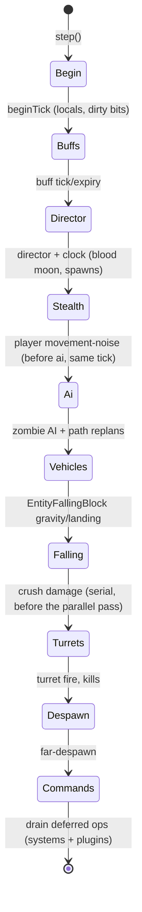
```mermaid
stateDiagram-v2
    [*] --> Begin: step()
    Begin --> Buffs: beginTick (locals, dirty bits)
    Buffs --> Director: buff tick/expiry
    Director --> Stealth: director + clock (blood moon, spawns)
    Stealth --> Ai: player movement-noise (before ai, same tick)
    Ai --> Vehicles: zombie AI + path replans
    Vehicles --> Falling: EntityFallingBlock gravity/landing
    Falling --> Turrets: crush damage (serial, before the parallel pass)
    Turrets --> Despawn: turret fire, kills
    Despawn --> Commands: far-despawn
    Commands --> [*]: drain deferred ops (systems + plugins)
```

Owners: `src/ecs/schedule.zig:9` (`Phase`, `Rules.systems` per-phase gate),
`src/server/game/step.zig` (the `step()` body), `src/server/game/tick.zig`
(player survival / stamina; `buffs.xml` thresholds when the table is loaded,
otherwise `Rules.progression`), `src/server/game/deco.zig` (deco mirror,
`[feature] deco_mirror`).

## 3. Zombie AI task selection

The coarse replicated state (`AiState`) plus the executing EAI task
(`TaskId`). Stock's prioritized `EAITaskList` is collapsed to a comptime task
table with mutex-based preemption; movement tasks are mutually exclusive,
BreakBlock/DestroyArea use mutex 0 and preempt approach when the path is
blocked. Wander resumes when the target is lost.

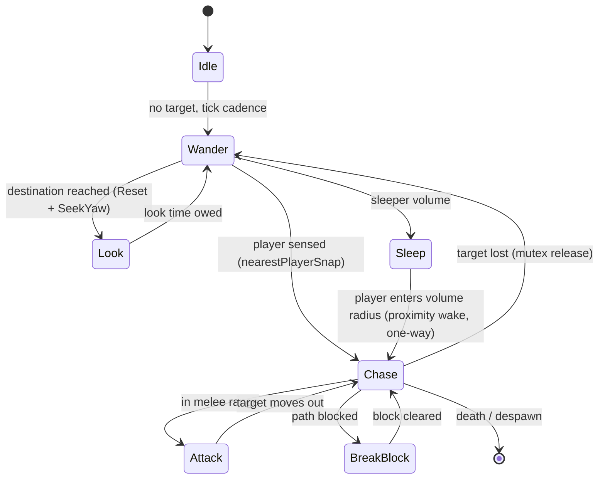
```mermaid
stateDiagram-v2
    [*] --> Idle
    Idle --> Wander: no target, tick cadence
    Wander --> Look: destination reached (Reset + SeekYaw)
    Look --> Wander: look time owed
    Wander --> Chase: player sensed (nearestPlayerSnap)
    Chase --> Attack: in melee range
    Attack --> Chase: target moves out
    Chase --> Wander: target lost (mutex release)
    Chase --> BreakBlock: path blocked
    BreakBlock --> Chase: block cleared
    Wander --> Sleep: sleeper volume
    Sleep --> Chase: player enters volume radius (proximity wake, one-way)
    Chase --> [*]: death / despawn
```

Owners: `src/ecs/components.zig:66` (`AiState`), `:79` (`TaskId`),
`src/ecs/systems.zig` AiCtx (`zombie_tasks` table).

## 4. Quest lifecycle

Per player slot, per quest. `QuestProgress` walks a phase graph (each phase =
one advancing objective kind + required count); `ready_turn_in` parks the quest
at the highest phase until the trader is opened. Wallet coins credit in the
sim; item and exp rewards pay out through the tick-end completed-quest ring.
`Optional` / `ForcePhaseFinish` (quest failure) are not modelled.

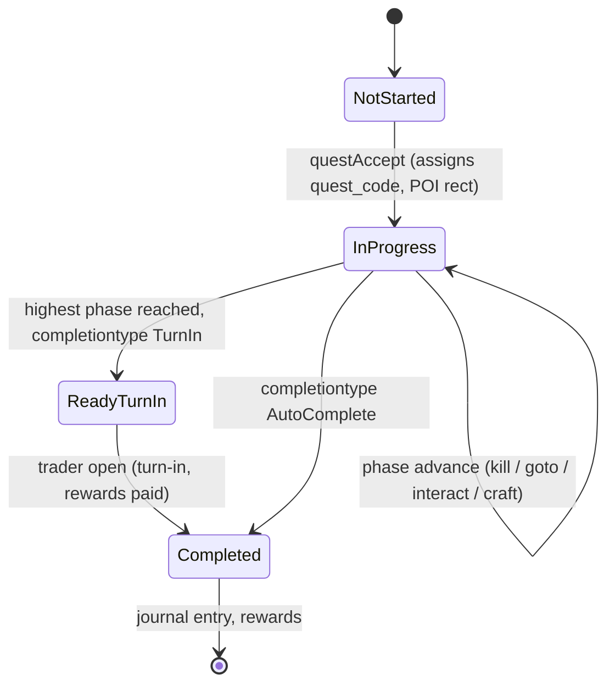
```mermaid
stateDiagram-v2
    [*] --> NotStarted
    NotStarted --> InProgress: questAccept (assigns quest_code, POI rect)
    InProgress --> InProgress: phase advance (kill / goto / interact / craft)
    InProgress --> ReadyTurnIn: highest phase reached, completiontype TurnIn
    ReadyTurnIn --> Completed: trader open (turn-in, rewards paid)
    InProgress --> Completed: completiontype AutoComplete
    Completed --> [*]: journal entry, rewards
```

Owners: `src/ecs/quest.zig` (`QuestDef`, `PhaseSpec`, `RewardSpec`),
`src/ecs/components.zig:349` (`QuestProgress`, `Journal`),
`src/ecs/systems.zig:185` (`completeQuest`), `:377` (`questOnTraderOpen`),
`:301` (`questAccept`), `src/server/game/step.zig` (tick-end payout drain).

Shared quests: `QuestProgress.is_shared` latches when the owner's party is
handed the quest (`server/game/social.zig:266` `shareQuestWithParty`); when the
owner disconnects, the party gets `remove_quest` events so their mirrors clear
(`src/server/game/session_drop.zig` `dropClientSlot`). Rally markers:
`rally_activated` latches per quest; a rally
phase without a POI rect is scaffolding and auto-skips.

POI lockout sub-machine (`src/ecs/poi_lock.zig`, the server half of
QuestLockInstance): a quest that activates a POI locks it to its questers; when
the last quester leaves the POI stays locked out for a 2000-tick grace, then
expires and is replaced.

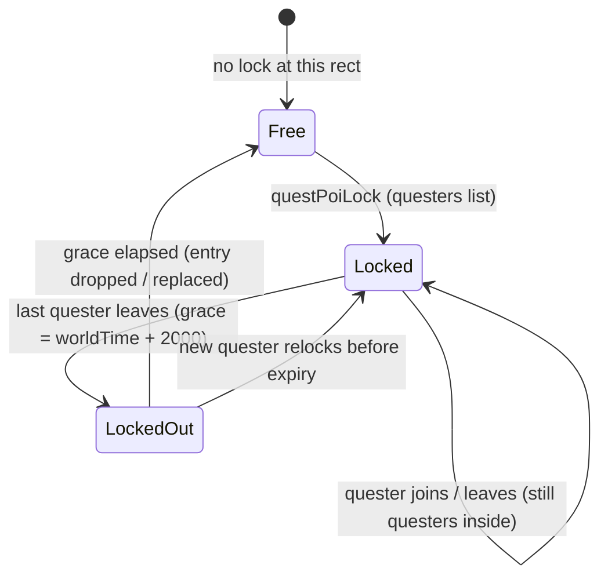
```mermaid
stateDiagram-v2
    [*] --> Free: no lock at this rect
    Free --> Locked: questPoiLock (questers list)
    Locked --> Locked: quester joins / leaves (still questers inside)
    Locked --> LockedOut: last quester leaves (grace = worldTime + 2000)
    LockedOut --> Free: grace elapsed (entry dropped / replaced)
    LockedOut --> Locked: new quester relocks before expiry
```

The lock is checked at the rally marker (`questCheckPoiLockout`:
`quest_lock` with LockedOutUntil as extra data, or `player_inside` when a
non-party player stands in the POI).

## 5. Weather storm SM

Per biome (`BiomeState`), driven by world time: `stormbuild` countdown →
`storm` → clear + reschedule. A blood moon forces every biome to its
`bloodMoon` group and pushes scheduled storms past the horde night. The state
is persisted (`weather.zwt`) and restored on restart.

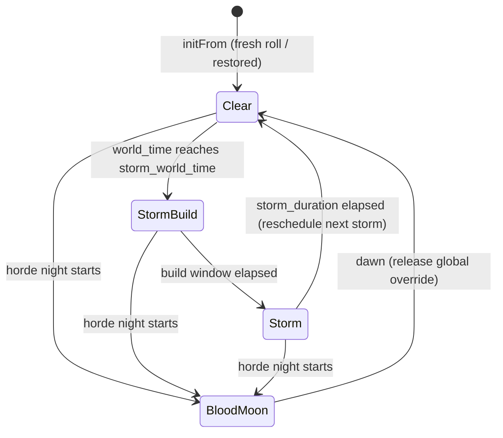
```mermaid
stateDiagram-v2
    [*] --> Clear: initFrom (fresh roll / restored)
    Clear --> StormBuild: world_time reaches storm_world_time
    StormBuild --> Storm: build window elapsed
    Storm --> Clear: storm_duration elapsed (reschedule next storm)
    Clear --> BloodMoon: horde night starts
    StormBuild --> BloodMoon: horde night starts
    Storm --> BloodMoon: horde night starts
    BloodMoon --> Clear: dawn (release global override)
```

Owners: `src/world/weather.zig:36` (`BiomeState.storm_state` 0/1/2),
`:106` (`tick`), `:125` (`forceBloodMoon`), `:302` (persistence).

## 6. Blood moon window

The clock's day/hours plus the scheduled blood-moon day. The window spans dusk
on the scheduled day through dawn of the next day (crosses the midnight
rollover); `GameStats.blood_moon_day` is re-broadcast to connected clients
when the scheduled day rolls.

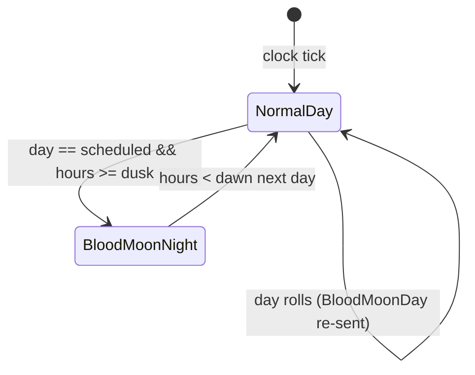
```mermaid
stateDiagram-v2
    [*] --> NormalDay: clock tick
    NormalDay --> BloodMoonNight: day == scheduled && hours >= dusk
    BloodMoonNight --> NormalDay: hours < dawn next day
    NormalDay --> NormalDay: day rolls (BloodMoonDay re-sent)
```

Owners: `src/ecs/aidirector.zig:61` (`isBloodMoonNight`), `:68`
(`isBloodMoonDay`), `src/server/game.zig` (`bloodMoonDayFor` + day-roll
broadcast).

Notes: `Director.bm_stage_frozen` latches the party gamestage at dusk and
clears at dawn with the horde marks (`aidirector.zig:818` / `clearHordeMarks`);
parties cluster players within 80 m and horde zombies teleport back to their
party focus past 150 m; one wave spawns per party every 6 s.

## 7. Power grid

Nodes (generator / battery / solar / consumer / trigger) resolve once per tick
from the grid graph. A node's effective state is derived (powered or not by
the resolved graph); triggers fire on activation while powered. The client's
rendered state and the grid agree from tick one.

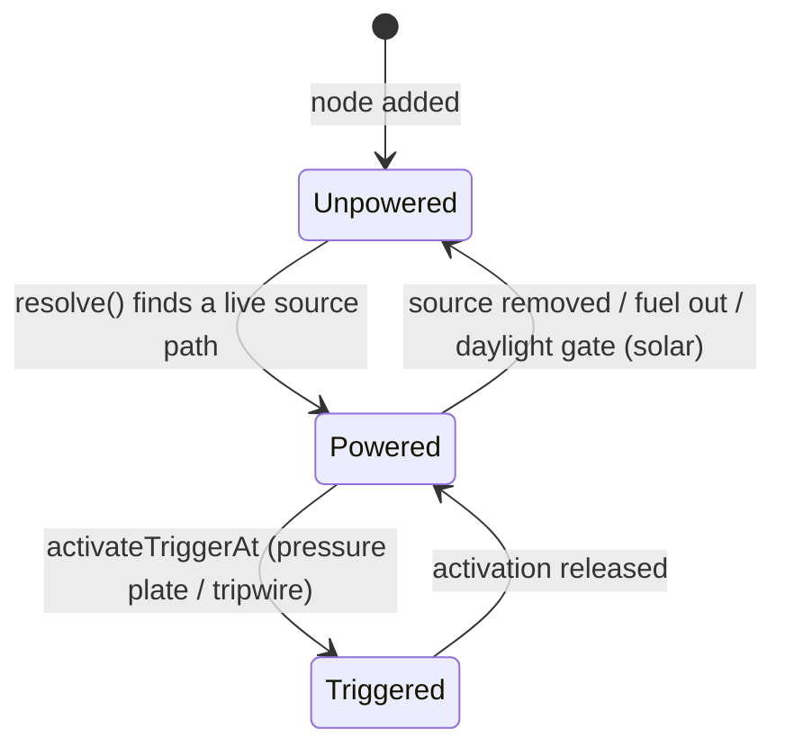
```mermaid
stateDiagram-v2
    [*] --> Unpowered: node added
    Unpowered --> Powered: resolve() finds a live source path
    Powered --> Unpowered: source removed / fuel out / daylight gate (solar)
    Powered --> Triggered: activateTriggerAt (pressure plate / tripwire)
    Triggered --> Powered: activation released
```

Owners: `src/ecs/electric.zig` (`PowerGrid`, `resolveDay`, `tick`,
`activateTriggerAt`, `setSwitchAt`, `resetTriggerAt`, `armTimer`),
`src/ecs/powerblocks.zig` (blocks.xml registry + `Resolved` node props),
`src/server/game.zig` (broadcast visuals on change).

Notes: a switch node stays powered while latched off but passes nothing
(`nodeIsOn` = the latch for switches); a trigger node is powered while idle
(gate closed) and opens for `pulse_left` after `delay_left`, or latches until
`resetTriggerAt` for duration Always; a timer relay toggles a wired consumer
on its period; generators burn fuel to empty (auto off), solar is daylight
gated, and overload drops the highest-id consumers (load shed).

## 8. Sleeper volumes

Prefab sleeper volumes hold dormant zombies until a player enters the volume;
once triggered they stay triggered (no re-spawn spam). Waking is a one-way
transition per volume.

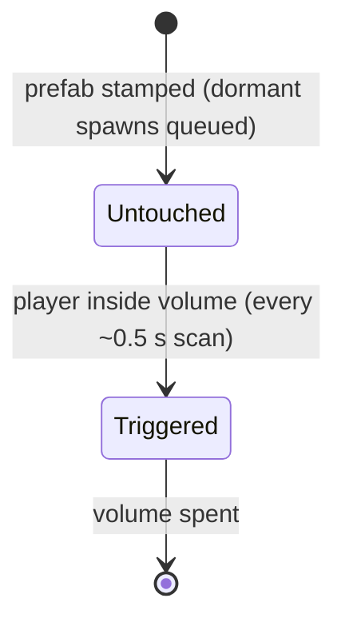
```mermaid
stateDiagram-v2
    [*] --> Untouched: prefab stamped (dormant spawns queued)
    Untouched --> Triggered: player inside volume (every ~0.5 s scan)
    Triggered --> [*]: volume spent
```

Owners: `src/world/sleepers.zig:38` (`triggered`),
`src/server/game/sleeper.zig` (`tickSleeperVolumes`), `src/ecs/systems.zig:987`
(per-entity `Sleeper.awake` wake: a player inside `volume_r` of the home cell;
sleepers are exempt from distraction targeting and far-despawn).

## 9. Trader SM

The trader surface (`TraderStock`, `ecs/components.zig:597`) owns the open
hours latch, the restock cadence and the money pool. Open/close is an
edge-latched cycle driven by the world clock; restock is lazy (triggered by the
window open) plus a daily timer; the wallet is server-owned.

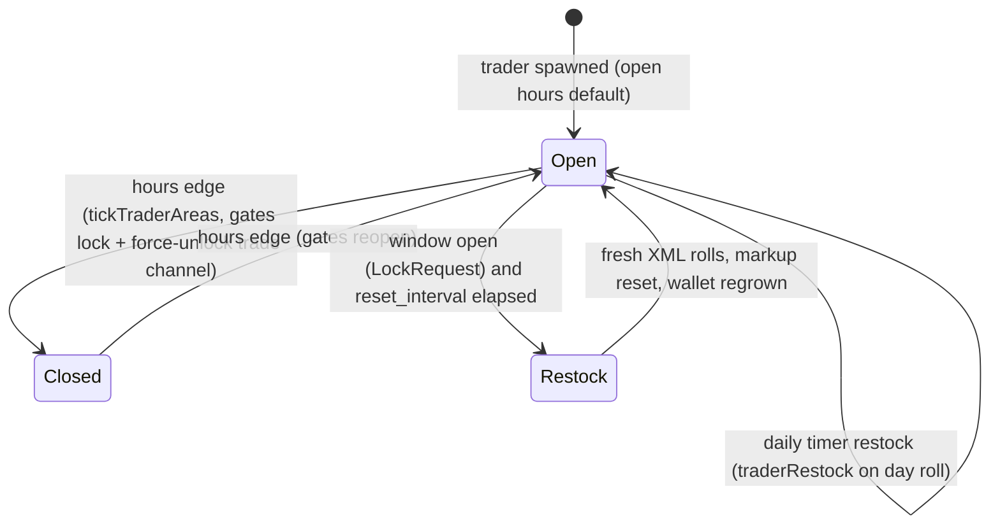
```mermaid
stateDiagram-v2
    [*] --> Open: trader spawned (open hours default)
    Open --> Closed: hours edge (tickTraderAreas, gates lock + force-unlock trade channel)
    Closed --> Open: hours edge (gates reopen)
    Open --> Restock: window open (LockRequest) and reset_interval elapsed
    Restock --> Open: fresh XML rolls, markup reset, wallet regrown
    Open --> Open: daily timer restock (traderRestock on day roll)
```

Owners: `src/server/game/trader.zig` (`traderIsOpen`, `tickTraderAreas`,
`maybeRestockTrader`, and `traderRollSeed`), `src/ecs/systems.zig`
(`traderRestock`), `src/server/c2s/misc.zig` (trader open via LockRequest,
denied outside hours), and `src/server/game/trader_wire.zig` (`handleTrade`,
`applyTraderDataCopyFrom`).

Restock cadence (`TraderStock.reset_interval` from traders.xml ResetInterval):
-1 never, 0 daily (spawn default), N > 0 every N days. The roll is
deterministic (world seed x trader id x day). Wallet: the trader `wallet` is
credited when players buy and debited when the trader buys from players (a
sell is refused once the pool runs out); it regrows toward `wallet_default` at
each restock. The C2S CopyFrom mirrors the client's post-trade stock deltas
and money back. Markup demand delta rides the wire (+100 after a buy, -4 after
a sell) and resets on restock.

## 10. Vehicle multi-seat

`Vehicle` (`ecs/components.zig:225`) keeps one seat per rider
(`seats[max_seats=6]`, -1 = free; `driver_seat = 0`). Seats flip between free
and occupied; only losing the driver stops the hull.

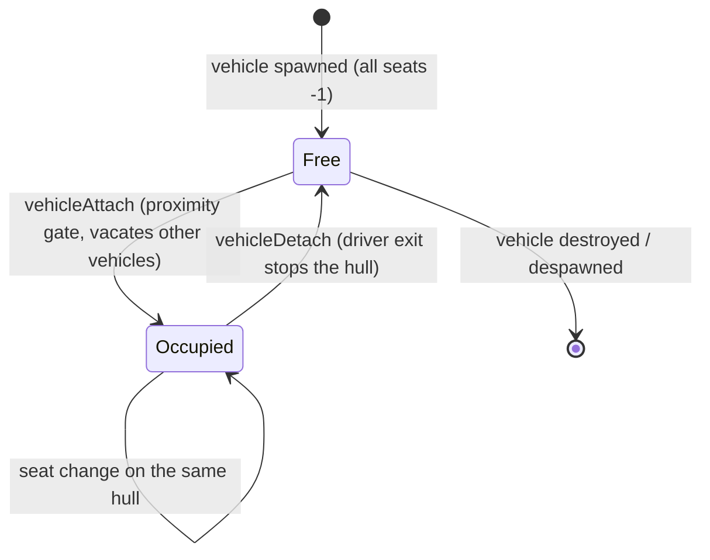
```mermaid
stateDiagram-v2
    [*] --> Free: vehicle spawned (all seats -1)
    Free --> Occupied: vehicleAttach (proximity gate, vacates other vehicles)
    Occupied --> Occupied: seat change on the same hull
    Occupied --> Free: vehicleDetach (driver exit stops the hull)
    Free --> [*]: vehicle destroyed / despawned
```

Owners: `src/ecs/systems.zig:1890` (`vehicleAttach`), `:1934`
(`vehicleDetach`), `:1862` (`vehicleFindSeat`), `:1872` (`vehicleOfRider`),
`src/server/c2s/misc.zig:520` (NetPackageEntityAttach, rider identity check),
`:504` (NetPackageVehicleSpawn op 0/1/2; only the seat-0 driver may steer).

An explicit request for an occupied seat is refused (the request comes off the
wire and must not evict another rider); re-requesting the held seat is a
no-op. The stock detach carries vehicleId = -1, so the hull is resolved from
server occupancy, never from the packet.

## 11. Ally status

Per directed relationship, mirrored across the two directions (SetStatus writes
the reverse). Client-side UI events ride alongside.

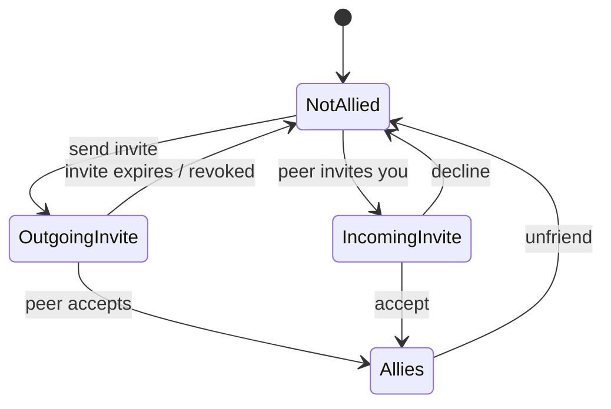
```mermaid
stateDiagram-v2
    [*] --> NotAllied
    NotAllied --> OutgoingInvite: send invite
    OutgoingInvite --> Allies: peer accepts
    OutgoingInvite --> NotAllied: invite expires / revoked
    NotAllied --> IncomingInvite: peer invites you
    IncomingInvite --> Allies: accept
    IncomingInvite --> NotAllied: decline
    Allies --> NotAllied: unfriend
```

Owners: `src/server/ally.zig:31` (`Status`), `:39` (`mirror`).

## 12. Plugin lifecycle

Two hosts share the hook order (enable, tick, playerJoin, shutdown) plus the
T15 event hooks (playerDeath, entityKilled, blockDamage, questComplete), which
run at their game events on the tick thread in that fixed order. The static
host is test scaffolding; the Wasm host loads `[plugin] modules` and disables a
module when a hook traps or exhausts its fuel budget.

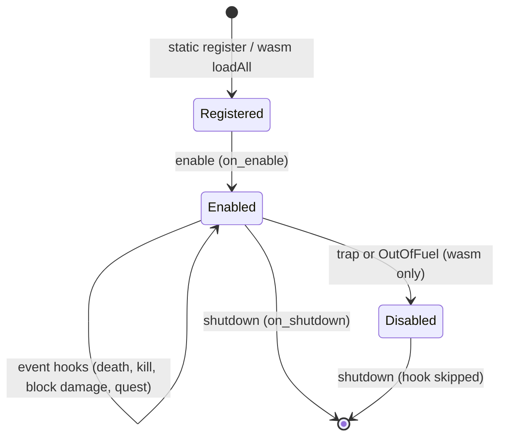
```mermaid
stateDiagram-v2
    [*] --> Registered: static register / wasm loadAll
    Registered --> Enabled: enable (on_enable)
    Enabled --> Enabled: per tick on_tick, on_player_join
    Enabled --> Enabled: event hooks (death, kill, block damage, quest)
    Enabled --> Disabled: trap or OutOfFuel (wasm only)
    Enabled --> [*]: shutdown (on_shutdown)
    Disabled --> [*]: shutdown (hook skipped)
```

Owners: `src/plugin/host.zig:10`, `src/plugin/wasm.zig:49`.
Now also `on_admin_command` (first >0 reply wins; traps = allow), `on_chat`
(deny/rewrite; bad UTF-8 treated as deny), and `on_player_login`
(sanitized name; first deny wins); same isolation and fuel+memory budget.

## 13. LiteNet peer

Transport-level peer lifecycle plus the reliable-window send path. A peer is
reaped when silent past `peer_stale_ms`; the reliable window retry pumps ACKs
for the fast window before pacing at 1 ms (so a dead peer is reclaimed by the
3 s sweep instead of wedging the tick).

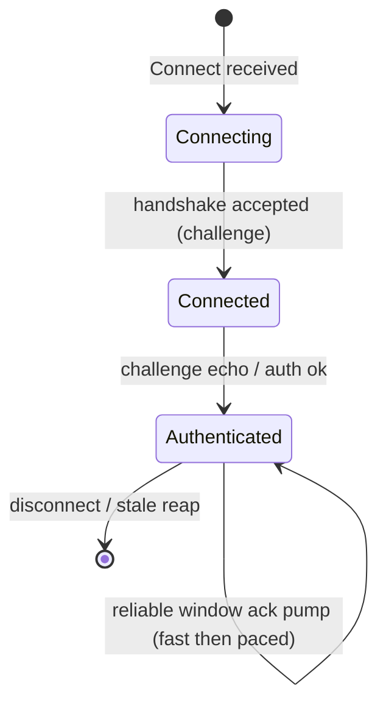
```mermaid
stateDiagram-v2
    [*] --> Connecting: Connect received
    Connecting --> Connected: handshake accepted (challenge)
    Connected --> Authenticated: challenge echo / auth ok
    Authenticated --> [*]: disconnect / stale reap
    Authenticated --> Authenticated: reliable window ack pump (fast then paced)
```

Owners: `src/litenet/peer.zig:129` (`Peer`), `src/server/game.zig`
(`reapStalePeers`, WindowFull retry pacing).

## 14. Land claims

Placed keystone claims protect a region for the owner; expiry is offline-days
based and re-checked on the in-game day roll.

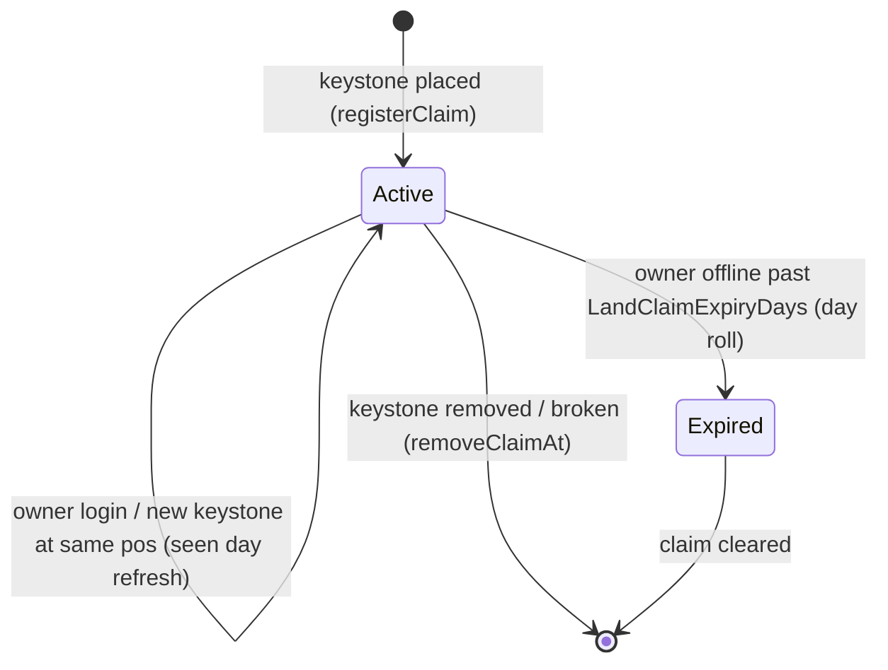
```mermaid
stateDiagram-v2
    [*] --> Active: keystone placed (registerClaim)
    Active --> Active: owner login / new keystone at same pos (seen day refresh)
    Active --> Expired: owner offline past LandClaimExpiryDays (day roll)
    Active --> [*]: keystone removed / broken (removeClaimAt)
    Expired --> [*]: claim cleared
```

Owners: `src/server/game/world.zig:26` (`registerClaim`), `:65`
(`removeClaimAt`), `:89` (`expireClaims`), `src/server/persist.zig:517`
(`saveClaims`), `:547` (`loadClaims`), `:586` (`reclaimForName`, re-maps the
restored claim to the entity id a player got at login and refreshes the seen
day). Expiry counts offline days only (`day - owner_seen_day >
land_claim_expiry_days`, 0 disables); a re-placement at the same keystone
replaces the owner instead of appending.

## 15. Party membership

Per-session grouping keyed on runtime entity id (stock `PartyManager`;
parties-factions.md §2). A party is thrown away on disband: the client only
sees entity ids, no platform identity. Membership is server-mutated from
`NetPackagePartyActions` and every mutation fans a `NetPackagePartyData`
snapshot to the party-relevant peers.

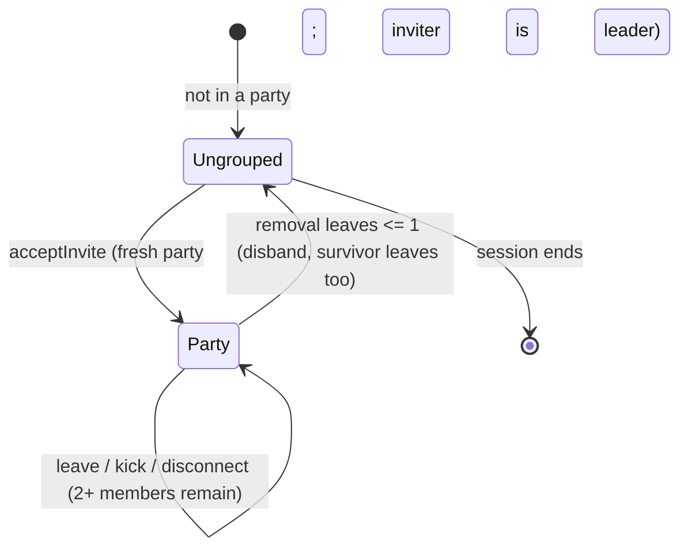
```mermaid
stateDiagram-v2
    [*] --> Ungrouped: not in a party
    Ungrouped --> Party: acceptInvite (fresh party; inviter is leader)
    Party --> Party: acceptInvite (joins inviter's existing party)
    Party --> Party: change_lead (leader index moves to the new host)
    Party --> Party: join_auto_party (party id 1, created when missing)
    Party --> Party: leave / kick / disconnect (2+ members remain)
    Party --> Ungrouped: removal leaves <= 1 (disband, survivor leaves too)
    Ungrouped --> [*]: session ends
```

Owners: `src/ecs/party.zig:64` (`Manager`, `next_party_id` starts at 1),
`:132` (`acceptInvite`), `:148` (`setLeader`), `:160` (`removePlayer`),
`:190` (`autoJoin`), `src/server/game/social.zig:118` (`handlePartyActions`,
validates member/leader identity before each mutation),
`src/server/game/session_drop.zig` (`dropClientSlot`: disconnect removal +
shared-quest cleanup).

Notes: `max_party_members = 8` (stock `IsFull` refuses), and a party of one
is not kept (the last member's removal disbands it). `setVoiceLobby` is a
wire round-trip only; zdtd owns no voice lobby. A shared quest latches
`QuestProgress.is_shared` (`server/game/social.zig:266`) and the party gets
`remove_quest` events when the owner disconnects (`session_drop.zig`).

## 16. Vending rental

Per-block `TileEntityVendingMachine` ownership. `rental_end_day = 0` is
unowned; a rent request pays `TraderInfo.RentCost` coins and sets the owner
plus a 30-day term (or `rent_time` when set). Expiry is checked on the C2S
path and on the in-game day roll.

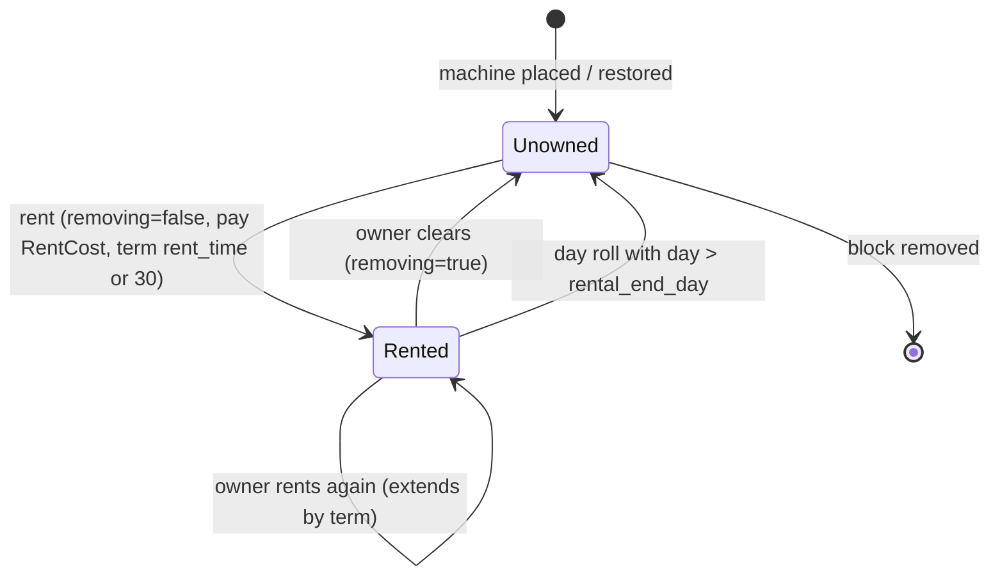
```mermaid
stateDiagram-v2
    [*] --> Unowned: machine placed / restored
    Unowned --> Rented: rent (removing=false, pay RentCost, term rent_time or 30)
    Rented --> Rented: owner rents again (extends by term)
    Rented --> Unowned: owner clears (removing=true)
    Rented --> Unowned: day roll with day > rental_end_day
    Unowned --> [*]: block removed
```

Owners: `src/world/vending.zig:64` (`Vending.rental_end_day`), `:88`
(`clear`, keeps pos / block_id / trader_id / stock),
`src/server/c2s/quest.zig:252` (`NetPackagePlayerVendingMachine`: rent and
clear, `CanRent` gates), `src/server/game/step.zig` (day-roll rental expiry).

Notes: rentability comes from `trader_info rentable`; the request acts only
on the sender's own identity and the owner may only clear their own machine;
one machine per player (CanRent 2); the wallet is synced from inventory
coins first, then the rent cost is drawn from it (CanRent 3 when short).
An expired rental clears before any new request is evaluated.

## 17. Loot respawn

World container lifecycle (`LootRespawnDays`, stock `TEFeatureStorage
.UpdateTick`). A world chest rolls once on first chunk scan; the fill itself
marks `touched` (and stamps `touched_day`). After the player empties it, the
next open re-rolls once `LootRespawnDays` have elapsed since the touch day.
Player-placed storage never respawns.

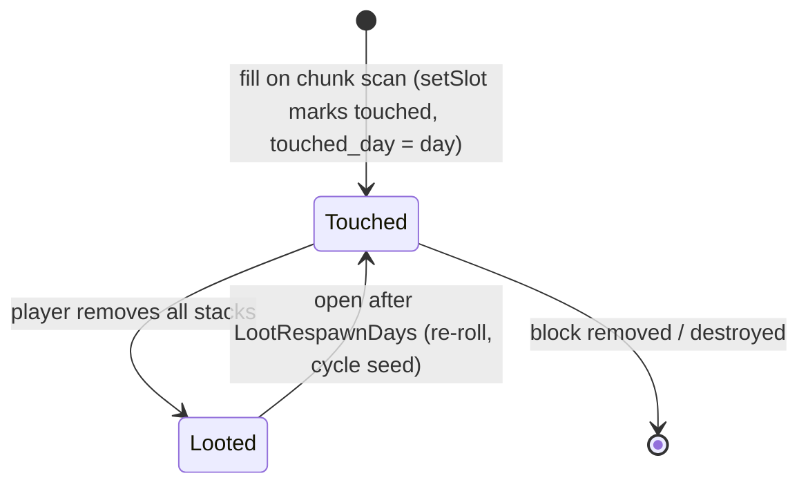
```mermaid
stateDiagram-v2
    [*] --> Touched: fill on chunk scan (setSlot marks touched, touched_day = day)
    Touched --> Looted: player removes all stacks
    Looted --> Touched: open after LootRespawnDays (re-roll, cycle seed)
    Touched --> [*]: block removed / destroyed
```

Owners: `src/server/game/chunk_fill.zig` (`fillContainerFromLoot`, stamps
`touched_day`, and `maybeRespawnContainer`), `src/server/game.zig`
(forwarding methods), `src/server/c2s/inv.zig` (re-roll before serving
`NetPackageInventoryDataRequest`), `src/world/containers.zig:33`
(`touched` / `touched_day`), `:44` (`setSlot`).

Notes: `loot_respawn_days = 0` disables the re-roll; the guard order is
`player_storage` → `!touched` → not empty → `day <= touched_day` →
`elapsed < loot_respawn_days`. The re-roll seed is
`lootSeedAt(pos) + cycle * 2654435761` with `cycle = day / loot_respawn_days`,
deterministic per (pos, cycle). A block with no LootList stays empty (fail
closed, audit A31).

## 18. Guard policy

P4 policy ladder over detector evidence: log-only (default) → quarantine
(opt-in) → kick (opt-in AND `dry_run=false` AND Correct authority mode).
Weak signals (`.info` / `.soft`) return before any counter moves, so they can
never open a gate no matter how often they fire.

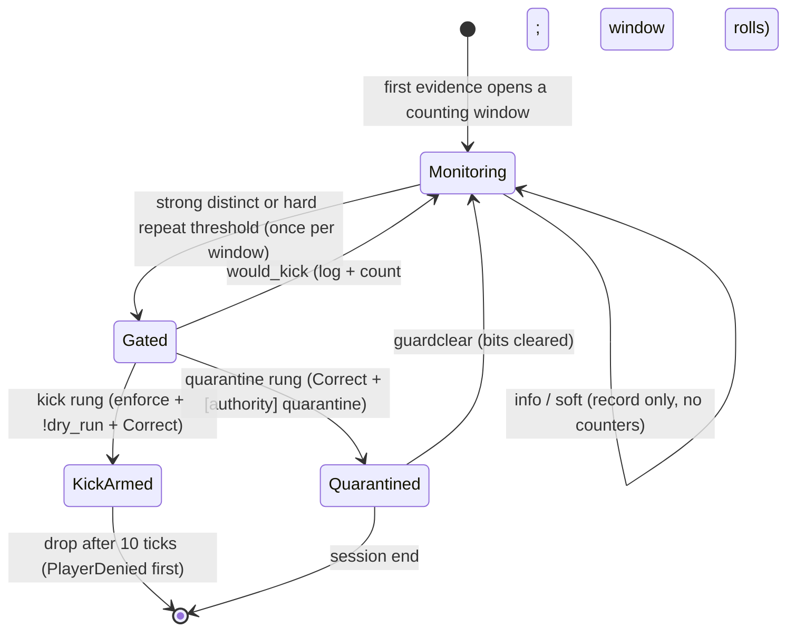
```mermaid
stateDiagram-v2
    [*] --> Monitoring: first evidence opens a counting window
    Monitoring --> Monitoring: info / soft (record only, no counters)
    Monitoring --> Gated: strong distinct or hard repeat threshold (once per window)
    Gated --> Quarantined: quarantine rung (Correct + [authority] quarantine)
    Gated --> KickArmed: kick rung (enforce + !dry_run + Correct)
    Gated --> Monitoring: would_kick (log + count; window rolls)
    Quarantined --> Monitoring: guardclear (bits cleared)
    KickArmed --> [*]: drop after 10 ticks (PlayerDenied first)
    Quarantined --> [*]: session end
```

Owners: `src/server/guard_policy.zig:71` (`Policy` rungs and thresholds),
`:114` (`PeerState`: strong_mask, hard_n, tripped, quarantine, kick_at_tick),
`:152` (`evaluate`), `src/server/game/guard.zig` (`noteEvidence`,
`applyQuarantine`, `armPolicyKick`, and `quarantineDenies` at the C2S trust
boundaries: damage / container / block), `src/server/game/tick.zig`
(`reapPolicyKicks`).

Notes: the window roll clears counters and the trip latch but deliberately
keeps the quarantine bits (cleared by admin `guardclear` or the session
ending). `bitsFor(surf)` sets only the abused surface (`.none` sets all
three). Observe mode records and logs but never denies or drops (`would_kick`
only). While load-shedding after a tick overrun, weak records are dropped
before the policy runs (`src/server/game/guard.zig` `noteEvidence`).

## 19. Chunk stream backpressure

The per-client stream pass and the reliable-window soft-drop. Chunks are
delivered in paced passes under named caps; when the LiteNet reliable window
is full the sender pumps ACKs with a retry deadline and drops the frame only
after the attempt cap, so one slow peer cannot wedge the tick.

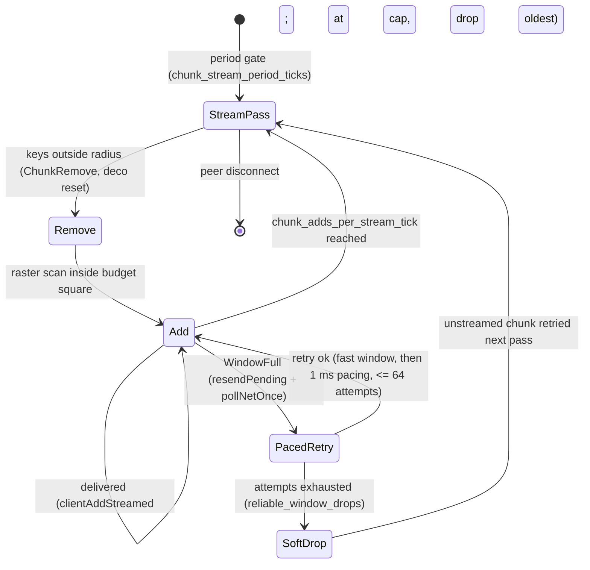
```mermaid
stateDiagram-v2
    [*] --> StreamPass: period gate (chunk_stream_period_ticks)
    StreamPass --> Remove: keys outside radius (ChunkRemove, deco reset)
    Remove --> Add: raster scan inside budget square
    Add --> Add: delivered (clientAddStreamed; at cap, drop oldest)
    Add --> PacedRetry: WindowFull (resendPending + pollNetOnce)
    PacedRetry --> Add: retry ok (fast window, then 1 ms pacing, <= 64 attempts)
    PacedRetry --> SoftDrop: attempts exhausted (reliable_window_drops)
    Add --> StreamPass: chunk_adds_per_stream_tick reached
    SoftDrop --> StreamPass: unstreamed chunk retried next pass
    StreamPass --> [*]: peer disconnect
```

Owners: `src/server/game/chunk_stream.zig` (`streamChunksForClient` and
`clientAddStreamed`) and `src/server/game/net.zig` (`sendReliablePumped`,
`sendFramedDroppable` soft-drop, and `sendFramedUnreliable` motion frames).

Notes: the radius is clamped to `[chunk_stream_radius_min, max]` and shrunk to
a square that fits `max_streamed_chunks`; each pass adds at most
`chunk_adds_per_stream_tick` chunks so the reliable window can drain.
`clientAddStreamed` drops the oldest key at `max_streamed_chunks_cap` and
warns once at 80% of the configured budget. A chunk whose send failed or was
soft-dropped is not marked streamed and is retried on the next pass. Motion
frames use the unreliable path (fire and forget); oversized frames fall back
to the droppable reliable path.

## 20. Buff lifecycle

Per entity `BuffSet` (stock `EntityBuffs`, asm.il 735832). The client ticks
its own copy of the same buff, so the server runs the identical rule on every
entity it owns or the HUD icon and timer drift.

```mermaid
stateDiagram-v2
    [*] --> Absent
    Absent --> Active: add (new instance, class or requested duration)
    Active --> Active: add again (stack rule: ignore revive / duration extend / effect +1 / replace restart)
    Active --> PendingRemove: remove() or duration elapsed (finished)
    PendingRemove --> Absent: next tick (expiry reported to observers)
    Active --> Absent: clearOnDeath (remove_on_death only, silent)
    Active --> Absent: invalid flag (tick drops)
    Active --> Active: paused or dead (tick skips the timer)
    Absent --> [*]: entity destroyed
```

Owners: `src/ecs/buff.zig:40` (`add`, stacking rules), `:95` (`remove` flags
for the next tick), `:123` (`tick`), `:166` (`clearOnDeath`),
`src/ecs/systems.zig:2134` (`systemBuffs`, per entity per tick),
`src/ecs/schedule.zig:64` (buffs phase; `TickResult.buff_expired`),
`src/server/game/social.zig:109` (`broadcastBuffExpiries` → relayBuff remove),
`src/server/c2s/join.zig:249` (death respawn silently clears
`remove_on_death` buffs, stock BuffClass::RemoveOnDeath).

Notes: `duration <= 0` never expires; the update flag fires and clears within
the same tick (no triggered-effect VM); the effect stack saturates at 255;
a dead entity skips the started/duration half of the tick; expiry removals
ride `TickResult.buff_expired` to the net layer, which relays the removal to
observers (the owner already dropped its own copy on death).

## Related docs

| Doc | Role |
|---|---|
| [GAMEPLAY.md](GAMEPLAY.md) | Gameplay flows - craft, trade, loot, survival |
| [ZIG_CLONE.md](ZIG_CLONE.md) | Architecture - M0-M6 and system overview |
| [AUTHORITY.md](AUTHORITY.md) | Join phases, C2S validation, interest, mode |
| [ECS_SYSTEMS.md](ECS_SYSTEMS.md) | SoA columns, queries, groups, tick order |
| [APM.md](APM.md) | Native metrics (`src/apm/`) |
| [wire/PACKAGES.md](wire/PACKAGES.md) | 190-package catalog |
| [STATUS.md](STATUS.md) | What works now - the hub |

## Keeping this document honest

- A diagram is a summary; the `src/` anchor owns the transitions. When they
  disagree, fix the code to match RE, then fix the diagram.
- State machines added or removed in code: update the table and the diagram in
  the same commit as the code change.
