# State machines in zdtd

Every stateful lifecycle in the server, with the state transitions and the code
that owns them. Diagrams are mermaid; the `src/` anchors are the authority when
a diagram and a comment disagree.

| # | State machine | Owner | Diagram |
|---|---|---|---|
| 1 | Join / client session SM | `server/game.zig` join SM, `server/phase_gate.zig` | [join](#1-join--client-session-sm) |
| 2 | Sim tick pipeline | `ecs/schedule.zig` | [tick](#2-sim-tick-pipeline) |
| 3 | Zombie AI task selection | `ecs/components.zig` `AiState`/`TaskId`, `ecs/systems.zig` AiCtx | [ai](#3-zombie-ai-task-selection) |
| 4 | Quest lifecycle | `ecs/quest.zig`, `ecs/systems.zig` | [quest](#4-quest-lifecycle) |
| 5 | Weather storm SM | `world/weather.zig` | [weather](#5-weather-storm-sm) |
| 6 | Blood moon window | `ecs/aidirector.zig` `WorldClock` | [blood-moon](#6-blood-moon-window) |
| 7 | Power grid | `ecs/powerblocks.zig` | [power](#7-power-grid) |
| 8 | Sleeper volumes | `world/sleepers.zig` | [sleepers](#8-sleeper-volumes) |
| 9 | Ally status | `server/ally.zig` | [allies](#9-ally-status) |
| 10 | Plugin lifecycle | `plugin/host.zig`, `plugin/wasm.zig` | [plugins](#10-plugin-lifecycle) |
| 11 | LiteNet peer | `litenet/peer.zig` | [peer](#11-litenet-peer) |
| 12 | Land claims | `server/game.zig` land claims | [claims](#12-land-claims) |

## 1. Join / client session SM

The wire sequence a stock client (or loadgen bot) walks. `Client.joined` /
`Client.entered` map to the `phase_gate` Phase (`connecting` → `joined` →
`playing`); the gate drops C2S packages that are not legal for the current
phase. Challenge is LiteNet-level; the challenge echo races the first payload,
which is buffered and replayed after auth (`Client.preauth_buf`).

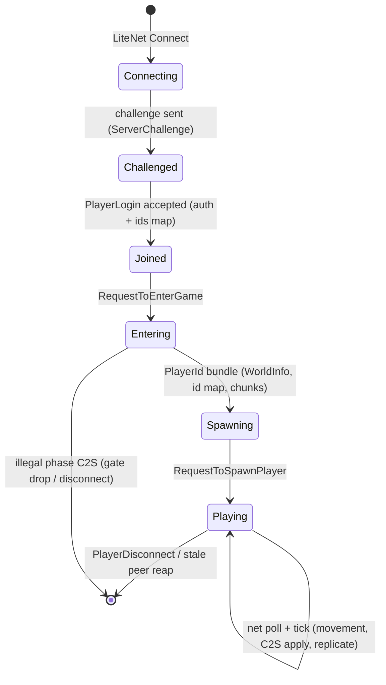

Owners: `src/server/game.zig:4816` (phase gate dispatch), `:7050`
(sendJoinBundle), `src/server/phase_gate.zig:7`.

## 2. Sim tick pipeline

The 20 TPS main loop. Phases run in document order; parallelism stays inside a
phase (`systemZombieAi` / `systemTurrets` via the `util/parallel` pool). The
command buffer drains once per tick after the sim settles; plugin-queued
commands land on the next tick's drain.

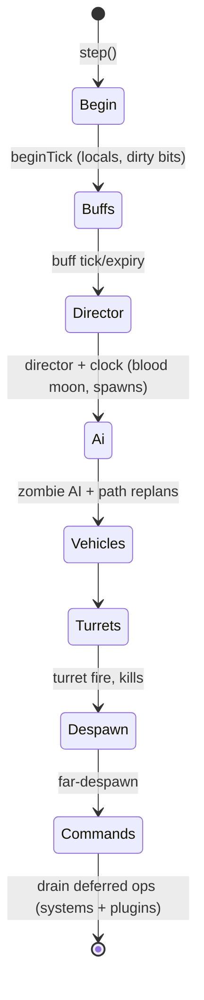

Owners: `src/ecs/schedule.zig:9` (`Phase`), `src/server/game.zig:9600+`
(the `step()` body that wraps `systems.tickAll`).

## 3. Zombie AI task selection

The coarse replicated state (`AiState`) plus the executing EAI task
(`TaskId`). Stock's prioritized `EAITaskList` is collapsed to a comptime task
table with mutex-based preemption; movement tasks are mutually exclusive,
BreakBlock/DestroyArea use mutex 0 and preempt approach when the path is
blocked. Wander resumes when the target is lost.

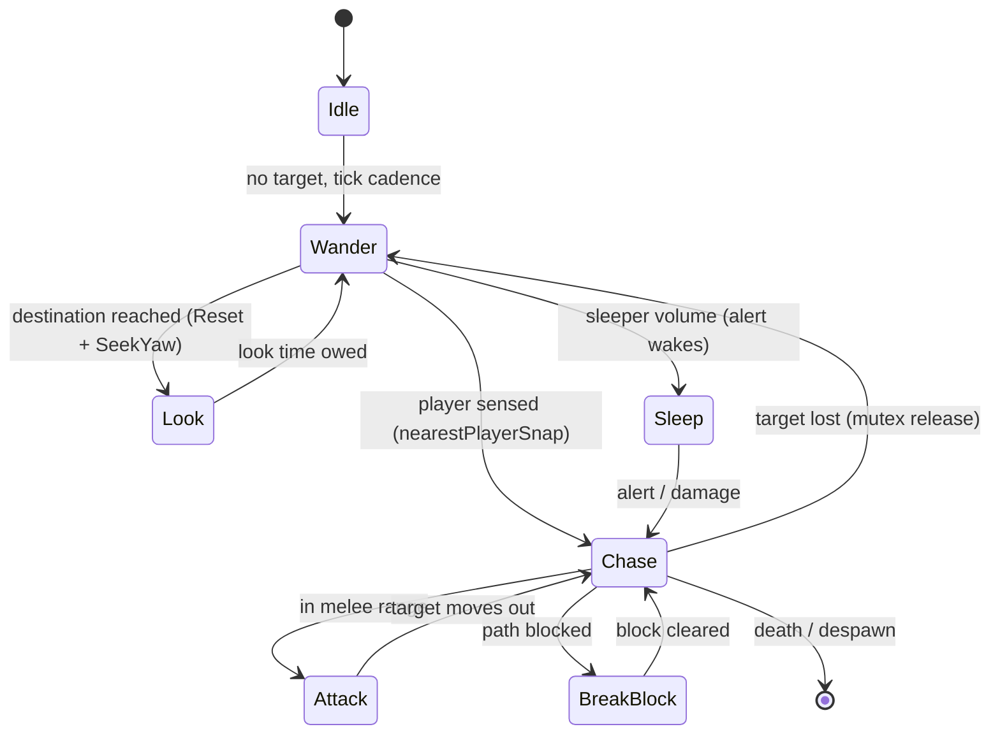

Owners: `src/ecs/components.zig:53` (`AiState`), `:68` (`TaskId`),
`src/ecs/systems.zig` AiCtx (`zombie_tasks` table).

## 4. Quest lifecycle

Per player slot, per quest. `QuestProgress` walks a phase graph (each phase =
one advancing objective kind + required count); `ready_turn_in` parks the quest
at the highest phase until the trader is opened. Wallet coins credit in the
sim; item and exp rewards pay out through the tick-end completed-quest ring.
`Optional` / `ForcePhaseFinish` (quest failure) are not modelled.

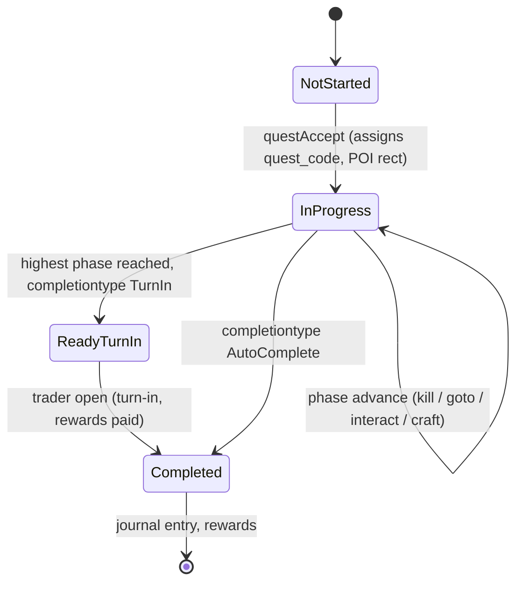

Owners: `src/ecs/quest.zig` (`QuestProgress`, `PhaseSpec`, `RewardSpec`),
`src/ecs/systems.zig:192` (`completeQuest`), `:340` (`questOnTraderOpen`),
`src/server/game.zig` (tick-end payout drain).

## 5. Weather storm SM

Per biome (`BiomeState`), driven by world time: `stormbuild` countdown →
`storm` → clear + reschedule. A blood moon forces every biome to its
`bloodMoon` group and pushes scheduled storms past the horde night. The state
is persisted (`weather.zwt`) and restored on restart.

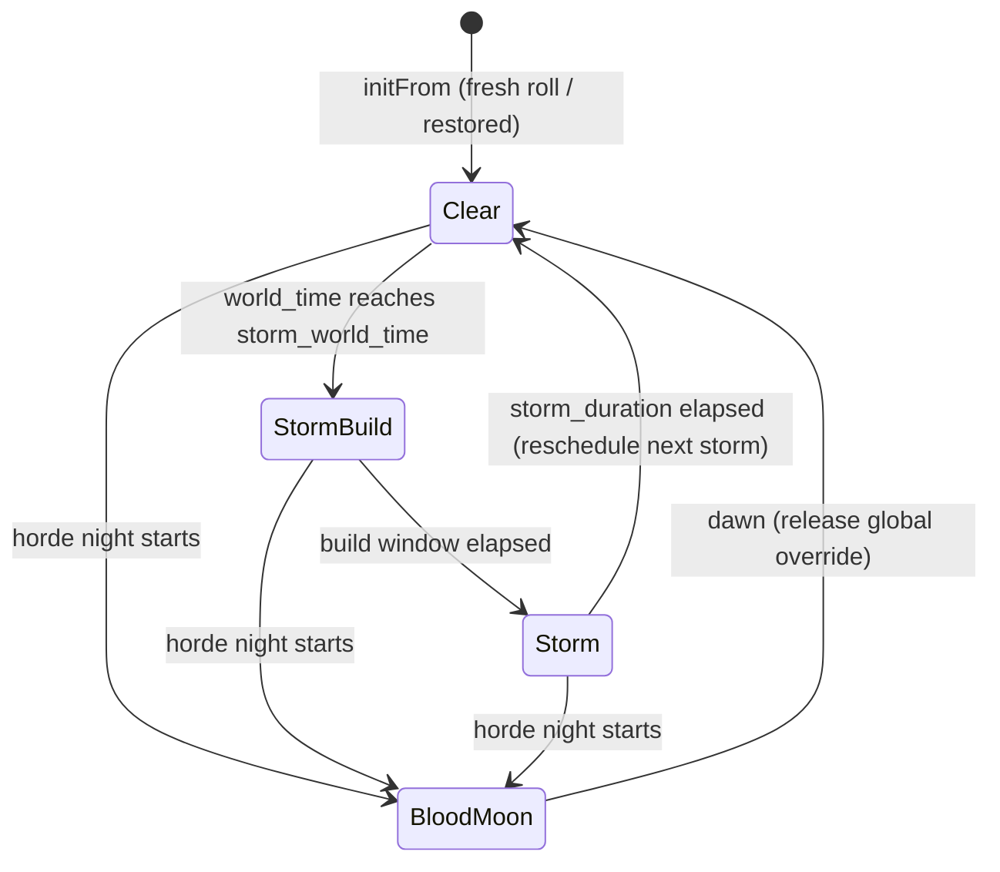

Owners: `src/world/weather.zig:29` (`BiomeState.storm_state` 0/1/2),
`:106` (`tick`), `:125` (`forceBloodMoon`), `:292` (persistence).

## 6. Blood moon window

The clock's day/hours plus the scheduled blood-moon day. The window spans dusk
on the scheduled day through dawn of the next day (crosses the midnight
rollover); `GameStats.blood_moon_day` is re-broadcast to connected clients
when the scheduled day rolls.

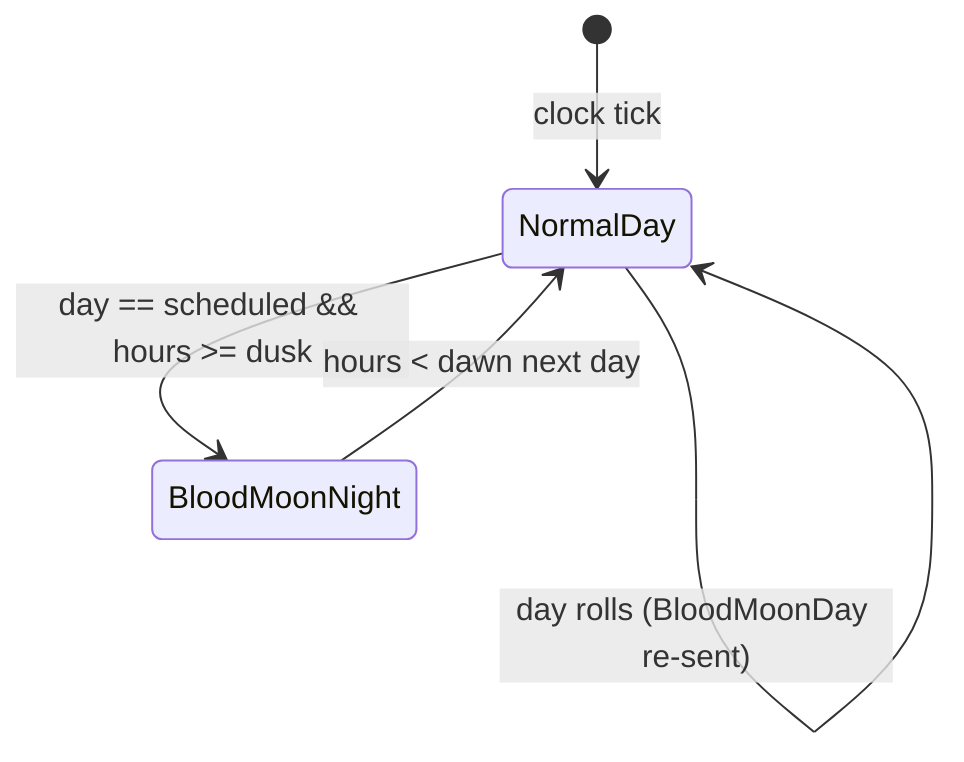

Owners: `src/ecs/aidirector.zig:62` (`isBloodMoonNight`), `:68`
(`isBloodMoonDay`), `src/server/game.zig` (`bloodMoonDayFor` + day-roll
broadcast).

## 7. Power grid

Nodes (generator / battery / solar / consumer / trigger) resolve once per tick
from the grid graph. A node's effective state is derived (powered or not by
the resolved graph); triggers fire on activation while powered. The client's
rendered state and the grid agree from tick one.

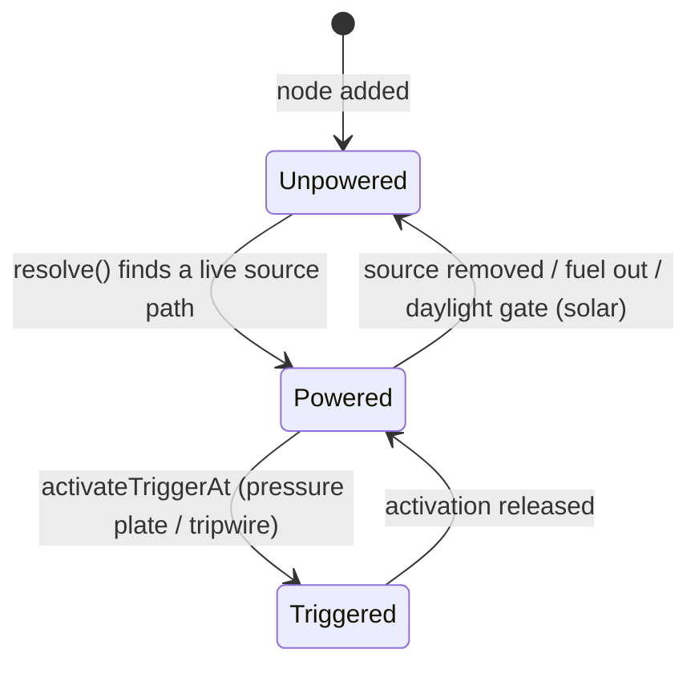

Owners: `src/ecs/powerblocks.zig` (`PowerGrid`, `resolve`, `tick`),
`src/server/game.zig` (broadcast visuals on change).

## 8. Sleeper volumes

Prefab sleeper volumes hold dormant zombies until a player enters the volume;
once triggered they stay triggered (no re-spawn spam). Waking is a one-way
transition per volume.

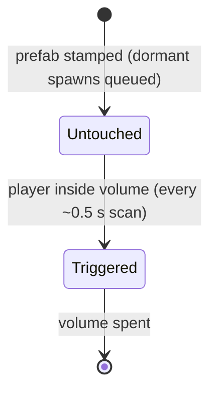

Owners: `src/world/sleepers.zig:36` (`triggered`), `src/server/game.zig`
(`tickSleeperVolumes`).

## 9. Ally status

Per directed relationship, mirrored across the two directions (SetStatus writes
the reverse). Client-side UI events ride alongside.

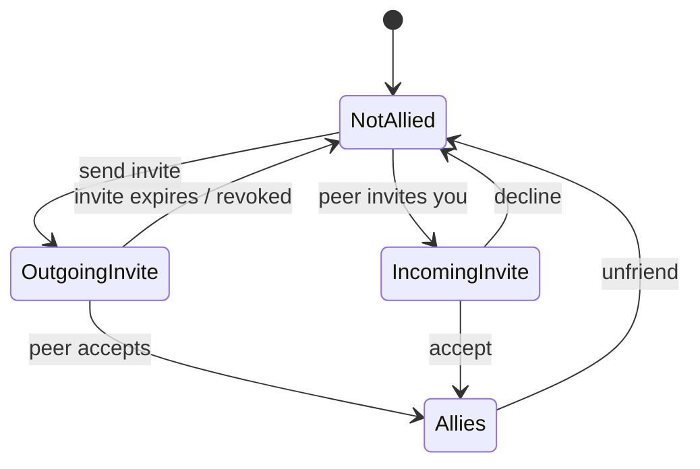

Owners: `src/server/ally.zig:25` (`Status` + `mirror`).

## 10. Plugin lifecycle

Two hosts share the hook order (enable, tick, playerJoin, shutdown). The static
host is test scaffolding; the Wasm host loads `[plugin] modules` and disables a
module when a hook traps or exhausts its fuel budget.

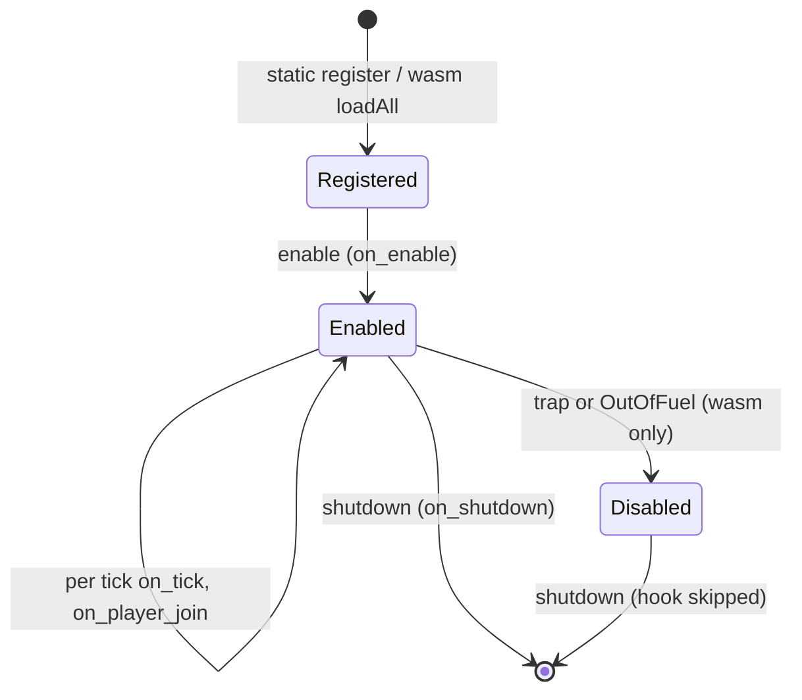

Owners: `src/plugin/host.zig:10`, `src/plugin/wasm.zig:49`.

## 11. LiteNet peer

Transport-level peer lifecycle plus the reliable-window send path. A peer is
reaped when silent past `peer_stale_ms`; the reliable window retry pumps ACKs
for the fast window before pacing at 1 ms (so a dead peer is reclaimed by the
3 s sweep instead of wedging the tick).

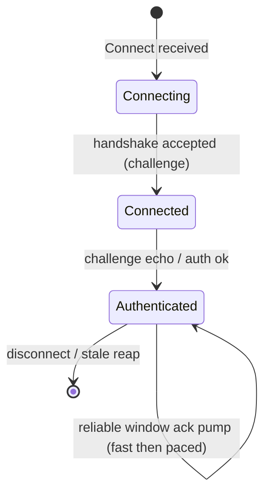

Owners: `src/litenet/peer.zig:129` (`Peer`), `src/server/game.zig`
(`reapStalePeers`, WindowFull retry pacing).

## 12. Land claims

Placed keystone claims protect a region for the owner; expiry is offline-days
based and re-checked on the in-game day roll.

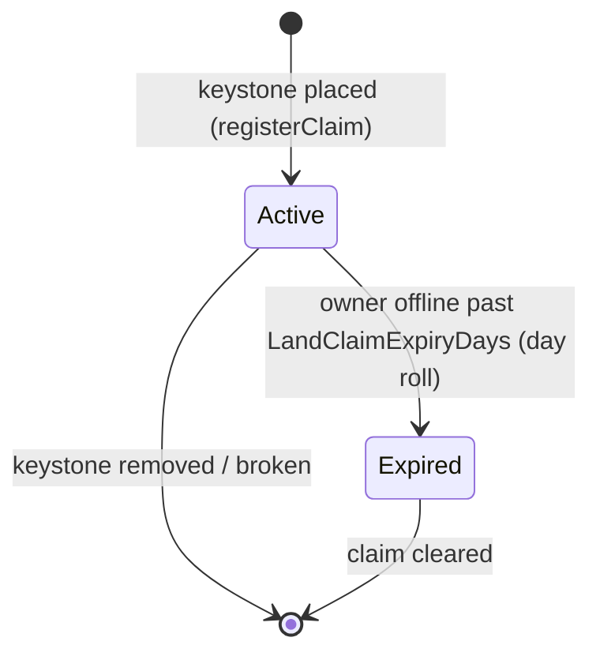

Owners: `src/server/game.zig` (`registerClaim`, `expireClaims`,
`removeClaimAt`).

## Keeping this document honest

- A diagram is a summary; the `src/` anchor owns the transitions. When they
  disagree, fix the code to match RE, then fix the diagram.
- State machines added or removed in code: update the table and the diagram in
  the same commit as the code change.
