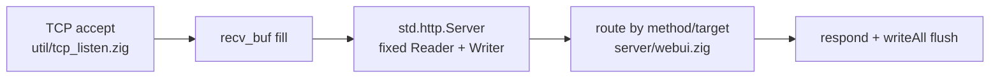

# Zig stdlib abstraction audit (zdtd)

> **What this is:** where the codebase uses high-level Zig 0.16 stdlib (`std.Io`, `std.http`, `std.Io.net`) versus the thin posix that remains.

> **Related:** [ARCHITECTURE §2](ARCHITECTURE.md#2-source-layout-and-dependency-edges) · [ARCHITECTURE §4](ARCHITECTURE.md#4-net-stack-litenet-framing-packages) · [WEBUI](WEBUI.md) · [APM](APM.md) · [SCALE](SCALE.md)

Living map of where we use high-level Zig 0.16 APIs vs thin posix.
Policy: **AGENTS rule 26** (stdlib / `std.Io` over raw `std.os.linux`).

## Target stack

```text
app (server/ecs/world/assets)
  → util/io_fs, util/clock, util/tcp_listen, util/sys_metrics, litenet/udp_socket
  → std.Io / std.Io.net / std.posix (thin)
  → OS
```

**No application `std.os.linux` imports** (only forbid-comments remain) - the
single exception is `util/sys_metrics.zig`, a thin leaf whose two syscalls
(sysinfo + getrusage) back the ops-dashboard `mem` metrics and stay out of the
FS path (AGENTS rule 26 confinement list).

## Status by subsystem

| Area | Preferred API | State |
|---|---|---|
| **Ordinary FS** | `util/io_fs` → `std.Io.Dir`/`File` | **Done** |
| **Paths** | `std.fs.path`, `std.fs.max_path_bytes` | **OK** |
| **UDP LiteNet** | `litenet/udp_socket` → `std.Io.net` | **Done** |
| **Monotonic time** | `util/clock` → `posix.system.clock_gettime` (vDSO; no Threaded) | **Done** |
| **Sleep** | `posix.system.nanosleep` | **Done** |
| **Thread pool** | `util/parallel` → `std.Io` | **Done** |
| **TCP listen** | `util/tcp_listen` → `IpAddress.listen` + poll/`accept4` | **Done** |
| **Admin TCP** | `tcp_listen` | **Done** |
| **GSI info TCP** | `tcp_listen` | **Done** |
| **WebUI TCP** | `tcp_listen` | **Done** |
| **HTTP framing** | `std.http.Server` | **Done** (`webui.serveHttp`: fixed Reader over recv_buf + Writer → writeAll) |

## WebUI HTTP path

1. Non-blocking TCP accept/read until full request in `recv_buf`
2. `http.Server.init(Io.Reader.fixed(buf), Io.Writer.fixed(out))`
3. `receiveHead` + route on `method`/`target`; body = remainder of fixed reader
4. `request.respond` + flush Writer buffer via `tcp.writeAll`



## Why clock stays on `posix.system`

`monoNs` is on the per-packet hot path. 0.16 moved timing into `std.Io`
(`Io.Clock.now(clock, io)`, `Io.sleep`); `std.time.Instant` and `Thread.sleep`
are gone. Every std time call requires an `Io`, and owning one means
`Io.Threaded.init`, which calls `getCpuCount()` and installs SIGIO/SIGPIPE
handlers (`Io/Threaded.zig:1652`) - too heavy and globally racy per packet.
`clock.zig` stays an Io-free leaf: Threaded's posix `.now` is exactly
`posix.system.clock_gettime` plus a timespec conversion (`Io/Threaded.zig:11428`),
so the direct vDSO read is the same call with no context to construct. Sleep is
analogous: `Io.sleep` lowers to `clock_nanosleep` (`Io/Threaded.zig:11598`); the
leaf `nanosleep` is the Io-free equivalent. (`Io.Threaded.init_single_threaded`
is a comptime-const `Io` whose `now` would work since userdata is unused, but it
is the single-thread fallback global, not the right anchor for a threaded server.)

## Why accept uses poll + accept4

`Io.net.Server.accept` treats EAGAIN as a programmer bug when the listen socket
is non-blocking. Listen stays blocking; `poll(0)` gates `accept4(..., NONBLOCK|CLOEXEC)`.

## Residual thin posix (acceptable)

| Call | Where |
|---|---|
| `posix.setsockopt` REUSEADDR | UDP bind (BindOptions has no reuse) |
| `system.setsockopt` V6ONLY | UDP dual-stack bind (post-bind EINVAL probe; std variant traps on EINVAL) |
| `posix.poll` + `system.accept4` | tcp_listen accept |
| `posix.read` / `system.write` / `system.close` | tcp_listen client I/O |
| `posix.poll` POLLOUT | tcp_listen `writeAll` EAGAIN gate (no std write-with-cap exists) |
| `system.clock_gettime` / `nanosleep` | clock hot path |
| `system.getrusage` | sys_metrics process CPU/RSS (no Io equivalent) |

## Checklist for new code

- [ ] No `std.os.linux` imports
- [ ] FS via `io_fs` / `std.Io.Dir`
- [ ] Time via `util/clock`
- [ ] UDP via `litenet/udp_socket`
- [ ] TCP via `util/tcp_listen`
- [ ] Prefer `std.http.Server` for new HTTP surfaces

## Verification

```bash
rg -n 'std\.os\.linux' src --type zig   # comments only
zig build && zig build test
```
