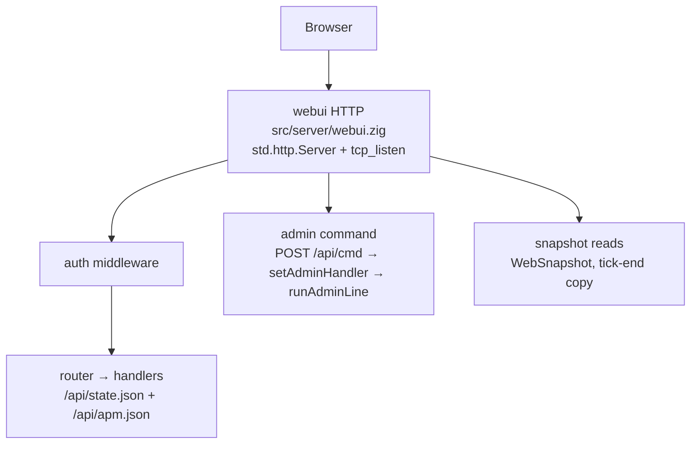

# Server web UI design (Preact dashboard)

> **What this is:** the operator web dashboard for zdtd, status, players, APM, and admin commands over loopback HTTP. Not a Steam browser clone.

> **Related:** [ARCHITECTURE](ARCHITECTURE.md) · [ARCHITECTURE §11](ARCHITECTURE.md#11-observability-apm) · [APM](APM.md) · [AUTHORITY](AUTHORITY.md) · [PLUGIN_API](PLUGIN_API.md) · [GAME_OPTIONS](GAME_OPTIONS.md) · [STD_ABSTRACTIONS](STD_ABSTRACTIONS.md) · `src/server/admin.zig`

Operator-facing **ops dashboard** for zdtd. Not a stock Steam browser clone, not
a Unity GUI, not a mod host. Complements existing **admin TCP** and **apm**
dumps with a browser UI.

| | |
|---|---|
| Status | **WU0–WU2 shipped** (dashboard + console cmds); WU3+ optional |
| Stack | Preact dashboard over `GET /api/state.json` ([ADR 0040](adr/0040-webui-preact-json-state.md), superseding the htmx/Alpine plan in [ADR 0018](adr/0018-webui-ops-dashboard.md) decision 2); the bundle is inlined into the committed page by `scripts/build-webui-ts.sh`, login and lockout stay server-rendered |
| Server | Zig HTTP on a dedicated bind (loopback default) |
| Related | [APM.md](APM.md), [AUTHORITY.md](AUTHORITY.md), `src/server/admin.zig`, [PLUGIN_API.md](PLUGIN_API.md) |

## Goals

1. **See** live server health: tick budget, joins, peers, chunks, zombies, apm.
2. **Act** safely: same command surface as admin TCP (give, tele, kick, time, …).
3. **Configure** visibility: read-only serverconfig / effective options; write only
   where we already allow hot reload (or explicit restart-required flags).
4. **Stay out of the 50 ms tick:** all UI I/O off the sim hot path (or
   command-queue only).
5. **Secure by default:** loopback bind, shared secret or cookie session, no
   anonymous open internet admin.

## Non-goals

- Stock client replacement or in-game HUD.
- Full telnet parity day one (incremental command coverage).
- Real-time 3D map editor or RWG designer (link worldgen later if at all).
- Embedding a Node/npm SPA build into the dedi binary.
- Harmony / ModAPI / Steam browser protocol.

## Why Preact over a JSON state endpoint

ADR 0018 chose htmx-style partial swaps with Alpine state. It shipped as a
hand-rolled poller over server-rendered fragments, which put every field in two
places (a Zig renderer and the page skeleton) and gave the client no state of
its own. [ADR 0040](adr/0040-webui-preact-json-state.md) replaced it.

| Choice | Rationale |
|---|---|
| **Preact** | Components own rendering; one state endpoint; view state (sort, expanded rows, selection) survives a poll because the client, not the markup, holds it |
| **JSON state** | `GET /api/state.json` mirrors the `Snapshot` struct at comptime, so a new field needs no second hand-maintained list, and machine clients read the same body the dashboard does |
| **Bundled once, no runtime dependency** | `bun build` bundles pinned preact into the committed page; the tree tracks no `node_modules`, the Zig build stays offline, and nothing is read from disk at runtime |
| **Server-rendered auth** | `/login` and the lockout page stay server-rendered so signing in works with JavaScript disabled |
| **No second authority path** | The dashboard posts to the same `/api/cmd` line parser as admin TCP |

## Architecture

```text
  Browser
    |  GET /  (shell)
    |  GET /api/state.json  (dashboard state)
    |  POST /api/cmd    (forms; JSON for the app)
    |  GET /api/apm.json  (machine clients and tools)
    v
  zdtd  --webui-port 8080  (default 127.0.0.1 only)
    |
    +-- webui HTTP listener  (std.Io / std.http when suitable; polled from Game.step)
    |     auth middleware
    |     router → handlers
    |     static files
    |
    +-- admin commands  (shipped: no queue)
    |     POST /api/cmd runs inline in the request via
    |     setAdminHandler → runAdminLine  (same parser as admin TCP)
    |
    +-- read snapshots
          apm harness copy
          client list, clock, world stats  (RCU or tick-end snapshot)
```



**Critical separation** (shipped: there is no HTTP thread; `Game.step` calls
non-blocking `webui.poll()` on the tick thread, which does accept, parse, auth,
HTML render, and the admin command)

| Path | Allowed |
|---|---|
| Tick (`webui.poll()`) | one client slot, short timeout, small pages, one cmd per request |
| Never on tick | template render of large pages, disk walk, TLS handshake bulk |

Same rule as admin TCP: loopback-first; give/kick are privileged.

## Security model

| Control | Default |
|---|---|
| Bind | IPv4 loopback only; remote access requires a TLS reverse proxy |
| Auth | Shared secret header or POST `/login` form; cookie is an HMAC session token with a fresh random nonce per login (not the secret). Server-side expiry is 12 hours. Login replaces the shared browser session; logout and restart invalidate it, requiring sign-in again |
| CSRF | SameSite cookie + form field = HMAC session token (secret also accepted for API tools on POST `/api/cmd` and `/logout`) |
| TLS | Optional reverse proxy (Caddy/nginx); v1 plain HTTP on loopback only |
| Rate limit | Single concurrent HTTP client slot + short request timeout; 8 bad auth/login tokens → 30 s lockout, **429** + `Retry-After: 30`; no multi-IP quota yet |
| Audit log | In-memory ring (24 lines) carried in `/api/state.json` as `console`; file log not implemented |
| Read vs write | GET routes need auth; POST cmds need auth + CSRF |

**Do not** expose webui on public WAN without TLS + strong secret + firewall.
Document that loudly in README / GAME_OPTIONS.

## Information architecture (pages)

Shell: header and nav plus an app mount point. The Preact app fetches
`GET /api/state.json` once per poll and renders every panel from it; tab
selection is client state carried in the URL hash.

| Route | Purpose | Data source |
|---|---|---|
| `GET /` | Dashboard shell: document, CSS, the Preact bundle and the app mount point | committed page |
| `GET /api/state.json` | The whole dashboard state: `tick` (Snapshot scalars), `players`, `modules`, `modlets`, `console`, `csrf`, `apm` | snapshot + wasm roster + ops ring |
| `POST /api/cmd` | Run one admin command; JSON when `Accept: application/json`, plain text for `Accept: text/plain`, HTML fragment otherwise | inline → admin parser (same request) |
| `POST /api/modlet` | Enable/disable a modlet; JSON when `Accept: application/json`, HTML fragment otherwise | modlet state file |
| `GET /partials/*` | Retired by ADR 0040: **404** (the dashboard reads `/api/state.json`) | - |
| `GET /api/apm.json` | Machine-readable apm + world + player roster (loadgen/tools); feeds the dashboard latency chart series | snapshot |
| `GET /login` | Sign-in form (200; **429** during lockout) | static HTML |
| `POST /login` | Form body `token=` → **303** + session cookie (missing token **400**, wrong secret **401**, non-form content type **415**, lockout **429**) | config secret |
| `POST /logout` | Revoke the server session and clear its cookie (CSRF: session token or secret) | session |
| `GET`/`HEAD` `/healthz` | Unauthenticated process liveness | static |
| `GET`/`HEAD` `/readyz` | Unauthenticated readiness; 503 until first live tick snapshot | snapshot |
| `GET /static/*` | No such route: the CSS is inline and the Preact bundle is spliced into the shell page (ADR 0040) | - |

Status notes: auth runs before routing, so unauthenticated requests get **401**
even on unknown paths or wrong methods. Authenticated: wrong method on a known
path returns **405** with `Allow` (not 404); unknown paths return **404**. Unauthenticated `/api/*`
returns plain `401 unauthorized` plus `WWW-Authenticate: Bearer realm="zdtd-webui"`
(HTML login form is for browser routes). `/readyz` returns **503** with
`Retry-After: 1` until the first live tick snapshot. All GET-only routes
(`/`, `/api/state.json`, `/api/apm.json`) also accept `HEAD` (same status and
headers, empty body), matching `/healthz` and `/readyz`; their `405` responses
advertise `Allow: GET, HEAD`.

The porting/provenance report is **not** a served route: it is a standalone
HTML document ([`provenance.html`](provenance.html)) kept with the scorecard
docs it summarizes (`docs/GAP_ANALYSIS.md` scorecard + `docs/PROVENANCE.md`
buckets) and opened directly from the repo. The shell dashboard's live ops
sections (status, apm, players, console) are rendered client-side by the Preact
app from `/api/state.json`.

Optional later:

| Route | Purpose |
|---|---|
| `GET /api/bans` | ban list CRUD (future; not implemented) |
| `GET /api/config` | effective serverconfig with restart badges (future; not implemented) |

## UI sketch (dashboard)

```text
+------------------------------------------------------------------+
| zdtd  ·  Navezgane  ·  day 7 22:14  ·  BM in 0d   [Logout]       |
+----------+-------------------------------------------------------+
| Status   |  Tick 48ms p99 · overruns 2 · joined 3/8 · peers 3    |
| Players  |  chunks 420 · zombies 12 · stream errs 0              |
| APM      |  [====tick====][net][sim][repl][stream]               |
| World    |                                                       |
| Console  |  Players                                              |
|          |  #  Name     Ent    X Y Z           | Kick | TP spawn |
|          |  0  Alice    107   120 72 -40       | ...  | ...      |
|          |                                                       |
|          |  Console                                              |
|          |  > give 0 meleeWpnClubT0WoodenClub 1                  |
|          |  ok                                                   |
+----------+-------------------------------------------------------+
```

The dashboard polls `/api/state.json` on the active tab's cadence (1 s for
status, apm and players; 5 s for console, settings and modules) and re-renders
the affected panels; the auto-refresh toggle and `visibilitychange` pause stop
the poll entirely.

## Command surface (v1)

Reuse **exactly** `admin.zig` / `Game` console verbs so TCP and web stay one path:

| Cmd | Web UI |
|---|---|
| `lp` / listplayers | Players table (auto) |
| `wipeplayer <name>` | Erase `players.zsv` record + release that owner's land claims + kick online (confirm dialog) |
| `kick <name/id> [reason]` | Row button |
| `give <slot> <item> <n>` | Form (name resolve via items table) |
| `tp` / `tele` | Form or "TP to spawn" (admin accepts both) |
| `settime day\|night\|<worldtime>` | Day/night buttons + custom |
| `say` | Broadcast form |
| `killall` / spawnentity | Confirm dialog in the app before the POST |
| `save` / `shutdown` | Confirm + danger class |
| `help` | Collapsible cheatsheet |

Unknown cmds: show the parser error in the console panel (same strings as TCP).

**Item picker:** typeahead from loaded item **names** (not bare ids) when
game-dir catalogs present; fail closed if unknown name.

## Data snapshot (tick-safe read model)

At end of `Game.step` (or every N ticks), copy into a `WebSnapshot` behind a
mutex or double-buffer:

```text
WebSnapshot {  // src/server/webui.zig Snapshot
  tick_n, last_tick_ns, day, hours, bloodmoon_active/frequency/in_days
  joined, entered, peers_alive, max_players
  zombies, animals, traders, vehicles, turrets, loot_bags, players_ent, chunks
  selected counters (net/errors/join/guard/evidence), not the full CounterId map
  section means/p50/p99 for tick/net/sim/repl/stream + save_mean_ns
  players: [{ slot, name, entity_id, x, y, z, ... }]
  modules: [{ name, disabled }]
  world_name, view/interest/stream caps, ports, auth flags, OS gauges
}
```
`/api/apm.json` is `{"type":"zdtd_webui_apm",...}` from this snapshot
(`renderApmJson`). Full `CounterId`/`Section` dumps stay on stdout as
`{"type":"zdtd_apm",...}` (see [APM.md](APM.md)).

HTTP handlers **only read** the snapshot (clone under lock, then render). No
walking live `clients` from the HTTP thread without the snapshot protocol.

Command queue (design; shipped is a single `cmd_pending` slot, and it is dead
code in the real server because `setAdminHandler` runs commands inline):

```text
WebCmd { id, session, raw_line, enqueued_ns }
// capacity e.g. 32; drop + 429 if full
```

Drain ≤ K cmds per tick (e.g. 4) so one operator cannot stall sim.

## Implementation plan (phased)

### WU0: Skeleton (1–2 PRs)

- [x] `src/server/webui.zig` (minimal HTTP/1.1, non-blocking poll from Game.step)
- [x] CLI: `--webui-port 0` (off), `--webui-bind 127.0.0.1`, `--webui-secret`
- [x] GAME_OPTIONS + INDEX; design in this file
- [x] HTTP: `GET /healthz` liveness and `GET /readyz` readiness (no auth), `GET /` (Bearer / X-Zdtd-Secret / session cookie)
- [x] Disabled by default (port 0); secret required when enabled

**Exit:** curl with secret shows hello; without → 401; off → nothing listens; `make check` green.

```bash
zig-out/bin/zdtd --port 27002 --world worlds/zdtd_default \
  --webui-port 8080 --webui-secret change-me --once
curl -sS -H 'Authorization: Bearer change-me' http://127.0.0.1:8080/
curl -sS http://127.0.0.1:8080/healthz
curl -sS http://127.0.0.1:8080/readyz
```

### WU1: Read-only dashboard

- [x] Tick-end `WebSnapshot` fill (`Game.fillWebuiSnap` → `webui.publishSnap`)
- [x] Partials: `/partials/status`, `/partials/players`, `/partials/apm` (HTML; retired by ADR 0040 in favour of `/api/state.json`)
- [x] Auto-refresh via a small inline poller (no CDN), later replaced by the state poll (ADR 0040)
- [x] `GET /api/apm.json` for scripts
- [x] Cookie login: POST `/login` form (secret in body, not URL) → `Set-Cookie: zdtd_webui=<HMAC session>` (not the secret)
- [x] APM counters include tick_overruns / encode_errors / join / pkg / section means

**Exit:** browser or curl with secret sees live tick/players/apm.

```bash
zig-out/bin/zdtd --port 27002 --world worlds/zdtd_default \
  --webui-port 8080 --webui-secret change-me
# browser: http://127.0.0.1:8080/login (enter secret in the form)
curl -sS -H 'Authorization: Bearer change-me' http://127.0.0.1:8080/api/state.json
curl -sS -H 'Authorization: Bearer change-me' http://127.0.0.1:8080/api/apm.json
```

### WU2: Commands

- [x] Shared command parse path (admin TCP + web POST via `setAdminHandler` → `runAdminLine`)
- [x] `POST /api/cmd` form `line`+`csrf`; same-request HTML reply
- [x] Console section plus the 24-line in-memory audit ring (now the `console` array in `/api/state.json`)
- [x] CSRF + session cookie (cookie-only needs csrf=session token (secret also accepted for API tools))
- [ ] Ops audit log **file** (ring only for now)

**Exit:** give/kick/settime from browser matches admin TCP semantics.

### WU3: UX polish

- [x] Live latency chart on the Performance tab: tick mean/p99 + stacked section means, log-style compressed timescale (toggle) with a faint grid visualizing the compression
- [x] Chart inspection: keyboard arrows/Escape + pointer drag scrub with screen-reader readout; history window synced to `?history=` (deep-linkable); still frame under `prefers-reduced-motion`
- [x] Deep-linkable tabs (`#players`, `#console`, …; unknown hash falls back to Status); roving tabindex; no-JS fallback reveals sections and hides dead controls
- [x] Paper cockpit visual world (docs/DESIGN-webui.md): recompile paper ground + cards + pills + sans/mono split, TMOG cockpit glance band + terminal chart; deep-linkable tabs; stacked ledgers on mobile
- [ ] In-app modals for destructive cmds
- [ ] Player row actions
- [ ] Item name typeahead (from ItemTable)
- [x] Embed the client for offline ops: preact is bundled into the committed page (ADR 0040), no CDN and no `/static/*`

### WU4: Optional depth (park until asked)

- [ ] Ban list UI
- [ ] Config viewer (effective knobs, restart-required tags)
- [ ] Chunk/interest heat numbers from apm
- [ ] Reverse-proxy TLS notes + example Caddyfile
- [ ] SSE/EventSource stream instead of poll (still snapshot-based)
- [ ] Read-only public status page (separate secret or none; no cmds)

## Zig module layout (as shipped)

```text
src/server/webui.zig          # listener, router, auth, snapshot, cmd queue, fragments
src/server/webui/ts/*.ts      # page JS authored as TypeScript (strict; tsc-pinned)
src/server/webui/shell.html   # page markup, @embedFile'd (AGENTS rule 12)
src/server/webui/login.html   # sign-in template (plain + failure states via placeholders)
src/server/webui/login_lockout.html
```

Markup is `@embedFile`d at comptime and templated by `__ZDTD_*__` placeholder
substitution; nothing is read from disk at runtime. Vendor JS/CSS under
`web/static/` stays a WU3 item (see the roadmap above), not a current path.

The page JS is authored as TypeScript in `src/server/webui/ts/` (one source per
page).
`scripts/build-webui-ts.sh` compiles it with tsc (pinned `TSC_VERSION`) and
splices the emitted classic script into each committed page between
`/* zdtd-ts:<page> */` markers; `zig build` never runs tsc, so the Zig build
stays pure and offline. `scripts/lint-webui.sh` (part of `make lint`)
type-checks with `tsc --noEmit`, lints the `.ts` sources with oxlint
(`.oxlintrc.jsonc`, anti-slop rule set, `--deny-warnings`), and fails when the
committed pages are stale (`make webui-ts` regenerates them). The HTML itself
plus the embedded CSS is checked by vnu, the Nu HTML Checker
(`scripts/lint-html.sh` with `vnu-filter.txt`, part of `make lint`); the
`hx-*` poller attributes are the one deliberate deviation from stock HTML and
are filtered there.

Facades: `server/root.zig` exports webui init. **No** import of webui from
`wire/` or `ecs/` (only `game.zig` fills snapshot + drains cmds).

HTTP stack preference (in order):

1. Zig 0.16 `std.http` / `std.Io` if adequate for small static + simple POST
2. Thin internal server (accept + parse HTTP/1.1 subset) if std is awkward
3. **Not** a second raw linux socket style copied from LiteNet unless forced;
   prefer std abstractions (AGENTS rule 26)

## Config / CLI

| Key | Default | Notes |
|---|---|---|
| `--webui-port` | `0` (disabled) | e.g. `8080` |
| `--webui-bind` | `127.0.0.1` | literal `127.0.0.1` or `localhost` only; put TLS termination in front for remote access |
| `--webui-secret` | empty → refuse start if port≠0 | or env `ZDTD_WEBUI_SECRET`; 8–128 chars, printable ASCII, no whitespace/quotes/backslash/comma/semicolon |

Precedence: CLI > env > defaults.

## Testing

| Layer | What |
|---|---|
| Unit | cmd queue bounds; snapshot copy; HTML escape; auth HMAC |
| Unit | parse same strings as admin.zig |
| Integration | start Game with webui port on 127.0.0.1; HTTP GET status; POST give |
| Lint | Page JS (TypeScript in `src/server/webui/ts/`) is type-checked (tsc) and linted by oxlint (`scripts/lint-webui.sh`, wired into `make lint`) with the anti-slop rule set in `.oxlintrc.jsonc`; a freshness gate fails when the committed pages were not regenerated (`make webui-ts`) |
| Lint | All repo HTML + embedded CSS is checked by vnu (`scripts/lint-html.sh`, `vnu-filter.txt`, wired into `make lint`); the deliberate `hx-*` poller attributes are filtered there |
| Manual | browser checklist in docs |
| Load | webui poll must not move tick_overruns under loadgen |

**Escape all user-controlled strings** in HTML (names, cmd echo) to prevent XSS
against the operator session.

## Relationship to existing surfaces

| Surface | Role vs webui |
|---|---|
| Admin TCP | Keep; webui shares command backend |
| In-game console packages | Unchanged; webui is out-of-band |
| apm text/JSON dump | webui displays live; dumps remain for CI |
| 7dtd-server-apm | Never integrate |
| Playtest orchestrator | May use `/api/apm.json` or keep TCP |

## Risks and mitigations

| Risk | Mitigation |
|---|---|
| Tick stalls from HTTP | Snapshot + cmd queue; time-box drain |
| Auth bypass | Default off; refuse listen without secret; loopback default |
| XSS via player names | HTML escape; CSP headers basic |
| Scope creep to full CMS | Phases WU0–2 only until STATUS asks |
| Dual command parsers | One `parseCommand` used by TCP and web |
| Large HTML on hot path | Pre-render not required; build strings on HTTP thread only |

## Success criteria (product)

- [ ] Disabled by default; zero impact on `make check` and join path when off
- [ ] With port+secret on loopback: see players/apm; run give/kick/settime
- [ ] Under loadgen, webui poll does not cause systematic tick_overruns
- [ ] Docs: WEBUI.md, GAME_OPTIONS, README snippet, SECURITY notes
- [ ] No em dashes / AI attribution in implementation commits

## Settled decisions (WU0–WU2)

Recorded in [ADR 0018](adr/0018-webui-ops-dashboard.md):

1. **std.http.Server** over a hand-rolled full parser (`tcp_listen` + std.http).
2. **Inline assets** in the binary. The vendor bundle question was settled later by [ADR 0040](adr/0040-webui-preact-json-state.md): preact is bundled into the page, still no `/static/*`.
3. **HMAC session cookie** (not raw secret); CSRF = session token (secret OK for API tools).
4. **Admin line path** for commands; in-memory audit ring for the console panel (served as the `console` array of `/api/state.json`).

## Optional later (WU3+)

1. Optional disk override for CSS (no `/static/*` route ships today).
2. Multi-session map / remote TLS bind hardening beyond reverse-proxy notes.
3. File-backed ops audit log.

---

## Appendix: historical HTMX fragments (superseded by ADR 0040)

```html
<!-- shell -->
<!-- Superseded by ADR 0040: the page keeps only the app mount point and the
     bundled Preact app, which fetches GET /api/state.json. -->
<div id="app"></div>

<form method="post" action="/api/cmd">
  <input type="hidden" name="csrf" value="...">
  <input name="line" placeholder="give 0 2 10" autocomplete="off">
  <button type="submit">Run</button>
</form>
<div id="console-out"></div>
```

The shipped app posts the same form fields with `Accept: application/json` and
renders the reply into the console panel; the HTML fragment path stays for tools.
