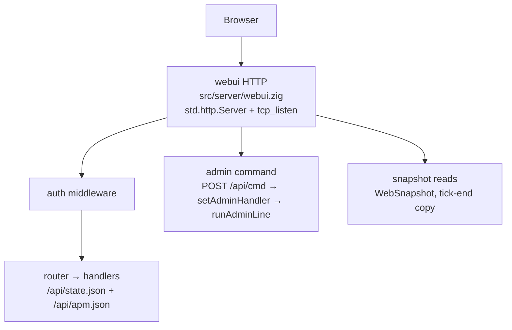

# Server web UI design (Preact dashboard)

> **What this is:** the operator web dashboard for zdtd, status, players, APM, and admin commands over loopback HTTP. Not a Steam browser clone.

> **Related:** [ARCHITECTURE](ARCHITECTURE.md) · [ARCHITECTURE §11](ARCHITECTURE.md#11-observability-apm) · [APM](APM.md) · [AUTHORITY](AUTHORITY.md) · [PLUGIN_API](PLUGIN_API.md) · [GAME_OPTIONS](GAME_OPTIONS.md) · [STD_ABSTRACTIONS](STD_ABSTRACTIONS.md) · `src/server/admin.zig`

Operator-facing **ops dashboard** for zdtd. Not a stock Steam browser clone, not
a Unity GUI, not a mod host. Complements existing **admin TCP** and **apm**
dumps with a browser UI.

| | |
|---|---|
| Status | **WU0–WU2 shipped** (dashboard + console cmds); WU3+ optional |
| Stack | Preact dashboard over `GET /api/state.json` ([ADR 0040](adr/0040-webui-preact-json-state.md), superseding the htmx/Alpine plan in [ADR 0018](adr/0018-webui-ops-dashboard.md) decision 2); the bundle is compiled to `shell.js` and referenced with `defer` by `scripts/build-webui-ts.sh` (login and lockout stay server-rendered, their ~1 KiB scripts inline) |
| Server | Zig HTTP on a dedicated bind (loopback default) |
| Related | [APM.md](APM.md), [AUTHORITY.md](AUTHORITY.md), `src/server/admin.zig`, [PLUGIN_API.md](PLUGIN_API.md) |

## Goals

1. **See** live server health: tick budget, joins, peers, chunks, zombies, apm.
2. **Act** safely: same command surface as admin TCP (give, tele, kick, time, …).
3. **Configure** visibility: read-only serverconfig / effective options; write only
   where we already allow hot reload (or explicit restart-required flags).
4. **Stay out of the 50 ms tick:** all UI I/O off the sim hot path (or
   command-queue only).
5. **Secure by default:** loopback bind, shared secret or cookie session, no
   anonymous open internet admin.

## Non-goals

- Stock client replacement or in-game HUD.
- Full telnet parity day one (incremental command coverage).
- Real-time 3D map editor or RWG designer (link worldgen later if at all).
- Embedding a Node/npm SPA build into the dedi binary.
- Harmony / ModAPI / Steam browser protocol.

## Why Preact over a JSON state endpoint

ADR 0018 chose htmx-style partial swaps with Alpine state. It shipped as a
hand-rolled poller over server-rendered fragments, which put every field in two
places (a Zig renderer and the page skeleton) and gave the client no state of
its own. [ADR 0040](adr/0040-webui-preact-json-state.md) replaced it.

| Choice | Rationale |
|---|---|
| **Preact** | Components own rendering; one state endpoint; view state (sort, expanded rows, selection) survives a poll because the client, not the markup, holds it |
| **JSON state** | `GET /api/state.json` mirrors the `Snapshot` struct at comptime, so a new field needs no second hand-maintained list, and machine clients read the same body the dashboard does |
| **Bundled once, no runtime dependency** | `bun build` bundles pinned preact into the committed page; the tree tracks no `node_modules`, the Zig build stays offline, and nothing is read from disk at runtime |
| **Server-rendered auth** | `/login` and the lockout page stay server-rendered so signing in works with JavaScript disabled |
| **No second authority path** | The dashboard posts to the same `/api/cmd` line parser as admin TCP |

## Architecture

```text
  Browser
    |  GET /  (shell)
    |  GET /api/state.json  (dashboard state)
    |  POST /api/cmd    (forms; JSON for the app)
    |  GET /api/apm.json  (machine clients and tools)
    v
  zdtd  --webui-port 8080  (default 127.0.0.1 only)
    |
    +-- webui HTTP listener  (std.Io / std.http when suitable; polled from Game.step)
    |     auth middleware
    |     router → handlers
    |     static files
    |
    +-- admin commands  (shipped: no queue)
    |     POST /api/cmd runs inline in the request via
    |     setAdminHandler → runAdminLine  (same parser as admin TCP)
    |
    +-- read snapshots
          apm harness copy
          client list, clock, world stats  (RCU or tick-end snapshot)
```


```mermaid
flowchart TB
    B[Browser] --> W[webui HTTP<br/>src/server/webui.zig<br/>std.http.Server + tcp_listen]
    W --> AUTH[auth middleware]
    AUTH --> ROUTER[router → handlers<br/>/api/state.json + /api/apm.json]
    W --> CMD[admin command<br/>POST /api/cmd → setAdminHandler → runAdminLine]
    W --> SNAP[snapshot reads<br/>WebSnapshot, tick-end copy]
```

**Critical separation** (shipped: there is no HTTP thread; `Game.step` calls
non-blocking `webui.poll()` on the tick thread, which does accept, parse, auth,
HTML render, and the admin command)

| Path | Allowed |
|---|---|
| Tick (`webui.poll()`) | one client slot, short timeout, small pages, one cmd per request |
| Never on tick | template render of large pages, disk walk, TLS handshake bulk |

Same rule as admin TCP: loopback-first; give/kick are privileged.

## Security model

| Control | Default |
|---|---|
| Bind | IPv4 loopback only; remote access requires a TLS reverse proxy |
| Auth | Shared secret header or POST `/login` form; cookie is an HMAC session token with a fresh random nonce per login (not the secret). Server-side expiry is 12 hours. Login replaces the shared browser session; logout and restart invalidate it, requiring sign-in again |
| CSRF | SameSite cookie + form field = HMAC session token (secret also accepted for API tools on POST `/api/cmd`, `/api/modlet`, and `/logout`) |
| TLS | Optional reverse proxy (Caddy/nginx); v1 plain HTTP on loopback only |
| Rate limit | Single concurrent HTTP client slot + short request timeout; 8 bad auth/login tokens → 30 s lockout, **429** + `Retry-After: 30`; no multi-IP quota yet |
| Audit log | In-memory ring (24 lines) carried in `/api/state.json` as `console`; file log not implemented |
| Read vs write | GET routes need auth; POST cmds need auth + CSRF |
| Transfer encoding | Text over 1 KiB is gzip'd when `Accept-Encoding` allows it (`Vary: Accept-Encoding`; failure keeps the plain body). Shell: one gzip per session (~73→~23 KiB). JSON polls: fastest deflate (~3.3→~1.1 KiB). `/favicon.svg`: `public, max-age=604800, immutable`; other responses `no-store` |

**Do not** expose webui on public WAN without TLS + strong secret + firewall.
Document that loudly in README / GAME_OPTIONS.

## Information architecture (pages)

Shell: header, nav, and an `#app` mount that paints "Loading dashboard…" before
the Preact bundle runs. The app polls `GET /api/state.json` and renders every
panel from it; tab selection is client state in the URL hash.

| Route | Purpose | Data source |
|---|---|---|
| `GET /` | Dashboard shell: document, CSS, the Preact bundle and the app mount point | committed page |
| `GET /api/state.json` | The whole dashboard state: `tick` (Snapshot scalars), `players`, `modules`, `modlets`, `console`, `csrf`, `apm` | snapshot + wasm roster + ops ring |
| `POST /api/cmd` | Run one admin command (400 bad `line`, 403 CSRF, 415 non-form, 429 console queue full, 503 console down); JSON when `Accept: application/json`, plain text for `Accept: text/plain`, HTML fragment otherwise | inline → admin parser (same request) |
| `POST /api/modlet` | Enable/disable a modlet (400 bad `name`/`action`, 403 CSRF, 404 unknown modlet, 415 non-form, 500 state file unwritable); JSON when `Accept: application/json`, plain text for `Accept: text/plain`, HTML fragment otherwise (errors use the same Accept negotiation as `/api/cmd`) | modlet state file |
| `GET /partials/*` | Retired by ADR 0040: **404** (the dashboard reads `/api/state.json`) | - |
| `GET /api/apm.json` | Machine-readable apm + world + player roster (loadgen/tools); feeds the dashboard latency chart series | snapshot |
| `GET /login` | Sign-in form (200; **429** during lockout) | static HTML |
| `POST /login` | Form body `token=` → **303** + session cookie (missing token **400**, wrong secret **401**, non-form content type **415**, lockout **429**) | config secret |
| `POST /logout` | Revoke the server session and clear its cookie (CSRF: session token or secret) | session |
| `GET`/`HEAD` `/healthz` | Unauthenticated process liveness | static |
| `GET`/`HEAD` `/favicon.svg` | Unauthenticated brand mark linked by all three pages | embedded SVG (`src/server/webui/favicon.svg`) |
| `GET`/`HEAD` `/readyz` | Unauthenticated readiness; 503 until first live tick snapshot | snapshot |
| `GET /shell.js` | The compiled Preact bundle, `@embedFile`d and gzipped once per process; `ETag` + `must-revalidate` so a reload costs a 304. CSS stays inline (ADR 0040) | - |

Status notes: auth runs before routing, so unauthenticated requests get **401**
even on unknown paths or wrong methods. Authenticated: wrong method on a known
path returns **405** with `Allow` (not 404); unknown paths return **404**.
Unauthenticated `/api/*` returns plain `401 unauthorized` plus
`WWW-Authenticate: Bearer realm="zdtd-webui"`; browser routes get the HTML login
form instead. `/readyz` returns **503** with `Retry-After: 1` until the first
live tick snapshot. All GET-only routes (`/`, `/api/state.json`,
`/api/apm.json`) also accept `HEAD` (same status and headers, empty body),
matching `/healthz` and `/readyz`; their `405` responses advertise
`Allow: GET, HEAD`.

A command that ran and reported a failure is still **200** with `"ok":false` in
the negotiated body: the console answered, the command did not succeed.

The porting/provenance report is **not** a served route: it is a standalone
HTML document ([`provenance.html`](provenance.html)) summarizing
`docs/GAP_ANALYSIS.md` and `docs/PROVENANCE.md`, opened from the repo. The shell
dashboard's live ops sections (status, apm, players, console) are rendered
client-side by the Preact app from `/api/state.json`.

## UI sketch (dashboard)

```text
+------------------------------------------------------------------+
| zdtd  ·  Navezgane  ·  day 7 22:14  ·  BM in 0d   [Logout]       |
+----------+-------------------------------------------------------+
| Status   |  Tick 48ms p99 · overruns 2 · joined 3/8 · peers 3    |
| Players  |  chunks 420 · zombies 12 · stream errs 0              |
| APM      |  [====tick====][net][sim][repl][stream]               |
| World    |                                                       |
| Console  |  Players                                              |
|          |  #  Name     Ent    X Y Z           | Kick | TP spawn |
|          |  0  Alice    107   120 72 -40       | ...  | ...      |
|          |                                                       |
|          |  Console                                              |
|          |  > give 0 meleeWpnClubT0WoodenClub 1                  |
|          |  ok                                                   |
+----------+-------------------------------------------------------+
```

The dashboard polls `/api/state.json` on the active tab's cadence (1 s for
status, apm and players; 5 s for console, settings and modules) and re-renders
the affected panels; the auto-refresh toggle and `visibilitychange` pause stop
the poll entirely.

## Command surface (v1)

Reuse **exactly** `admin.zig` / `Game` console verbs so TCP and web stay one path:

| Cmd | Web UI |
|---|---|
| `lp` / listplayers | Players table (auto) |
| `wipeplayer <name>` | Erase `players.zsv` record + release that owner's land claims + kick online (confirm dialog) |
| `kick <name/id> [reason]` | Row button |
| `give <slot> <item> <n>` | Form (name resolve via items table) |
| `tp` / `tele` | Form or "TP to spawn" (admin accepts both) |
| `settime day\|night\|<worldtime>` | Day/night buttons + custom |
| `say` | Broadcast form |
| `killall` / spawnentity | Confirm dialog in the app before the POST |
| `save` / `shutdown` | Confirm + danger class |
| `help` | Collapsible cheatsheet |

Unknown cmds: show the parser error in the console panel (same strings as TCP).

**Item picker:** typeahead from loaded item **names** (not bare ids) when
game-dir catalogs present; fail closed if unknown name.

## Data snapshot (tick-safe read model)

At end of `Game.step` (or every N ticks), copy into a `WebSnapshot` behind a
mutex or double-buffer:

```text
WebSnapshot {  // src/server/webui.zig Snapshot
  tick_n, last_tick_ns, day, hours, bloodmoon_active/frequency/in_days
  joined, entered, peers_alive, max_players
  zombies, animals, traders, vehicles, turrets, loot_bags, players_ent, chunks
  selected counters (net/errors/join/guard/evidence), not the full CounterId map
  section means/p50/p99 for tick/net/sim/repl/stream + save_mean_ns
  players: [{ slot, name, entity_id, x, y, z, ... }]
  modules: [{ name, disabled }]
  world_name, view/interest/stream caps, ports, auth flags, OS gauges
}
```
`/api/apm.json` is `{"type":"zdtd_webui_apm",...}` from this snapshot
(`renderApmJson`). Full `CounterId`/`Section` dumps stay on stdout as
`{"type":"zdtd_apm",...}` (see [APM.md](APM.md)).

HTTP handlers **only read** the snapshot (clone under lock, then render). No
walking live `clients` from the HTTP thread without the snapshot protocol.

Command queue (design; shipped is a single `cmd_pending` slot, and it is dead
code in the real server because `setAdminHandler` runs commands inline):

```text
WebCmd { id, session, raw_line, enqueued_ns }
// capacity e.g. 32; drop + 429 if full
```

Drain ≤ K cmds per tick (e.g. 4) so one operator cannot stall sim.

## Implementation plan (phased)

### WU0: Skeleton (1–2 PRs)

- [x] `src/server/webui.zig` (minimal HTTP/1.1, non-blocking poll from Game.step)
- [x] CLI: `--webui-port 0` (off), `--webui-bind 127.0.0.1`, `--webui-secret`
- [x] GAME_OPTIONS + INDEX; design in this file
- [x] HTTP: `GET /healthz` liveness and `GET /readyz` readiness (no auth), `GET /` (Bearer / X-Zdtd-Secret / session cookie)
- [x] Disabled by default (port 0); secret required when enabled

**Exit:** curl with secret shows hello; without → 401; off → nothing listens; `make check` green.

```bash
zig-out/bin/zdtd --port 27002 --world worlds/zdtd_default \
  --webui-port 8080 --webui-secret change-me --once
curl -sS -H 'Authorization: Bearer change-me' http://127.0.0.1:8080/
curl -sS http://127.0.0.1:8080/healthz
curl -sS http://127.0.0.1:8080/readyz
```

### WU1: Read-only dashboard

- [x] Tick-end `WebSnapshot` fill (`Game.fillWebuiSnap` → `webui.publishSnap`)
- [x] Partials: `/partials/status`, `/partials/players`, `/partials/apm` (HTML; retired by ADR 0040 in favour of `/api/state.json`)
- [x] Auto-refresh via a small inline poller (no CDN), later replaced by the state poll (ADR 0040)
- [x] `GET /api/apm.json` for scripts
- [x] Cookie login: POST `/login` form (secret in body, not URL) → `Set-Cookie: zdtd_webui=<HMAC session>` (not the secret)
- [x] APM counters include tick_overruns / encode_errors / join / pkg / section means

**Exit:** browser or curl with secret sees live tick/players/apm.

```bash
zig-out/bin/zdtd --port 27002 --world worlds/zdtd_default \
  --webui-port 8080 --webui-secret change-me
# browser: http://127.0.0.1:8080/login (enter secret in the form)
curl -sS -H 'Authorization: Bearer change-me' http://127.0.0.1:8080/api/state.json
curl -sS -H 'Authorization: Bearer change-me' http://127.0.0.1:8080/api/apm.json
```

### WU2: Commands

- [x] Shared command parse path (admin TCP + web POST via `setAdminHandler` → `runAdminLine`)
- [x] `POST /api/cmd` form `line`+`csrf`; same-request HTML reply
- [x] Console section plus the 24-line in-memory audit ring (now the `console` array in `/api/state.json`)
- [x] CSRF + session cookie (cookie-only needs csrf=session token (secret also accepted for API tools))
- [ ] Ops audit log **file** (ring only for now)

**Exit:** give/kick/settime from browser matches admin TCP semantics.

### WU3: UX polish

- [x] Live latency chart on the Performance tab: tick mean/p99 + stacked section means, log-style compressed timescale (toggle) with a faint grid visualizing the compression
- [x] Chart inspection: keyboard arrows/Escape + pointer drag scrub with screen-reader readout; history window synced to `?history=` (deep-linkable); still frame under `prefers-reduced-motion`
- [x] Deep-linkable tabs (`#players`, `#console`, …; unknown hash falls back to Status); roving tabindex; no-JS fallback reveals sections and hides dead controls
- [x] Paper cockpit visual world (docs/DESIGN-webui.md): recompile paper ground + cards + pills + sans/mono split, TMOG cockpit glance band + terminal chart; deep-linkable tabs; stacked ledgers on mobile
- [ ] In-app modals for destructive cmds
- [ ] Player row actions
- [ ] Item name typeahead (from ItemTable)
- [x] Embed the client for offline ops: preact is bundled into the committed page (ADR 0040), no CDN and no `/static/*`

### WU4: Optional depth (park until asked)

- [ ] Ban list UI
- [ ] Config viewer (effective knobs, restart-required tags)
- [ ] Chunk/interest heat numbers from apm
- [ ] Reverse-proxy TLS notes + example Caddyfile
- [ ] SSE/EventSource stream instead of poll (still snapshot-based)
- [ ] Read-only public status page (separate secret or none; no cmds)

## Zig module layout (as shipped)

```text
src/server/webui.zig                  # listener, router, auth, snapshot, cmd queue, fragments
src/server/webui/ts/*.tsx             # page TSX authored as TypeScript (strict; tsc-pinned)
src/server/webui/ts/chart.ts          # the tick chart canvas painter
src/server/webui/ts/lib/utils.ts      # cn() (clsx + tailwind-merge)
src/server/webui/ts/components/ui/    # the shadcn primitives (vendored, restyled)
src/server/webui/webui.css            # Tailwind v4 entry: shadcn token contract + @utility extras
src/server/webui/webui-<page>.css     # per-page entry (@source set over webui.css)
src/server/webui/shell.html           # page markup, @embedFile'd (AGENTS rule 12)
src/server/webui/shell.js             # compiled dashboard bundle, @embedFile'd, served at /shell.js
src/server/webui/login.html           # sign-in template (plain + failure states via placeholders)
src/server/webui/login_lockout.html
components.json                       # shadcn aliases + theme paths (read by @shadcn/lint)
```

Markup is `@embedFile`d at comptime and templated by `__ZDTD_*__` placeholder
substitution; nothing is read from disk at runtime. The dashboard bundle is
the one exception to inlining: it is emitted as `shell.js` and referenced
with `defer`, so the document is ~34 KB (8.4 KB gzipped, inside the initial
congestion window) instead of ~126 KB, first paint does not wait on parsing
~90 KB of script, and a reload revalidates the bundle with an `ETag` instead
of re-downloading it. Vendor JS/CSS under
`web/static/` stays a WU3 item (see the roadmap above), not a current path.

## Design system: the shadcn contract plus vendored components

[ADR 0041](adr/0041-shadcn-webui-design-system.md) is the decision; this is
the map of where things live.

**Tokens.** `src/server/webui/webui.css` is the single Tailwind entry. Its
`:root` block is the shadcn semantic contract (`--background`, `--card`,
`--card-foreground`, `--popover`, `--primary`, `--primary-foreground`,
`--secondary`, `--muted`, `--muted-foreground`, `--accent`,
`--accent-foreground`, `--destructive`, `--destructive-foreground`, `--border`,
`--input`, `--ring`, `--radius`, `--chart-1..5`) holding the paper-cockpit
values, plus the status extensions shadcn has no name for
(`destructive-soft`, `destructive-border`, `border-strong`, `success-border`,
`warning`, `warning-soft`, `warning-border`, `primary-ghost`). `@theme inline`
publishes those as Tailwind colors; a second `@theme` holds what the contract
does not name: the terminal palette, the type scale, `--radius-card`,
`--radius-ctl` and `--shadow-card`. One name per value: `bg-card` is the only
way to say "card surface". The `@layer components` block at the bottom holds the
legacy classes the Zig-injected fragments carry, and `@utility` holds the three
things utilities cannot express (`signin-shell`, `cmd-hint`, `chart-surface`)
plus the flash keyframe.

**Components.** `src/server/webui/ts/components/ui/` is the shadcn/ui
component layer, vendored: the registry source (new-york, v4) restyled to the
paper cockpit, each file carrying `data-slot` attributes and `cva` variants
(`button.tsx`, `card.tsx`, `badge.tsx`, `alert.tsx`, `input.tsx`, `label.tsx`,
`table.tsx`, `progress.tsx`). They are Preact, not React, and they are ours,
not a dependency.
They already diverge from the registry on purpose: no `asChild` and no radix,
`CardTitle` renders an `<h2>` so a card that is a page section keeps a real
heading, `Badge` has the deck's four state variants, and `Table` adds
`TableNumber`, `TableRowHeader` and `TableEmpty`. `cn()` is
`src/server/webui/ts/lib/utils.ts`; `@/...` maps to `ts/` through
`tsconfig.json` and `components.json`.

**Conventions.** `className` is the merge prop everywhere in the TSX layer,
including on plain elements, because that is the prop `@shadcn/lint` reads
when deciding whether a call site restyles a component. A restyle a page
genuinely needs becomes a variant in the component, not a class at the call
site: `shadcn/no-restyle` is on with layout classes allowed, and the
`components/ui` directory is exempt so the components own their own classes.

**Server-rendered pages** (the two sign-in pages, the dashboard header and the
nav) carry the same token names as plain utilities. They cannot call the TSX
primitives, so where a variant is needed it is an `@utility` in `webui.css`.

**The provenance dashboard is the second consumer.** `docs/provenance.css`
imports `webui.css` by path, so `docs/provenance.html` is written in the same
utilities against the same contract rather than carrying its own token block.
It is generated, so its CSS is a second build step:
`scripts/gen_provenance.py` writes the markup with an empty
`zdtd-css:provenance` region, then `scripts/build-doc-css.sh` compiles the
entry against the committed page and splices the bundle in (`make
docs-provenance`, gated by `make check`). The splice also fails when a class
in the page has no generated rule, because a utility the theme cannot generate
otherwise drops a style with no error anywhere. The page stays one
self-contained file that opens over `file://`: the CSS is inlined, never
linked.

A generated page has no component layer, so the variant sets it repeats many
times are `@utility` rules in `webui.css` next to the other three
(`signin-shell`, `cmd-hint`, `chart-surface`): `score-cell` (four state fills
plus the colour-vision outline, ~300 uses) and `feat-state` (the four state
text colors, ~366 uses). Written per call site those two would be 100 KB of
duplicated class list. Everything else on the page is an ordinary class list.
The port is bigger on disk and close on the wire: 158 KB raw / 20.5 KB gzipped
against the hand-written CSS's 81 KB / 16 KB, for a page opened from the repo
rather than served.

## Build and gates

`scripts/build-webui-ts.sh` compiles each `webui-<page>.css` entry with the
cached `@tailwindcss/cli` (pinned `TAILWIND_VERSION`, staged by
`scripts/webui-ts-project.sh`; no `package.json`/`node_modules` in the tree)
and splices the output into each committed page between the
`/* zdtd-css:<region> */` markers. There is no hand-written page stylesheet: every page's CSS is the compiled form of `webui.css`. Page JS is bundled by the same script with
`bun build` between the `/* zdtd-ts:<page> */` markers, and spliced inline
except for the shell, whose bundle is written to `shell.js` and referenced as
`<script src="/shell.js" defer>` inside the marker. `zig build` runs
neither, so the Zig build stays pure and offline.

`scripts/webui-ts-project.sh` stages the sources plus `components.json` into a
cache project, and blanks the generated regions on the staged page copies
(`scripts/strip-generated-regions.py`): the Tailwind scanner reads
class-shaped tokens anywhere in a file, so a compiled `.transition-colors{...}`
rule inside a committed page would regenerate its own utility forever and keep
a rule alive after its source stopped using it.

`scripts/lint-webui.sh` (part of `make lint`) type-checks with `tsc --noEmit`,
lints the sources with oxlint (`.oxlintrc.jsonc`: anti-slop plus the
`@shadcn/lint` rules including `no-restyle`, `--deny-warnings`), checks the
token contract and the page markers, and fails when the committed pages are
stale (`make webui-ts` regenerates them). vnu (Nu HTML Checker) checks the
HTML and embedded CSS (`scripts/lint-html.sh` with `vnu-filter.txt`, part of
`make lint`); the `hx-*` poller attributes are the one deliberate deviation,
filtered there.

Facades: `server/root.zig` exports webui init. **No** import of webui from
`wire/` or `ecs/` (only `game.zig` fills snapshot + drains cmds).

HTTP stack preference (in order):

1. Zig 0.16 `std.http` / `std.Io` if adequate for small static + simple POST
2. Thin internal server (accept + parse HTTP/1.1 subset) if std is awkward
3. **Not** a second raw linux socket style copied from LiteNet unless forced;
   prefer std abstractions (AGENTS rule 26)

## Config / CLI

| Key | Default | Notes |
|---|---|---|
| `--webui-port` | `0` (disabled) | e.g. `8080` |
| `--webui-bind` | `127.0.0.1` | literal `127.0.0.1` or `localhost` only; put TLS termination in front for remote access |
| `--webui-secret` | empty → refuse start if port≠0 | or env `ZDTD_WEBUI_SECRET`; 8–128 chars, printable ASCII, no whitespace/quotes/backslash/comma/semicolon |

Precedence: CLI > env > defaults.

## Testing

| Layer | What |
|---|---|
| Unit | cmd queue bounds; snapshot copy; HTML escape; auth HMAC |
| Unit | parse same strings as admin.zig |
| Integration | start Game with webui port on 127.0.0.1; HTTP GET status; POST give |
| Lint | Page TSX (in `src/server/webui/ts/`, primitives in `ts/components/ui/`) is type-checked (tsc) and linted by oxlint (`scripts/lint-webui.sh`, wired into `make lint`) with the anti-slop rule set plus the `@shadcn/lint` rules in `.oxlintrc.jsonc`, `no-restyle` included; a freshness gate fails when the committed pages were not regenerated (`make webui-ts`) |
| Lint | All repo HTML + embedded CSS is checked by vnu (`scripts/lint-html.sh`, `vnu-filter.txt`, wired into `make lint`); the deliberate `hx-*` poller attributes are filtered there |
| Manual | browser checklist in docs |
| Load | webui poll must not move tick_overruns under loadgen |

**Escape all user-controlled strings** in HTML (names, cmd echo) to prevent XSS
against the operator session.

## Relationship to existing surfaces

| Surface | Role vs webui |
|---|---|
| Admin TCP | Keep; webui shares command backend |
| In-game console packages | Unchanged; webui is out-of-band |
| apm text/JSON dump | webui displays live; dumps remain for CI |
| 7dtd-server-apm | Never integrate |
| Playtest orchestrator | May use `/api/apm.json` or keep TCP |

## Risks and mitigations

| Risk | Mitigation |
|---|---|
| Tick stalls from HTTP | Snapshot + cmd queue; time-box drain |
| Auth bypass | Default off; refuse listen without secret; loopback default |
| XSS via player names | HTML escape; CSP headers basic |
| Scope creep to full CMS | Phases WU0–2 only until STATUS asks |
| Dual command parsers | One `parseCommand` used by TCP and web |
| Large HTML on hot path | Pre-render not required; build strings on HTTP thread only |

## Success criteria (product)

- [ ] Disabled by default; zero impact on `make check` and join path when off
- [ ] With port+secret on loopback: see players/apm; run give/kick/settime
- [ ] Under loadgen, webui poll does not cause systematic tick_overruns
- [ ] Docs: WEBUI.md, GAME_OPTIONS, README snippet, SECURITY notes
- [ ] No em dashes / AI attribution in implementation commits

## Settled decisions (WU0–WU2)

Recorded in [ADR 0018](adr/0018-webui-ops-dashboard.md):

1. **std.http.Server** over a hand-rolled full parser (`tcp_listen` + std.http).
2. **Inline assets** in the binary. The vendor bundle question was settled later by [ADR 0040](adr/0040-webui-preact-json-state.md): preact is bundled into the page, still no `/static/*`.
3. **HMAC session cookie** (not raw secret); CSRF = session token (secret OK for API tools).
4. **Admin line path** for commands; in-memory audit ring for the console panel (served as the `console` array of `/api/state.json`).

## Optional later (WU3+)

1. Optional disk override for CSS (no `/static/*` route ships today).
2. Multi-session map / remote TLS bind hardening beyond reverse-proxy notes.
3. File-backed ops audit log.

---

