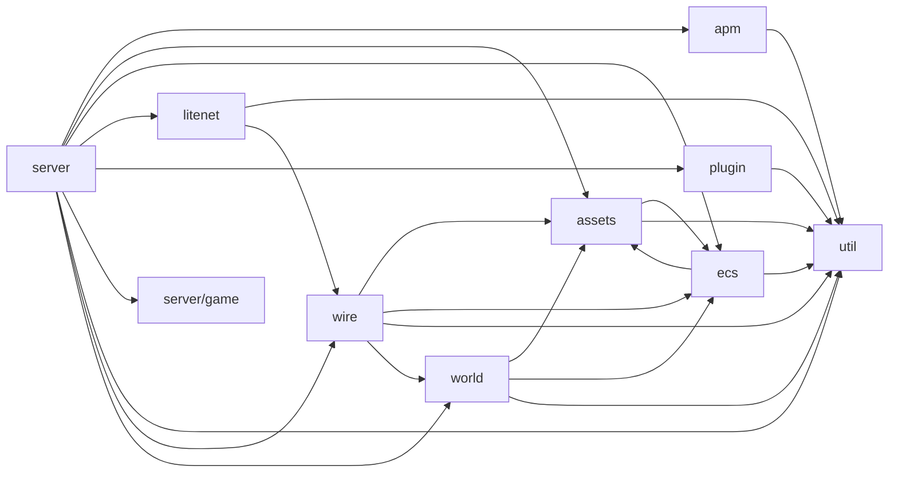

<!-- Generated by tools/gen_docs_catalogs.py - do not edit by hand. Run `make docs-catalogs` to regenerate. -->

# Module Graph

Package dependency edges that exist in `src/`, next to the edges
`scripts/lint-architecture.sh` enforces. A row counts real `@import` occurrences,
not intent.

## Observed edges

Only imports of another package directory are counted; single-file imports
(`../protocol.zig`) and std imports are not edges between packages.

| From package | To package | Imports |
|---|---|---|
| `apm` | `util` | 2 |
| `assets` | `ecs` | 10 |
| `assets` | `util` | 93 |
| `ecs` | `assets` | 1 |
| `ecs` | `util` | 7 |
| `litenet` | `util` | 3 |
| `litenet` | `wire` | 1 |
| `plugin` | `util` | 4 |
| `server` | `apm` | 10 |
| `server` | `assets` | 142 |
| `server` | `ecs` | 110 |
| `server` | `litenet` | 37 |
| `server` | `plugin` | 10 |
| `server` | `server/game` | 14 |
| `server` | `util` | 92 |
| `server` | `wire` | 83 |
| `server` | `world` | 77 |
| `wire` | `assets` | 8 |
| `wire` | `ecs` | 2 |
| `wire` | `util` | 3 |
| `wire` | `world` | 2 |
| `world` | `assets` | 21 |
| `world` | `ecs` | 5 |
| `world` | `util` | 26 |

## Enforced edges (`scripts/lint-architecture.sh`)

| Package | Rule |
|---|---|
| `util` | `server\|wire\|world\|ecs\|assets\|litenet\|apm` (forbidden) |
| `apm` | `server\|wire\|world\|ecs\|assets\|litenet` (forbidden) |
| `litenet` | `server\|world\|ecs\|assets\|apm` (forbidden) |
| `plugin` | `server\|wire\|world\|ecs\|assets\|litenet\|apm` (forbidden) |
| `assets` | `server\|wire\|world\|litenet\|apm` (forbidden) |
| `ecs` | `server\|wire\|world\|litenet\|apm` (forbidden) |
| `world` | `server\|wire\|litenet\|apm` (forbidden) |
| `wire` | `server\|litenet\|apm` (forbidden) |

## Graph

