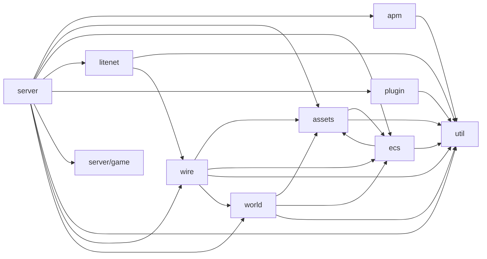

<!-- Generated by tools/gen_docs_catalogs.py - do not edit by hand. Run `make docs-catalogs` to regenerate. -->

# Module Graph

Package dependency edges that exist in `src/`, next to the edges
`scripts/lint-architecture.sh` enforces. A row counts real `@import` occurrences,
not intent.

## Observed edges

Only imports of another package directory are counted; single-file imports
(`../protocol.zig`) and std imports are not edges between packages.

| From package | To package | Imports |
|---|---|---|
| `apm` | `util` | 2 |
| `assets` | `ecs` | 14 |
| `assets` | `util` | 116 |
| `ecs` | `assets` | 1 |
| `ecs` | `util` | 9 |
| `litenet` | `util` | 3 |
| `litenet` | `wire` | 1 |
| `plugin` | `util` | 6 |
| `server` | `apm` | 11 |
| `server` | `assets` | 196 |
| `server` | `ecs` | 162 |
| `server` | `litenet` | 76 |
| `server` | `plugin` | 16 |
| `server` | `server/game` | 33 |
| `server` | `util` | 170 |
| `server` | `wire` | 149 |
| `server` | `world` | 98 |
| `wire` | `assets` | 12 |
| `wire` | `ecs` | 5 |
| `wire` | `util` | 3 |
| `wire` | `world` | 4 |
| `world` | `assets` | 23 |
| `world` | `ecs` | 6 |
| `world` | `util` | 39 |

## Enforced edges (`scripts/lint-architecture.sh`)

| Package | Rule |
|---|---|
| `util` | `server\|wire\|world\|ecs\|assets\|litenet\|apm` (forbidden) |
| `apm` | `server\|wire\|world\|ecs\|assets\|litenet` (forbidden) |
| `litenet` | `server\|world\|ecs\|assets\|apm` (forbidden) |
| `plugin` | `server\|wire\|world\|ecs\|assets\|litenet\|apm` (forbidden) |
| `assets` | `server\|wire\|world\|litenet\|apm` (forbidden) |
| `ecs` | `server\|wire\|world\|litenet\|apm` (forbidden) |
| `world` | `server\|wire\|litenet\|apm` (forbidden) |
| `wire` | `server\|litenet\|apm` (forbidden) |

## Graph

```mermaid
graph LR
  apm --> util
  assets --> ecs
  assets --> util
  ecs --> assets
  ecs --> util
  litenet --> util
  litenet --> wire
  plugin --> util
  server --> apm
  server --> assets
  server --> ecs
  server --> litenet
  server --> plugin
  server --> server/game
  server --> util
  server --> wire
  server --> world
  wire --> assets
  wire --> ecs
  wire --> util
  wire --> world
  world --> assets
  world --> ecs
  world --> util
```
