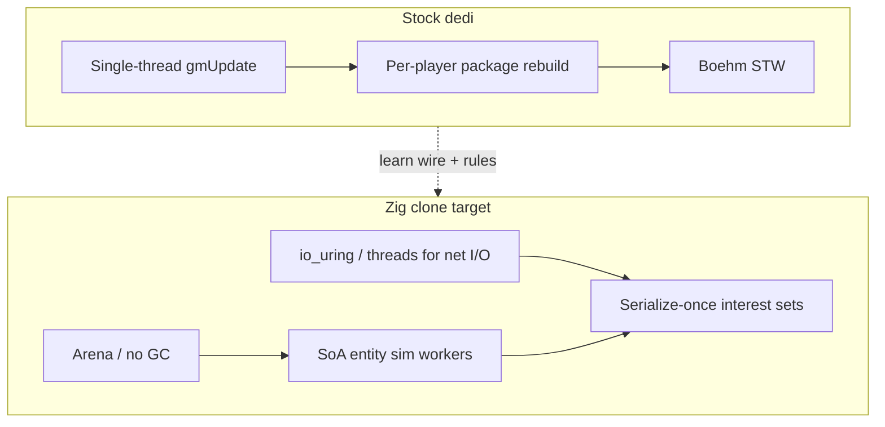
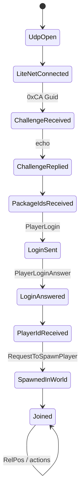

# High-performance Zig dedicated clone (architecture from the stock RE)

**Version note:** the architecture here was derived from the V3.0.1 RE. The
project now targets **V3.1.0 b14**, which is what the live gate runs against.
Structure carried over; where a wire detail changed, the wire docs and the code
comments are the authority, not this document.

**Owns:** how to structure a **from-scratch** dedicated server in Zig that is *informed by* stock 7DTD RE (wire, tick, world, scale walls).  
**Not:** redistributing game IL/DLL; not a shipping product plan; not “drop-in replace Steam dedi tomorrow.”  
**Not:** **mod host** (no Harmony/ModAPI/modlets) or **7dtd-apm target** (APM assumes stock Mono dedi).  
**Hub:** [INDEX.md](../../7dtd-research/docs/INDEX.md).  
**Stock ceilings:** [engine-limitations.md](../../7dtd-research/docs/engine-limitations.md) (why stock hits walls; measured on stock, not on zdtd).  
**Live scale walls:** [measured-scaling.md](../../7dtd-optimizer/docs/measured-scaling.md) (stock APM ladders; design against these shapes).  
**Ranked bottlenecks + bang-for-buck:** [bottlenecks.md](../../7dtd-optimizer/docs/bottlenecks.md) (what the clone must beat, and the structural theme: missing spatial index + serial stages).  
**Every hot algorithm:** [algorithms.md](../../7dtd-optimizer/docs/algorithms.md).  
**Allocation strategy (why the clone uses arenas, no GC):** [allocation-reuse.md](../../7dtd-optimizer/docs/allocation-reuse.md) - stock's Boehm STW measured **479 ms** on a ~7 GB heap (megapause); the clone must never STW.  
**Wire details:** [protocol.md](../../7dtd-research/docs/protocol.md).  
**Loop:** [loop.md](../../7dtd-research/docs/loop.md).  
**World/save:** [world-chunks.md](../../7dtd-research/docs/world-chunks.md), [save-region.md](../../7dtd-research/docs/save-region.md).  
**Entities:** [entity-ai.md](../../7dtd-research/docs/entity-ai.md).  
**Golden wire / join bots:** sibling [`../../7dtd-loadgen/`](../../7dtd-loadgen) (`PackageCodec`, `JoinStateMachine`).  
**Implementation:** [`../../zdtd/`](..).

**Policy:** research only. Clone work must use **your** reimplemented logic and **your** assets pipeline; do not ship TFP managed assemblies or bulk decompiled source.

### Non-goals (zdtd)

| Non-goal | Reason |
|---|---|
| Load `Mods/` / Harmony / ModAPI / EfficientServer / RealEarth | Clean-room Zig process; no managed game assembly |
| Run under **7dtd-apm** bridge or Mono GC probes | APM is built for stock Unity dedicated |
| EAC-on clients | Custom server |

**Validate with:** loadgen golden wire + join bots, stock clients (EAC off), **zdtd `src/apm/`** dumps.  
**Do not validate with:** **7dtd-apm** sessions, “install this mod and measure.”

---

## 0. Honest scope

A **client-compatible** dedicated that vanilla Steam clients join is roughly:

| Layer | Effort class | RE status in this repo |
|---|---|---|
| UDP + LiteNetLib framing + join | Months | **Strong** (loadgen joins live dedi; golden wire) |
| ~194 NetPackage read/write paths | Many months | **Names + maxIL + hot bodies**; most bodies not hand-annotated |
| Chunk binary + region files | Months | **Structure closed**; sector payload codec residual |
| Tick / entity authority / combat | Large | **Pipeline closed**; full EAI/combat tables open |
| AIDirector / sleepers / blood moon | Large | Types + install closed; behavior depth open |
| Pathfinding (A*) | Large | ASP→A* stack closed; third-party residual |
| XML content (blocks, items, biomes, prefabs) | Huge | Out of RE dumps; data-driven loaders |
| Dynamic mesh / vehicles / quests / traders | Huge | Package surface present; sim shallow |
| EAC / EOS | Do not clone | Residual; EAC-off servers only for custom |

**Zig’s advantage is not “decode every IL method once.”** It is redesigning **data layout and concurrency** so the measured stock walls (player-axis ~O(N²) net, entity O(N) AI, Boehm GC) never appear.



---

## 1. Clone goals (pick one)

| Goal | Compatible with stock clients? | Performance bar | Recommended first |
|---|---|---|---|
| **A. Wire-compatible dedi** | Yes (EAC off) | Beat stock at 64–256 players | Yes for “clone” |
| **B. Custom protocol server** | No (custom client) | Unlimited redesign | Faster to 10k entities |
| **C. Headless sim-only** | No net | Benchmark AI/path only | Research harness |

This document targets **Goal A**, with architecture that can later fork to B.

Acceptance for A (minimal):

1. Stock client connects (LiteNet, challenge, PackageIds, login, spawn).  
2. Receives world time + enough chunks to stand.  
3. RelPos / PosAndRot accepted both ways.  
4. Other players visible and move.  
5. Simple damage kills a zombie.  
6. Chunk edits persist across restart (region write).  

Everything else (quests, traders, vehicles, full blood moon, XML parity) is later.

---

## 2. Recommended Zig crate / module map

**Implementation tree:** sibling [`../../zdtd/`](..) (**zdtd** = Zig Days To Die).

```text
zdtd/                        # workspace folder name
  src/main.zig               # process entry (M0 stub today)
  src/protocol.zig           # wire constants from protocol.md
  net/                       # planned
    litenet.zig              # LiteNetLib peer (C bind or pure Zig later)
    frame.zig                # channel + envelope + pkg stream (see protocol.md)
    challenge.zig            # 0xCA + Guid16
    package_ids.zig          # dynamic name→u16 table
    packages/                # one file per package or family
      join.zig               # PackageIds, PlayerLogin*, Auth*, RequestTo*
      entity.zig             # PosAndRot, RelPos, AliveFlags, Spawn, Remove, Damage
      chunk.zig              # NetPackageChunk*, Remove*
      world.zig              # WorldInfo, WorldTime, …
  sim/
    tick.zig                 # 20 Hz fixed step + slice budget
    world.zig                # chunk map, SetBlock, observers
    entity.zig               # SoA entities
    ai/                      # phased; start with dumb chase / idle
    combat.zig
    path/                    # optional A* worker pool
  world/
    chunk_store.zig          # layers y>>2, density channels
    region.zig               # RegionFileRaw headers + .ttc
    save.zig                 # WorldState-ish sidecar if not full parity
  content/
    xml_blocks.zig           # load blocks.xml subset
    prefab.zig               # later
  admin/
    telnet.zig               # stock-like admin port optional
  apm/                       # FIRST-CLASS: counters, section latency, JSON/text
    metrics.zig
    profiler.zig
    report.zig
  # drive load with sibling 7dtd-loadgen; never require 7dtd-apm
```

**Do not** model Unity MonoBehaviours. Model:

- one **net reactor** (accept, decode, enqueue commands)  
- one **sim step** (apply commands, tick entities, commit)  
- one **replicate** phase (interest → encode → send)  
- background **path / region I/O** workers  

That is the stage split stock *almost* has, without the single-thread commit tax.

---

## 3. Time and tick model (from RE)

| Stock fact | Clone implication |
|---|---|
| `GameTimer.ticksPerSecond = 20` | Fixed **50 ms** sim step (or substeps) |
| Unity frame ≠ game tick | You own the loop; no Unity tax |
| `TickEntitiesSlice` spreads entities | Keep a **work budget** per step (entities/ms) |
| AI observer-gated | Only tick entities near player observers |
| Path drain ≤8 / yield | Cap path jobs per step; worker pool for compute |

```zig
// Pseudocode: tick ownership (not production code)
const TICK_NS: u64 = 50_000_000;

fn serverLoop(s: *Server) void {
    var next = monoTime() + TICK_NS;
    while (s.running) {
        s.net.pollAndDecode();          // fill command queue
        s.sim.step(TICK_NS);            // apply cmds + entity budget
        s.replicate.flushInterest();    // encode once per entity where possible
        s.net.flushSends();
        sleepUntil(next);
        next += TICK_NS;
    }
}
```

Stock hot path reference: [loop.md](../../7dtd-research/docs/loop.md), [loop-gmupdate.md](../../7dtd-research/docs/loop-gmupdate.md).  
**Critical:** stock `ConnectionManager.Update` is a **peer** of gmUpdate. In Zig, **explicitly schedule** net before/after sim; never “accidentally” serialize packages inside per-entity AI.

---

## 4. Network architecture (avoid stock O(N²))

### 4.1 Measured stock wall

| Section | Shape | Implication |
|---|---|---|
| `ConnectionManager.Update` | ~O(N².27) per-call (player ladder) | Death spiral ~450–500 bots |
| `NetEntityDistribution.OnUpdateEntities` | ~O(N².26) | Per-entity × per-player rebuild |
| Entity AI | ~O(N) | Volume, well-behaved |

Detail: [measured-scaling.md](../../7dtd-optimizer/docs/measured-scaling.md), [network.md](../../7dtd-research/docs/network.md) §4b.

**Stock reality (verified RE 2026-07-20, corrects earlier drafts):** `updatePlayerList`
already **builds each package once**, broadcasts via `SendToPlayers`, and **change-gates**
the player-independent ones (`bPlayerStatsChanged`…). So build-once + dirty-flagging is
NOT the stock gap. Two real stock gaps the clone eliminates:
1. **Per-connection re-serialization** - each connection's writer thread
   (`NetConnectionSimple.taskSerialize`) serializes the *same* broadcast package
   independently into its own byte stream (N encodes of identical bytes). The clone
   encodes the buffer once and scatters bytes per connection (memcpy, not re-encode).
2. **Linear send fan-out** - stock `ConnectionManager.SendPackage` linear-scans the
   whole `Clients` list by `entityId` per recipient; the clone keys connections by an
   `entityId -> connection` map (O(1)), the same fix EfficientServer's `FastSendPatch`
   applies to stock. See [bottlenecks.md](../../7dtd-optimizer/docs/bottlenecks.md) §1-2.

### 4.2 Zig default design

```text
For each entity dirty this tick:
  encode player-independent state to ONE byte buffer (change-gated, like stock)
    for each interested player: scatter the SAME bytes (refcount / memcpy) -- do NOT re-encode
  RelPos (relative-to-player delta): the only genuinely per-player encode

Send:
  connection lookup by entityId map, never a Clients scan (stock O(clients)/send)

Interest (the real stock wall - O(N^2.26) all-pairs, no spatial index):
  grid hash (chunk or 16-block cells); each entity evaluates only players in nearby cells
  rebuild interest only when entity cell changes or player cell changes
  stock interest rebuild distSq > 16 is a lower bound hint, not your only model
  -- this is the single biggest ceiling raise vs stock (collapses the 450-500p death spiral)
```

### 4.3 Framing (must match clients)

See [protocol.md](../../7dtd-research/docs/protocol.md). Summary:

```text
LiteNetLib reliable ordered (delivery 2)
[channel:u8=0]
[payloadSize:i32][compressed:u8][encrypted:u8][pkgCount:u16]
  repeated:
    [contentLen:i32][pkgId:u16][body...]
    contentLen = sizeof(pkgId)+sizeof(body)  // excludes contentLen itself

Pre-auth challenge: raw 17 bytes [0xCA][Guid16]  // echo back
```

**Package IDs are not fixed integers across builds.** Server sends `NetPackagePackageIds` with ordered type names; client maps name→u16. Clone must:

1. Own a stable ordered list of supported package type names.  
2. Advertise it in PackageIds.  
3. Accept that missing packages = incomplete client experience.

Live capture notes (V3.0.1 loadgen, historical): version fields `1,3,1,4` → display string `V 3.0.1`. The current pin is V3.1.0 b14 and the live map count is **189** in one capture (census ~194 types in DLL; not all mapped every path).

### 4.4 Join state machine (client-compatible)

From loadgen `JoinStage` (proven against live dedi):



Also: rate limit ~500 ms per IP on stock (loadgen uses unique 127.x binds). Clone should document join rate policy.

### 4.5 Hot package bodies (golden wire)

Implemented and size-checked in loadgen `PackageCodec` (IL-backed):

| Package | Body notes |
|---|---|
| EntityPosAndRot (!q) | entityId + 3×f32 pos + bUseQ + 3×f32 rot + onGround → **30** bytes |
| EntityRelPosAndRot (!q) | entityId + bUseQ + 3×i16 rot + 3×i16 dPos + onGround + i16 steps → **20** bytes; rot packed deg/360×256 |
| EntityAliveFlags | entityId + u16 flags → **6** bytes |
| DamageEntity | large fixed layout (source, type, strength, fatal, attacker, hit data, …) |
| PlayerLogin | name, platform users, version longs, discord id |
| RequestToSpawnPlayer | i16 chunkViewDim + PlayerProfile v5 + nearEntityId |
| ExplosionInitiate | dynamite path used by demolition bots |

**Next RE priority for clone:** `NetPackageChunk` read/write, `EntitySpawn` / `SpawnResponse`, `WorldInfo` / `WorldTime`, `SetBlock`, `PlayerInventory`, encryption optional path.

---

## 5. World and chunk representation

### 5.1 Stock model (clone must understand for wire + save)

| Constant | Stock value | Use |
|---|---:|---|
| Chunk XZ | 16×16 | |
| YDim | 256 | columns |
| Layer height | 4 | `layer = y >> 2` |
| Layers | 64 | hard-coded save loop |
| Heightmaps | byte[256] | x + z×16 |
| Density channels | layer bands | 1024 bytes/layer pattern |

Index: [terrain-height.md](../../7dtd-research/docs/terrain-height.md), [world-chunks.md](../../7dtd-research/docs/world-chunks.md), [save-region.md](../../7dtd-research/docs/save-region.md).

```text
block index:
  layer = y >> 2
  idx   = x + z*16 + (y & 3)*256
```

### 5.2 Zig storage (high performance)

Prefer **SoA sections** over stock full columns if you do not need bit-identical region files on day one:

| Phase | Storage | Client-compatible? |
|---|---|---|
| M1 flat world | dense 16×256×16 u16 block ids + heightmap | via NetPackageChunk only |
| M2 region load | decode stock `.ttc` into RAM | yes if codec complete |
| M3 sparse Y | sectioned columns (Minecraft-like) | yes if encode stock on send |

For **performance**, sparse + palette compression beats stock full layers. For **parity**, implement stock `Chunk.write` order when saving.

### 5.3 Region files

| Fact | Value |
|---|---|
| RegionFileRaw chunks/region | 8×8 = 64 |
| Header constants | fileHeader 11, location 128, timestamp 64, sectorsStart **779** |
| Chunk file ext | `.ttc` |
| Sector payload codec | **Residual** (managed methods exist; not hand-annotated) |

Clone phase M2 can store **custom** region format and only speak stock on the **wire** until codec is finished.

---

## 6. Entity simulation (Zig-friendly)

### 6.1 Stock authority path

```text
UpdateTick → TickEntities / Slice → TickEntity
  → OnUpdatePosition → OnUpdateEntity → OnUpdateLive → updateTasks
  → EAI + path enqueue → MoveHelper
```

Dual path: Unity MB Update may still run if GO enabled (residual on pure dedi). Clone has **one** path.

### 6.2 Minimal viable AI (M1)

| Behavior | Enough for |
|---|---|
| Idle + wander in chunk | Presence |
| Chase nearest player if dist &lt; R | “zombies” |
| Melee damage pulse | combat smoke |
| Despawn if no observers | capacity |

Stock AI LOD bands (distSq full / mid / far) are hints: [entity-ai.md](../../7dtd-research/docs/entity-ai.md).

### 6.3 Data layout

```text
EntityId: u32
pos: [N]Vec3f
vel: [N]Vec3f
rot_y: [N]f32
flags: [N]u16
hp: [N]f32
class: [N]u16          // zombie archetype index
ai_state: [N]u8
last_sent_pos: per-player sparse OR quantized grid
```

**No GC.** Arena for path results; free at end of tick.

### 6.4 Pathfinding

Stock: main enqueues, `ASPPathFinderThread` drains ≤8, Aron Granberg A*.  
Clone: worker pool + fixed grid nav (chunk walkability). Do not embed A* PP commercial if licensing unclear; use your own grid A*.

---

## 7. Replication interest (design for 1k players)

Stock rebuilds interest when last-pos distSq &gt; **16** and chooses packages by delta bands:

| Condition | Package |
|---|---|
| Δ axis ≥ 256 | Teleport |
| Δ ≥ 128 or age &gt; 100 | PosAndRot |
| small move | RelPosAndRot |
| motion Δ² &gt; 0.04 | Velocity |
| dirty flags | AliveFlags / stats / equipment |

Clone:

1. Spatial hash interest (chunk radius per client view dim).  
2. Dirty bitsets per entity: `POS | ROT | FLAGS | HP | SPAWN | REMOVE`.  
3. Encode independent streams once.  
4. Cap bytes/tick/client (backpressure).  

This is where Zig wins vs stock: **no** per-player `Setup(EntityAlive)` for identical flags.

---

## 8. Content and config

Stock loads vast XML (blocks, items, biomes, loot, entityclasses, prefabs). Clone M1 needs:

| Content | Minimum |
|---|---|
| Block ids | air, dirt, stone, water, bedrock |
| Entity classes | player, one zombie |
| World | flat or single prefab island |
| serverconfig | port, max players, world name, password |

**Do not** require full Navezgane to validate wire. Use loadgen `make join` against your Zig process on 26902.

---

## 9. Admin / ops surfaces

| Stock | Clone |
|---|---|
| Telnet admin | Optional (loadgen spawn hooks only if you implement them) |
| `settargetfps` | N/A (you own loop) |
| Steam server browser | Later (Steamworks) |
| EAC | Off; document |
| 7dtd-apm | **Out of scope** as a dependency (stock Mono only) |
| zdtd `src/apm/` | **In scope** (native metrics/profiler) |
| Mods | **Out of scope** |

---

## 10. Performance budget (design numbers)

From stock measurements + engine limits:

| Budget idea | Rationale |
|---|---|
| 50 ms hard step | Match 20 TPS client expectations |
| ≤ 5 ms net poll+decode | Leave rest for sim |
| ≤ 30 ms entity work | Slice remaining entities |
| ≤ 10 ms replicate+encode | Cap package builds |
| ≤ 5 ms I/O wait | Region async; never stall step |

Host still matters ([HOST_TUNING](../../7dtd-optimizer/docs/HOST_TUNING.md)): pin one CCD, multi-channel RAM, local NVMe. Zig removes GC but not DRAM bandwidth.

**Target that stock cannot hit without redesign:** hundreds of players with spatial interest + serialize-once, thousands of dormant entities, zero forced STW.

---

## 11. Implementation milestones (M0–M6)

| Milestone | Deliverable | RE dependency | Done when |
|---|---|---|---|
| **M0** | Zig process + config + tick empty | none | p99 step &lt; 1 ms idle |
| **M1** | LiteNet accept + challenge + PackageIds + login + spawn stub | protocol.md, loadgen golden | loadgen probe green |
| **M2** | WorldTime + flat chunks on wire | NetPackageChunk RE | client stands |
| **M3** | Multi-player see each other (Pos/RelPos) | entity packages | 2 clients + loadgen |
| **M4** | SetBlock both ways + region save | chunk write + SetBlock packages | restart keeps edits |
| **M5** | Zombie SoA + simple chase + damage | DamageEntity, spawn | combat smoke |
| **M6** | Interest serialize-once + bench 128 bots | stock scale shapes (measured-scaling as design input only) | better than stock under **same loadgen profile**, using **zdtd `src/apm/`** (not 7dtd-apm) |

Parallel RE tracks (feed packages/):

1. Dump/annotate `NetPackageChunk` write/read.  
2. Annotate `EntitySpawn` / `SpawnResponse`.  
3. Region sector payload codec.  
4. Encryption path if password/EAC variants needed.  
5. Inventory / holding item for “real” play.

---

## 12. Clone readiness matrix

| Subsystem | Documented enough to start Zig? | Remaining RE |
|---|---|---|
| Tick / frame semantics | **Yes** | Fine thresholds only |
| Scale walls / design constraints | **Yes** | Continuous measure |
| Wire envelope + join SM | **Yes** | Edge cases, password, crypto |
| Hot entity move/damage packages | **Yes** (golden sizes) | Full flag enum semantics |
| Full NetPackage catalog names | **Yes** (~194) | Per-type body layouts |
| Chunk memory model | **Yes** | - |
| Chunk **wire** blob | Partial | Full annotate |
| Region disk codec | Partial headers | Sector payload |
| WorldState save | Field list | Blob codecs (AIDirector, sleepers) |
| AI / blood moon / sleepers | Pipeline | Full behavior |
| Pathfinding | Stack known | Own grid impl |
| Prefabs / RWG | Gen trampoline | Content system |
| Vehicles / wiring / quests | Package names | Deep sim |
| Dynamic mesh | Exists on dedi | Often skip in clone |
| EAC | Residual | Never for open clone |

---

## 13. What not to copy from stock

| Stock pattern | Why drop in Zig |
|---|---|
| Mono + Boehm GC | Use arenas |
| Forced `GC.Collect` every 120 s | N/A |
| Rebuild identical packages per player | Serialize once |
| Hundreds of MonoBehaviour peers | Explicit stages |
| Full column air layers always | Sparse/palette |
| DynamicMesh on headless | Optional / off |
| Twitch / SpeedTree managers | Never |
| Unity script order residual | Deterministic schedule |

---

## 14. Legal / ops notes

- Compatible protocol reverse engineering for interoperability is a common industry practice; **shipping TFP assets, prefabs, or decompiled C#** is not.  
- Use your own or licensed content.  
- EAC-on clients will not accept unsigned custom servers.  
- Do not commit game `Assembly-CSharp.dll` or bulk IL into a public clone repo; keep regenerable dumps under `il/` policy.

---

## Related docs

| Doc | Role |
|---|---|
| [protocol.md](../../7dtd-research/docs/protocol.md) | Wire framing, join, golden bodies |
| [engine-limitations.md](../../7dtd-research/docs/engine-limitations.md) | Stock ceilings |
| [loop.md](../../7dtd-research/docs/loop.md) | Sim orchestration |
| [network.md](../../7dtd-research/docs/network.md) | Replication + O(N²) mechanism |
| [entity-ai.md](../../7dtd-research/docs/entity-ai.md) | Authority AI path |
| [world-chunks.md](../../7dtd-research/docs/world-chunks.md) | Chunk pipeline |
| [save-region.md](../../7dtd-research/docs/save-region.md) | Disk layout |
| [measured-scaling.md](../../7dtd-optimizer/docs/measured-scaling.md) | Stock APM ladders (design input only; not a zdtd tool) |
| [residuals.md](../../7dtd-research/docs/residuals.md) | Non-IL gaps |
| Loadgen | [`../../7dtd-loadgen/docs/README.md`](../../7dtd-loadgen/docs/README.md) (zdtd validation) |
| HOST_TUNING | [`../../7dtd-optimizer/docs/HOST_TUNING.md`](../../7dtd-optimizer/docs/HOST_TUNING.md) (host ops ideas) |
| SIM_PARALLELISM | [`../../7dtd-optimizer/docs/SIM_PARALLELISM.md`](../../7dtd-optimizer/docs/SIM_PARALLELISM.md) (stock MT limits) |
| zdtd | [`../../zdtd/`](..) (implementation; no mods, no APM) |

## Changelog

- **2026-07-20:** Explicit non-goals: no mods, no APM; validate with loadgen + own metrics.
- **2026-07-20:** Initial Zig clone architecture from dedicated RE + loadgen golden wire.
